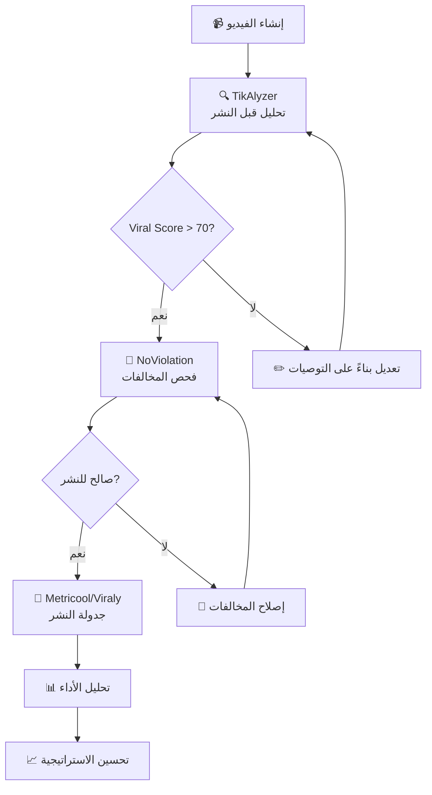

# 🔍 دليل أدوات تحليل السوشيال ميديا 2026
## التحليل الشامل لـ Instagram, TikTok, Facebook

---

## 📊 ملخص تنفيذي

بناءً على بحث شامل، إليك أفضل الأدوات المتوافقة مع معايير 2026:

| الأداة | التخصص | السعر الشهري | المنصات المدعومة |
|--------|--------|--------------|-------------------|
| **TikAlyzer.AI** | تحليل الفيديو والأخطاء | $9.99 - $49.99 | TikTok, Reels, Shorts |
| **Viraly** | تحليلات شاملة + جدولة | $19 - $99 | جميع المنصات |
| **Metricool** | إدارة شاملة + تحليلات | مجاني - $49 | جميع المنصات |
| **NoViolation.ai** | فحص مخالفات المحتوى | مجاني - $15 | TikTok, Instagram |

---

## 🎬 الأداة #1: TikAlyzer.AI

> **الأفضل لتحليل الفيديو واكتشاف الأخطاء**

### 🔗 الموقع
[tiktokalyzer.ai](https://tiktokalyzer.ai/)

### ✅ المميزات الرئيسية:

| الميزة | الوصف |
|--------|-------|
| **Viral Score** | نقاط من 100 تقيس احتمالية الفيروسية |
| **Hook Scanner** | تحليل أول 3 ثواني (الأهم!) |
| **Moment Map** | خريطة توضح أين يفقد المشاهدون الاهتمام |
| **Pothole Detection** | اكتشاف "الحفر" - اللحظات التي تسبب drop-off |
| **Caption Analysis** | تحليل جودة الوصف والهاشتاقات |
| **Sound ROI** | تحليل تأثير الصوت المستخدم |

### 💰 الأسعار:

```
📦 Starter:     $9.99/شهر  - 50 تحليل
📦 Growth:      $19.99/شهر - تحليل متقدم + تاريخ الفيديوهات
📦 Creator:     $49.99/شهر - غير محدود + تقارير قابلة للتصدير
```

### 🎯 ماذا يكتشف من أخطاء؟

1. ✗ **Hook ضعيف** → أول 3 ثواني لا تجذب الانتباه
2. ✗ **Retention منخفض** → المشاهدون يغادرون بسرعة
3. ✗ **Pacing سيء** → إيقاع الفيديو بطيء أو سريع جداً
4. ✗ **CTA مفقود** → لا يوجد دعوة للتفاعل
5. ✗ **Cover غير جذاب** → الصورة المصغرة لا تشجع على النقر

---

## 📈 الأداة #2: Viraly.io

> **الأفضل للتحليلات الشاملة والجدولة**

### 🔗 الموقع
[viraly.io](https://viraly.io/)

### ✅ المميزات الرئيسية:

| الميزة | الوصف |
|--------|-------|
| **AI Caption Generator** | توليد وصف بالذكاء الاصطناعي |
| **Best Time to Post** | أفضل أوقات النشر حسب جمهورك |
| **Engagement Analytics** | تحليل التفاعل التفصيلي |
| **Competitor Analysis** | مراقبة المنافسين |
| **Link in Bio** | صفحة روابط مخصصة |
| **Multi-Platform** | Instagram, TikTok, Facebook, Twitter |

### 💰 الأسعار:

```
🆓 Free:        $0    - 3 حسابات
📦 Influencer:  $19/شهر - 10 حسابات
📦 Business:    $49/شهر - 25 حساب
📦 Agency:      $99/شهر - 50 حساب + تقارير White Label
```

### 🎯 التحليلات المقدمة:

- 📊 معدل التفاعل (Engagement Rate)
- 👥 نمو المتابعين
- 🕐 أفضل أوقات النشر
- 📍 توزيع الجمهور الجغرافي
- 🏷️ أداء الهاشتاقات
- 📱 أداء كل منشور

---

## 🛠️ الأداة #3: Metricool

> **الأفضل للإدارة الشاملة مع خطة مجانية سخية**

### 🔗 الموقع
[metricool.com](https://metricool.com/)

### ✅ المميزات الرئيسية:

| الميزة | الوصف |
|--------|-------|
| **جدولة متعددة** | جدولة لجميع المنصات من مكان واحد |
| **تحليلات مفصلة** | تقارير شاملة عن الأداء |
| **مراقبة المنافسين** | تتبع حسابات المنافسين |
| **Hashtag Tracker** | تتبع أداء الهاشتاقات |
| **Link in Bio** | SmartLinks مجاني |
| **تقارير PDF** | تقارير جاهزة للعملاء |

### 💰 الأسعار:

```
🆓 Free:       $0/شهر  - 1 علامة تجارية + 50 منشور/شهر
📦 Starter:    $22/شهر - 5 علامات تجارية
📦 Advanced:   $54/شهر - 15 علامة تجارية
📦 Custom:     تسعير مخصص
```

### 🎯 المنصات المدعومة:

✅ Instagram ✅ TikTok ✅ Facebook ✅ Twitter  
✅ YouTube ✅ LinkedIn ✅ Pinterest ✅ Google Business

---

## 🚨 الأداة #4: NoViolation.ai

> **الأفضل لفحص مخالفات المحتوى قبل النشر**

### 🔗 الموقع
[noviolation.ai](https://noviolation.ai/)

### ✅ المميزات الرئيسية:

| الميزة | الوصف |
|--------|-------|
| **AI Policy Scanner** | يفحص المحتوى ضد سياسات المنصة |
| **Audio Analysis** | يحلل الصوت للكشف عن حقوق النشر |
| **Visual Analysis** | يفحص العناصر المرئية المخالفة |
| **Pre-Post Check** | فحص قبل النشر |
| **Strike Prevention** | يمنع الـ strikes والحظر |

### 💰 الأسعار:

```
🆓 Free:      5 فحوصات/شهر
📦 Creator:   $9.99/شهر - 50 فحص
📦 Pro:       $24.99/شهر - غير محدود
```

### 🎯 ماذا يكتشف؟

- ⚠️ محتوى مخالف لسياسات TikTok/Instagram
- ⚠️ موسيقى محمية بحقوق النشر
- ⚠️ محتوى قد يسبب تقييد (Shadowban)
- ⚠️ كلمات أو صور حساسة

---

## 🏆 التوصية النهائية

### 🥇 للمبتدئين (ميزانية محدودة):

```
Metricool (Free) + TikAlyzer ($9.99)
= $9.99/شهر للتحليل الشامل + تحليل الفيديو
```

### 🥈 للمحترفين (نمو سريع):

```
Viraly ($19) + TikAlyzer ($19.99) + NoViolation ($9.99)
= $48.97/شهر للباقة المتكاملة
```

### 🥉 للوكالات/العلامات التجارية:

```
Metricool Advanced ($54) + TikAlyzer Creator ($49.99)
= $103.99/شهر لإدارة متعددة الحسابات
```

---

## 🔄 سير العمل المقترح



---

## 📌 نصائح مهمة لـ 2026

> [!IMPORTANT]
> **خوارزميات 2026 تركز على:**
> - 🎯 **Retention Rate** - أهم من عدد المشاهدات
> - 🔄 **Shares/Saves** - أهم من الإعجابات
> - ⏱️ **Watch Time** - مدة المشاهدة الكاملة
> - 🗣️ **Comments** - جودة التعليقات وليس فقط العدد

> [!TIP]
> **الأخطاء الشائعة التي يجب تجنبها:**
> 1. Hook ضعيف في أول 0.5 ثانية
> 2. عدم استخدام Trending Audio
> 3. وصف طويل جداً أو قصير جداً
> 4. هاشتاقات عامة جداً (#fyp فقط)
> 5. عدم وجود CTA واضح

---

## 🆓 بدائل مجانية (محدودة)

| الأداة | ماذا تقدم مجاناً |
|--------|-----------------|
| **TikTok Analytics** | تحليلات أساسية داخل التطبيق |
| **Instagram Insights** | تحليلات أساسية للـ Business accounts |
| **Meta Business Suite** | تحليلات Facebook + Instagram |
| **Google Trends** | اكتشاف التريندات |

---

**آخر تحديث:** يناير 2026  
**المصادر:** Tavily Research, G2, Capterra, SourceForge
