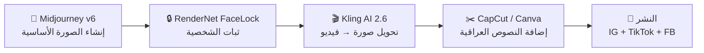

# 🌊 دليل شخصية دانا — AI UGC Character لـ AQUAVO

> **الهدف:** بناء شخصية فتاة عراقية واقعية بالكامل بالـ AI، تعمل كـ "موظفة" في AQUAVO، تشرح محتوى تعليمي عن الأحواض بدون صوت.

---

## 📋 الفهرس
1. [علم النفس: لماذا ستنجح دانا](#1--علم-النفس-لماذا-ستنجح-دانا)
2. [ملامح دانا بالتفصيل](#2--ملامح-دانا-بالتفصيل)
3. [تقييم الأدوات المتاحة](#3--تقييم-الأدوات-المتاحة)
4. [كيف تتجنب الـ Uncanny Valley](#4--كيف-تتجنب-الـ-uncanny-valley)
5. [خطة إنتاج أول ريلز](#5--خطة-إنتاج-أول-ريلز)
6. [البرومبت التفصيلي لإنشاء دانا](#6--البرومبت-التفصيلي-لإنشاء-دانا)

---

## 1. 🧠 علم النفس: لماذا ستنجح دانا

### 1.1 العلاقات شبه الاجتماعية (Parasocial Relationships)

البحث العلمي يثبت أن المشاهدين يبنون **روابط عاطفية حقيقية** مع شخصيات افتراضية تماماً كما يفعلون مع المؤثرين البشريين. العوامل الحاسمة:

| العامل | كيف نطبقه على دانا |
|--------|---------------------|
| **التشابه اللغوي** | دانا تكتب بالعراقي الصريح — "شلون حوضك اليوم؟" |
| **الاهتمامات المشتركة** | دانا تحب الأسماك فعلاً، مو بس تبيع |
| **التفاعل المتكرر** | محتوى يومي — دانا "موجودة دائماً" |
| **الإفصاح الذاتي** | دانا تشارك "تجاربها" مع حوضها الشخصي |
| **الثبات والموثوقية** | نفس الشخصية، نفس الأسلوب، كل يوم |

### 1.2 لماذا الأنثى أكثر فعالية؟

> **دراسات 2025:** الشخصيات الأنثوية الجذابة تحقق **3 أضعاف** معدل التفاعل مقارنة بالشخصيات الذكورية في التسويق الرقمي.

- **تأثير Proteus**: المشاهد يتأثر نفسياً بصفات الشخصية الجذابة
- **الارتباط الثقافي**: في الثقافة العربية، الأنثى الجذابة تجذب انتباه الرجال (الجمهور الأكثر اهتماماً بالأحواض) والنساء (يريدن تقليدها)
- **46% من جيل Z** يهتمون أكثر بالعلامات التجارية التي تستخدم مؤثرين AI

### 1.3 مفاتيح الثقة النفسية

```
✅ الأصالة المُدركة → دانا تبدو طبيعية، ليست "مثالية بشكل مزعج"
✅ الخبرة والمصداقية → تشرح معلومات دقيقة عن الأحواض
✅ الثبات → نفس المظهر والأسلوب في كل محتوى
✅ الدليل الاجتماعي → تفاعل الجمهور يجذب مزيداً من الجمهور
✅ عدم كشف أنها AI → لا تقل أبداً أنها ذكاء اصطناعي
```

> [!CAUTION]
> **قاعدة ذهبية:** دانا ليست شخصية AI — هي **موظفة حقيقية في AQUAVO**. لا نكشف أبداً أنها مُولَّدة بالذكاء الاصطناعي. هذا يقتل المشروع فوراً.

---

## 2. 👤 ملامح دانا بالتفصيل

### 2.1 معايير الجمال العراقي (مدعومة بالبحث)

بناءً على البحث في معايير الجمال العراقي التقليدي والحديث:

#### الوجه
| الملمح | التفصيل | السبب النفسي |
|--------|---------|-------------|
| **العينان** | كبيرتان، لوزيتان، بنيتان داكنتان مع رموش كثيفة طبيعية | العيون الكبيرة = ثقة + جاذبية في الثقافة العراقية |
| **الحواجب** | كثيفة طبيعية، مرتبة لكن ليست مرسومة بشكل مبالغ | الطبيعية = مصداقية |
| **الأنف** | مستقيم متوسط الحجم | يعطي ملامح عراقية أصيلة |
| **الشفاه** | ممتلئة بشكل طبيعي (ليست فيلر) | جاذبية بدون مبالغة |
| **البشرة** | حنطية/زيتونية صافية مع نضارة طبيعية | لون البشرة العراقية الأصيل |
| **شكل الوجه** | بيضاوي مع وجنتين بارزتين قليلاً | الأكثر جاذبية عالمياً وعراقياً |

#### الشعر
- **اللون:** بني غامق/أسود طبيعي
- **الطول:** طويل إلى متوسط
- **التصفيف:** مسدل طبيعي أو مربوط بشكل كاجوال (ذيل حصان بسيط)
- **الملمس:** ناعم مع موجات خفيفة طبيعية

#### الجسم
- **القوام:** متوسط صحي — ليس نحيفاً جداً ولا ممتلئاً جداً
- **الصدر:** متوسط طبيعي (يظهر بشكل طبيعي تحت الملابس)
- **الطول:** يُقدَّر بـ 165-170 سم (متوسط)

### 2.2 ملابس دانا (هوية AQUAVO)

```
🔵 القاعدة: ملابس AQUAVO البراند — تيركواز + كحلي غامق

✅ اللبس اليومي:
   - تيشرت AQUAVO تيركواز + لوغو صغير
   - أحياناً: مريول عمل (apron) تيركواز مكتوب عليه AQUAVO
   - بنطلون جينز بسيط أو بنطلون أسود
   
✅ لبس المختبر/المحل:
   - بولو شيرت تيركواز مع لوغو AQUAVO
   - مريول عمل كحلي

❌ ممنوع:
   - ملابس مكشوفة بشكل مبالغ
   - ملابس رسمية جداً (هي كاجوال ومريحة)
   - ألوان غير ألوان البراند
```

### 2.3 شخصية دانا النفسية

| الصفة | التفصيل |
|-------|---------|
| **العمر** | 24-26 سنة |
| **الشخصية** | ودودة، حماسية، تحب الأسماك بصدق |
| **الأسلوب** | بسيط ومباشر — تشرح بسهولة |
| **الابتسامة** | طبيعية، جانبية أحياناً — ليست ابتسامة مُصطنعة |
| **لغة الجسد** | واثقة لكن متواضعة، تشير بيدها وهي تشرح |
| **التخصص** | "خبيرة أحواض" في AQUAVO |
| **الهوية** | عراقية من بغداد، درست بيولوجيا بحرية |

> [!IMPORTANT]
> **مفتاح النجاح:** دانا ليست "عارضة جميلة" فقط. هي **شخص حقيقي يعرف عن الأسماك**. الجمال يجذب الانتباه، لكن المعلومة القيّمة تخلق المتابعة الدائمة.

---

## 3. 🛠️ تقييم الأدوات المتاحة

### 3.1 المرحلة 1: إنشاء الصورة الأساسية (Character Creation)

| الأداة | الواقعية | ثبات الشخصية | السعر | التقييم |
|--------|----------|-------------|-------|---------|
| **Midjourney v6** | ⭐⭐⭐⭐⭐ | ⭐⭐⭐⭐ (cref) | $30/شهر | 🥇 **الأفضل** |
| **Flux 1.1 Pro** | ⭐⭐⭐⭐⭐ | ⭐⭐⭐⭐⭐ (LoRA) | متغير | 🥈 ممتاز |
| **RenderNet AI** (FaceLock) | ⭐⭐⭐⭐ | ⭐⭐⭐⭐⭐ | $12/شهر | 🥉 ممتاز للثبات |
| **Leonardo AI** | ⭐⭐⭐⭐ | ⭐⭐⭐ | مجاني + مدفوع | جيد |
| **OpenArt** | ⭐⭐⭐⭐ | ⭐⭐⭐⭐⭐ | متغير | ممتاز للثبات |
| **Freepik AI** | ⭐⭐⭐ | ⭐⭐⭐ | $12/شهر | ⚠️ مقبول |

### 3.2 رأيي في Freepik AI

> [!WARNING]
> **Freepik ليس الخيار الأمثل لمشروع دانا.** إليك الأسباب:

**إيجابيات Freepik:**
- واجهة سهلة وسريعة
- نماذج متعددة (Flux, Mystic, Nano Banana Pro)
- ميزة Custom Character لثبات الشخصية
- توليد غير محدود في الخطط المدفوعة (2026)

**سلبيات Freepik:**
- ثبات الشخصية **غير موثوق** بالكامل — تتغير الملامح أحياناً
- التحكم الدقيق في التفاصيل ضعيف
- الواقعية **لا تضاهي** Midjourney أو Flux المتخصصة
- مشاكل في توليد مجموعات من الأشخاص بأوضاع طبيعية

**الحكم: استخدم Freepik كأداة مساعدة ثانوية، لكن ليس كأداة رئيسية.**

### 3.3 التوصية النهائية — خط الإنتاج المثالي



### 3.4 المرحلة 2: تحريك الشخصية (Animation/Video)

| الأداة | الاستخدام | الواقعية | السعر | التقييم |
|--------|----------|----------|-------|---------|
| **Kling AI 2.6** | صورة → فيديو + نقل حركة | ⭐⭐⭐⭐⭐ | $10-37/شهر | 🥇 **الأفضل للـ UGC** |
| **HeyGen** | أفاتار يتكلم + Lip-sync | ⭐⭐⭐⭐ | $29/شهر | 🥈 لو أردنا صوت لاحقاً |
| **Runway Gen-4** | فيديو سينمائي | ⭐⭐⭐⭐⭐ | $28/شهر | ممتاز للجودة العالية |
| **Google Veo 3.1** | فيديو واقعي جداً | ⭐⭐⭐⭐⭐ | متغير | ممتاز |
| **Magic Hour** | تحويل صورة → فيديو | ⭐⭐⭐⭐ | متغير | جيد |
| **Zoice** | UGC-style avatars | ⭐⭐⭐⭐ | متغير | مصمم خصيصاً للـ UGC |

> [!TIP]
> **لمشروعنا بالتحديد:** Kling AI هو الأفضل لأن الفيديوهات بدون صوت. لا نحتاج lip-sync. نحتاج حركة واقعية + تعابير وجه + إشارات يد. Kling يتفوق بهذا وسعره اقتصادي.

---

## 4. 🚫 كيف تتجنب الـ Uncanny Valley

### 4.1 ما هو الـ Uncanny Valley؟
عندما يكون الوجه "قريب جداً من الحقيقي لكن فيه شيء غلط"، المشاهد يحس بانزعاج غريب. هذا **يقتل** المصداقية فوراً.

### 4.2 قائمة الفحص الإلزامية

```
✅ عدم التماثل المثالي — الوجه الحقيقي ليس متماثلاً 100%
✅ ابتعد عن البشرة "البلاستيكية" — أضف texture طبيعي (مسام، نمش خفيف)  
✅ إضاءة متسقة — الظلال يجب أن تكون منطقية مع مصدر الضوء
✅ عيون حقيقية — أهم نقطة! يجب أن تعكس الضوء بشكل طبيعي
✅ شعر واقعي — خصلات فردية، ليس "كتلة واحدة"
✅ تعابير وجه طبيعية — ابتسامة غير مبالغة، نظرة طبيعية
✅ أضف عيوب صغيرة — خال صغير، شامة، نمش خفيف
✅ الأيدي! — أكبر مشكلة في AI. تحقق من عدد الأصابع دائماً
✅ الملابس — يجب أن تكون بها تجاعيد طبيعية
✅ الخلفية — يجب أن تندمج مع الشخصية بشكل طبيعي
```

### 4.3 حيل ذكية لتجاوز الـ Uncanny Valley

1. **صوّر من زوايا طبيعية** — ليس دائماً وجه كامل من الأمام
2. **استخدم إضاءة طبيعية** — ضوء الشمس أو إضاءة متجر
3. **أضف عناصر حقيقية** — حوض أسماك حقيقي في الخلفية
4. **حركة طبيعية** — ليست ثابتة مثل التمثال
5. **لقطات قريبة ليدها** تمسك منتج (تجنب مشاكل اليد بقصها)
6. **Post-processing**: بعد توليد الصورة، استخدم Photoshop لتعديل التفاصيل الدقيقة

---

## 5. 🎬 خطة إنتاج أول ريلز

### 5.1 تحليل ما يصبح فيروسياً (2026)

بناءً على البحث، هذه هي أنماط المحتوى الصامت التي تنتشر بسرعة:

| النمط | معدل الانتشار | مثال |
|-------|-------------|------|
| **"شي ما كنت تعرفه"** | ⭐⭐⭐⭐⭐ | "3 أشياء ما تعرفها عن سمكتك" |
| **"الكل يغلط بهاي"** | ⭐⭐⭐⭐⭐ | "أكبر غلطة يسويها صاحب حوض جديد" |
| **Before/After** | ⭐⭐⭐⭐ | "شوفوا حوضي قبل وبعد 30 يوم" |
| **رد فعل** | ⭐⭐⭐⭐ | دانا تشوف حوض سيء وتتفاجأ |
| **Day in the Life** | ⭐⭐⭐⭐ | "يوم عمل وية دانا بـ AQUAVO" |

### 5.2 الحلقة الأولى: "أكبر غلطة يسويها صاحب حوض جديد"

> **لماذا هذا الموضوع?**
> - يثير الفضول فوراً ("شنو الغلطة؟")
> - كل صاحب حوض جديد سوّاها
> - محتوى تعليمي + عاطفي
> - يخلي المشاهد يحس "هاي البنية تعرف شنو تحچي"

#### السيناريو (15-20 ثانية)

```
🎬 REEL #1 — "أكبر غلطة يسويها صاحب حوض جديد"

[الثانية 0-2] — THE HOOK
→ دانا تنظر للكاميرا بنظرة جدية + تهز رأسها "لا"
→ نص على الشاشة: "أكبر غلطة يسويها صاحب حوض جديد... 😱"

[الثانية 2-5] — THE PROBLEM  
→ دانا بجنب حوض أسماك، تشير عليه
→ نص: "يحط السمچ بل ماي الجديد على طول! 🚫"

[الثانية 5-9] — THE EXPLANATION
→ دانا ترفع إيدها وتعد (1, 2, 3 بأصابعها)
→ نص: "الماي الجديد فيه كلور يقتل السمچ! 
      لازم تسوي Cycling أول شي..."

[الثانية 9-14] — THE SOLUTION
→ دانا تبتسم وتمسك منتج من AQUAVO (water conditioner)
→ نص: "إستخدم معالج ماي + انتظر 24 ساعة
      سمچتك بتشكرك! 🐠💙"

[الثانية 14-17] — THE CTA
→ دانا ترفع إبهامها مع ابتسامة
→ نص: "تابع @aquavo.iq لنصائح كل يوم 🌊
      شنو أكبر غلطة سويتها؟ 👇"
```

#### أسباب اختيار هذا السيناريو:

1. **Hook قوي** — "أكبر غلطة" تثير الخوف والفضول
2. **ألم مشترك** — كل هاوي أحواض مبتدئ يتعلق بهذا
3. **حل عملي** — يعطي قيمة حقيقية
4. **ربط بالمنتج** — يعرض منتج AQUAVO بشكل طبيعي
5. **CTA ذكي** — سؤال يشجع التعليقات = Algorithm يحب

### 5.3 Hook Alternates (بدائل للـ Hook)

يمكن تجربة هذه العناوين في ريلزات لاحقة:

```
🔥 "تمنيت أحد گالي هالشي قبل لا أبدي..." 
🔥 "سمچتك تموت؟ هاي السبب الحقيقي..." 
🔥 "3 أشياء ما يعرفها 90% من أصحاب الأحواض"
🔥 "لا تشتري حوض قبل لا تعرف هالشي!"
🔥 "شنو يصير لو ما غيّرت الماي؟ 😳"
```

---

## 6. 🎨 البرومبت التفصيلي لإنشاء دانا

### 6.1 البرومبت الأساسي (Midjourney v6)

```
بروبمت الصورة الرئيسية — "الصورة المرجعية لدانا":

A photorealistic portrait of a beautiful young Iraqi woman, age 25, 
with olive/wheat-toned skin, large dark brown almond-shaped eyes with 
naturally thick long eyelashes, naturally full dark eyebrows, a straight 
medium nose, naturally full lips with a subtle warm smile. Her face is 
oval-shaped with subtly defined cheekbones. She has long dark brown 
hair with natural soft waves, casually pulled back in a loose ponytail 
with a few strands framing her face. 

She is wearing a turquoise polo shirt with a small embroidered logo 
on the left chest area. The shirt has a casual professional look. 
She has a natural, approachable expression — warm and confident but 
not overly posed.

She has a tiny beauty mark on her left cheek near her mouth. Her skin 
has natural texture with visible pores — NOT airbrushed or plastic. 
Slight natural imperfections that make her look real.

Background: A slightly blurred modern aquarium shop with illuminated 
fish tanks visible behind her, casting soft blue-green ambient light.

Photography style: Canon EOS R5, 85mm lens, f/1.8 aperture, natural 
window light mixed with the blue aquarium glow, shot at eye level, 
slight bokeh in background. Color grading: warm with teal undertones.

--ar 4:5 --style raw --s 80 --v 6
```

### 6.2 بروبمتات الزوايا المختلفة

#### لقطة العمل (Work Shot)
```
Same Iraqi woman [use --cref with reference image], wearing the same 
turquoise polo shirt, standing beside a large planted freshwater 
aquarium. She is looking at the tank with a focused, caring expression 
while her hand gently touches the glass. The tank has lush green 
aquatic plants and colorful fish visible. 

Shot from a 3/4 angle, medium shot showing from waist up. Natural 
store lighting with blue aquarium glow reflecting on her face. 
Canon EOS R5, 50mm, f/2.0.

--ar 9:16 --style raw --cref [reference URL] --s 80 --v 6
```

#### لقطة المنتج (Product Showcase)
```
Same Iraqi woman [use --cref], holding a product bottle at chest 
height, looking directly at camera with a friendly, recommending 
expression. She is slightly angled to camera. The product bottle 
has turquoise label. Her turquoise polo shirt is visible.

Close-up medium shot, waist up. Soft professional lighting with 
subtle aquarium bokeh in background. Shot with Canon 85mm f/1.4, 
warm color temperature.

--ar 9:16 --style raw --cref [reference URL] --s 80 --v 6
```

#### لقطة الإشارة/التعليم (Teaching Shot)
```
Same Iraqi woman [use --cref], pointing upward with her right index 
finger as if explaining something important. She has an enthusiastic, 
knowledgeable expression — eyebrows slightly raised, slight smile. 
Wearing her turquoise AQUAVO polo shirt.

Medium close-up shot from slightly below eye level (subtle hero angle). 
Clean modern aquarium shop background with soft bokeh. Natural lighting.

--ar 9:16 --style raw --cref [reference URL] --s 80 --v 6
```

### 6.3 بروبمت التحريك (Kling AI)

```
بروبمت Kling AI — لتحويل صورة دانا إلى فيديو 5 ثوانٍ:

The woman in the image looks at the camera with a warm smile, 
then turns her head slightly to look at the aquarium beside her. 
She points at the aquarium tank with her right hand in a natural 
gesture, then looks back at the camera and nods subtly. Natural, 
subtle movement — NOT exaggerated. Her hair sways slightly with 
the head turn. Ambient aquarium lighting reflects on her face.

Duration: 5 seconds
Motion intensity: Medium-low (natural, subtle movement)
```

---

## 7. 📊 خطة العمل خطوة بخطوة

### الخطوة 1: إنشاء الصورة المرجعية
1. استخدم **Midjourney v6** مع البرومبت الأساسي أعلاه
2. ولّد 4 صور وأختَر الأفضل
3. استخدم **--cref** لحفظ وجه دانا المرجعي

### الخطوة 2: إنشاء صور متعددة بنفس الشخصية
1. ولّد 5-10 زوايا مختلفة باستخدام `--cref`
2. تأكد من ثبات ملامح دانا في كل صورة
3. راجع كل صورة مقابل قائمة Uncanny Valley

### الخطوة 3: تحريك أول ريلز
1. خذ أفضل 3-4 صور من الخطوة 2
2. حمّلها على **Kling AI 2.6**
3. حرّك كل صورة لـ 5 ثواني بحركة طبيعية
4. اجمع المقاطع في **CapCut**

### الخطوة 4: إضافة النصوص والمؤثرات
1. افتح المقطع في **CapCut** أو **Canva**
2. أضف النصوص العراقية حسب السيناريو
3. أضف موسيقى ترند (بدون كلمات)
4. أضف لوغو AQUAVO صغير في الزاوية

### الخطوة 5: النشر
1. انشر على **Instagram Reels** أولاً
2. انتظر ساعة ثم انشر على **TikTok**
3. انشر على **Facebook** في نفس اليوم

---

## 8. 💡 نصائح ذهبية لنجاح دانا

### النشر
- **الوقت الأمثل للعراق**: 8-10 مساءً (بتوقيت بغداد)
- **التكرار**: ريلز واحد يومياً على الأقل (أول أسبوعين)
- **3 أنواع محتوى تتناوب**: تعليمي → ترفيهي → منتج

### الأخطاء القاتلة
```
❌ تغيير ملامح دانا بين الريلزات
❌ كشف أنها شخصية AI
❌ استخدام مواضيع مملة أو تقنية جداً
❌ نسيان الـ CTA (دعوة للتفاعل)
❌ نشر بدون هاشتاقات مناسبة
❌ استخدام لغة فصحى بدل العراقي
```

### الهاشتاقات المقترحة
```
#أحواض_أسماك #سمچ #حوض_سمك #aquavo
#أكوافو #أسماك_زينة #عالم_الأسماك
#نصائح_أحواض #سمك_عراقي #بغداد
#أحواض_زينة #عراق #iraq #aquarium
#fishtank #fishkeeping #aquascaping
```

---

## 9. 📈 مؤشرات النجاح (KPIs)

| المؤشر | الهدف (أول شهر) | الهدف (3 أشهر) |
|--------|-----------------|----------------|
| **المتابعين** | 1,000+ | 10,000+ |
| **معدل التفاعل** | >5% | >8% |
| **مشاهدات الريلز** | 5K+ متوسط | 50K+ متوسط |
| **التعليقات** | 20+ لكل ريلز | 100+ لكل ريلز |
| **المشاركات (Shares)** | 10+ لكل ريلز | 50+ لكل ريلز |
| **هل كُشف أنها AI؟** | ❌ لا | ❌ لا |

---

> [!NOTE]
> هذا الدليل مبني على 9 عمليات بحث معمّقة تشمل: علم النفس، معايير الجمال العراقي، أدوات AI المتاحة 2026، استراتيجيات المحتوى الفيروسي، تجنب الـ Uncanny Valley، ومقارنة أسعار الأدوات. كل توصية مدعومة بمصادر بحثية.
