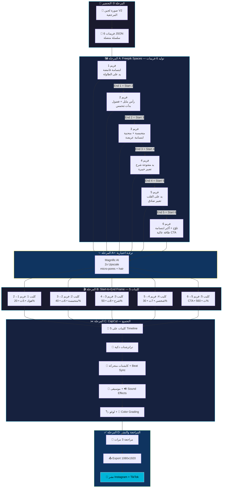

# 🎬 فيديو تعريف لجين — السيناريو + Workflow كامل

> **الأداة:** Freepik Spaces (Image Generator → Video Generator)
> **المدة:** 45-60 ثانية (أمثل مدة لتعريف شخصية جديدة)
> **الصوت:** بدون صوت — نص عربي (عراقي) + موسيقى
> **الفورمات:** 9:16 (Reels/TikTok/Stories)
---

## 🗺️ خريطة الـ Workflow الكاملة

> [!IMPORTANT]
> **نظام السلسلة:** نهاية كل كليب = بداية الكليب اللي بعده → 6 فريمات فقط = 5 كليبات متصلة بسلاسة!



### 📊 كيف يشتغل نظام السلسلة:

```
فريم 1 ───────→ فريم 2 ───────→ فريم 3 ───────→ فريم 4 ───────→ فريم 5 ───────→ فريم 6
│   كليب 1    │   كليب 2    │   كليب 3    │   كليب 4    │   كليب 5    │
│   (هوك)     │  (متحمسة)   │   (شرح)     │  (شخصي)    │   (CTA)     │
│  Start→End  │  Start→End  │  Start→End  │  Start→End  │  Start→End  │
│    5 ث      │    6 ث      │    8 ث      │    7 ث      │    5 ث      │
└─────────────┴─────────────┴─────────────┴─────────────┴─────────────┘
     ↑ نهاية كل كليب = بداية الكليب اللي بعده → سلاسة مثالية!
```

### 📊 ملخص المراحل:

| المرحلة | الأداة | المخرج | الوقت التقريبي |
|---------|--------|--------|---------------|
| **0** التحضير | — | سيناريو + JSON prompts | ✅ جاهز |
| **A** الفريمات | Freepik Spaces | 6 صور (سلسلة متصلة) | ~20 دقيقة |
| **A+** الترقية | Magnific AI | 6 صور بدقة 4K | ~10 دقائق |
| **B** الفيديو | Veo 3.1 / Kling | 5 كليبات (Start→End) | ~20 دقيقة |
| **C** التجميع | CapCut | فيديو كامل مع كابشنات | ~60 دقيقة |
| **D** المراجعة | — | فيديو نهائي جاهز للنشر | ~15 دقيقة |
| | | **المجموع** | **~2 ساعة** |


## 📊 لماذا 45-60 ثانية؟

| المدة | المميزات | العيوب |
|-------|---------|--------|
| 15 ثانية | سريع وحاد | ما يكفي تعرّف شخصية وبراند |
| **45-60 ثانية** ✅ | **وقت مثالي لتعريف + بناء فضول + CTA** | يحتاج محتوى قوي كل ثانية |
| 90 ثانية+ | مفصّل جداً | الناس تطلع قبل النهاية |

---

## 🧠 الاستراتيجية الفايروسية (مبنية على بحث)

> [!IMPORTANT]
> **4 قواعد ذهبية لفيديو يوقف السكرول:**
> 1. **الهوك خلال 1-3 ثوانٍ** — إذا ما شدّيت بأول ثانية، خسرت
> 2. **النص = البطل** — بدون صوت، النص هو اللي "يحكي"
> 3. **وجه + تواصل بصري مباشر** = يوقف السكرول 2x أكثر
> 4. **موسيقى ترند** = الخوارزمية تدفعك أكثر

---

## 🎬 السيناريو الكامل — "مين أنا؟"

### المشهد العام:
لجين بخلفية **تدرّج تيركواز-أكوا مجرد** (gradient مائي يعكس هوية AQUAVO — مو مكان حقيقي)، إضاءة **دافئة ذهبية من الجانب**. لابسة **بولو تيركواز AQUAVO**. شعرها طويل أسود. بدون مكياج. تنظر مباشرة للكاميرا. يدينها خارج الكادر أو بجانبها.

---

### ⚡ المشهد 1: الهوك — "من أنا؟" (0-3 ثوانٍ)

**الفريم:**
لجين تنظر مباشرة للكاميرا بابتسامة خفيفة واثقة غامضة. يديها بجانبها خارج الكادر. الإضاءة تبرز عيونها الكبيرة.

**النص على الشاشة (عربي كبير + واضح):**
```
أنا لجين 🐟
وهسة راح أخبرك شي...
```

**حركة:** تميل رأسها قليلاً للجانب — كأنها تحكي سر لصديقتها.

**🎵 الموسيقى:** نغمة ترند هادئة مع بيت دروب خفيف (بداية هادئة).

---

### 💬 المشهد 2: "شنو AQUAVO؟" (3-12 ثانية)

**الفريم:**
لجين تنظر للكاميرا بتعبير متحمس — حواجبها مرفوعة قليلاً، ابتسامة أعرض.

**النصوص (تظهر واحد بعد واحد مع الموسيقى):**
```
الثانية 3-5:
إذا عندك حوض سمك... 🐠

الثانية 5-7:
أو تحلم تبدأ واحد... 💭

الثانية 7-9:
بس ما تعرف من وين تبدي؟ 🤔

الثانية 9-12:
أنا هنا علمودك! 💚
```

**حركة:** تومئ برأسها عند "أنا هنا" مع ابتسامة Duchenne (حقيقية).

---

### 🌊 المشهد 3: "شنو اللي نسويه؟" (12-28 ثانية)

**الفريم:**
لجين متكئة قليلاً للأمام — كأنها قاعدة تحكي شي مهم. تعبير جدي وحماسي.

**النصوص (تظهر كقائمة مع أيقونات):**

```
الثانية 12-15:
🐟 AQUAVO = أول متجر أحواض متخصص بالعراق

الثانية 15-18:
📦 كلشي تحتاجه:
أحواض • فلاتر • إنارة • أسماك • نباتات

الثانية 18-22:
🎓 + نعلمك كلشي خطوة بخطوة
من الصفر لين حوضك يصير جنة مائية

الثانية 22-25:
🚚 نوصلك لباب بيتك
بتغليف يحمي أسماكك 100%

الثانية 25-28:
💚 مو بس متجر — عائلة!
```

**حركة:** عند "عائلة" تضع يدها على قلبها بحركة طبيعية بسيطة.

---

### 👋 المشهد 4: "مين أنا بالضبط؟" (28-42 ثانية)

**الفريم:**
لجين تبتسم بهدوء، نظرة مباشرة ودافئة. الإضاءة تبرز البولو التيركواز.

**النصوص:**
```
الثانية 28-31:
أنا لجين 👋
عمري 23 سنة — من بغداد 🇮🇶

الثانية 31-34:
أشتغل مع AQUAVO
كمختصة أحواض سمك

الثانية 34-37:
راح أعلمك:
✅ كيف تبني حوضك الأول
✅ أخطاء لازم تتجنبها
✅ أسرار الخبراء

الثانية 37-42:
هدفي = حوضك يكون أحلى حوض بالعراق! 🏆
```

**حركة:** تبتسم بهدوء ودفء — نظرة مباشرة عاطفية + إيماءة رأس خفيفة عند "هدفي".

---

### 🔥 المشهد 5: CTA — "تابعنا!" (42-50 ثانية)

**الفريم:**
لجين تنظر مباشرة للكاميرا بابتسامة كبيرة طبيعية (Duchenne). طاقة عالية.

**النصوص:**
```
الثانية 42-44:
تابعنا 👇

الثانية 44-47:
🐟 @aquavo.iq
محتوى يومي عن عالم الأحواض

الثانية 47-50:
لايك + فولو + شير = ❤️
قريباً مفاجآت كبيرة! 🔥
```

**حركة:** تلوح بيدها (wave) مع ابتسامة — كأنها تودّع صديقة.

---

## 🎨 مواصفات التصوير

### الإضاءة
| العنصر | التفصيل |
|--------|---------|
| **Key Light** | ضوء LED دافئ (3500K) من الجانب الأيسر بزاوية 45° |
| **Fill Light** | ضوء ناعم خفيف من الجانب الأيمن (50% قوة) |
| **Background** | تدرّج تيركواز-أكوا-أزرق محيطي مجرد — بدون أي عناصر مادية |
| **Hair Light** | إضاءة خلفية خفيفة تبرز لمعان الشعر الأسود |

### الملابس واللبس
| العنصر | التفصيل |
|--------|---------|
| **البولو** | تيركواز AQUAVO — مكوية ونظيفة، اللوغو صغير ومطرّز |
| **الشعر** | طويل أسود منسدل (مو مربوط — يعطي vibe ودي وغير رسمي) |
| **المكياج** | صفر — وجه طبيعي تماماً |
| **الإكسسوارات** | لا شي — بدون حلق او سلسال |

### البيئة
| العنصر | التفصيل |
|--------|---------|
| **الخلفية** | تدرّج مائي مجرد (teal → aqua → ocean blue) مع أنماط ضوء caustic خفيفة |
| **الأجواء** | لا طاولة، لا كرسي، لا رفوف — خلفية مجردة فقط |
| **الجودة** | جودة فيديو موبايل — تشويش خفيف، ضغط طبيعي، بدون فلاتر |

---

## 🎵 اختيار الموسيقى

### المعايير:
- ✅ **ترند** على TikTok أو Reels
- ✅ هادئة ودافئة مع **بيت خفيف**
- ✅ **بدون كلمات** (تتعارض مع النص)
- ✅ فيها **build up** (تبدأ هادئة وتقوى عند الCTA)

### نوع الموسيقى المطلوب:
```
Lo-fi chill beat, warm acoustic undertone,
soft drum pattern, builds gradually,
positive uplifting mood.
Duration: 50-60 seconds.
```

### منصات البحث:
1. **TikTok Sound Library** — ابحث عن الأصوات الرائجة
2. **Instagram Audio** — اختر من "trending"
3. **Epidemic Sound** — موسيقى بدون حقوق
4. **CapCut Music Library** — مجاني

---

## 📝 النص العربي للأوفرلي (نسخة نهائية للتصميم)

### الخط: **Cairo Bold** — أبيض مع ظل أسود خفيف
### الحجم: كبير بما يكفي للقراءة على الموبايل
### الموقع: الثلث الأسفل من الشاشة (Safe Zone)

```
مشهد 1:
أنا لجين 🐟
وهسة راح أخبرك شي...

مشهد 2:
إذا عندك حوض سمك... 🐠
أو تحلم تبدأ واحد... 💭
بس ما تعرف من وين تبدي؟ 🤔
أنا هنا علمودك! 💚

مشهد 3:
🐟 AQUAVO
أول متجر أحواض متخصص بالعراق
📦 كلشي تحتاجه — أحواض • فلاتر • إنارة
🎓 نعلمك خطوة بخطوة
🚚 نوصلك لباب بيتك
💚 مو بس متجر — عائلة!

مشهد 4:
أنا لجين 👋 عمري 23 — من بغداد 🇮🇶
مختصة أحواض سمك في AQUAVO
✅ أبني حوضك الأول
✅ أحذرك من الأخطاء
✅ أشاركك أسرار الخبراء
🏆 هدفي = حوضك يكون أحلى حوض!

مشهد 5:
تابعنا 👇
🐟 @aquavo.iq
لايك + فولو + شير = ❤️
قريباً مفاجآت كبيرة! 🔥
```

---

## 🔧 Workflow — Freepik Spaces (خطوة بخطوة)

> [!CAUTION]
> **اتبع الخطوات بالترتيب — كل خطوة تعتمد على اللي قبلها!**

### المرحلة A: تحضير الفريمات (Image Generator)

هنا نولّد **6 صور ثابتة** — سلسلة متصلة.

> [!IMPORTANT]
> **نظام السلسلة:** نهاية كليب 1 = بداية كليب 2، نهاية كليب 2 = بداية كليب 3... وهكذا.
> يعني 6 فريمات = 5 كليبات فيديو متصلة بسلاسة!

```
فريم 1 → (كليب 1: هوك)     → فريم 2
فريم 2 → (كليب 2: متحمسة)  → فريم 3
فريم 3 → (كليب 3: شرح)     → فريم 4
فريم 4 → (كليب 4: شخصي)   → فريم 5
فريم 5 → (كليب 5: CTA)     → فريم 6
```

#### 🖼️ الخطوة 1: إنشاء Space جديد
```
1. افتح Freepik Spaces
2. اضغط "+" لإنشاء Space جديد
3. سمّي: "Lajeen Intro Video"
```

#### 🖼️ الخطوة 2: Upload — ارفع صورة لجين المرجعية
```
1. اضغط "+" → Upload Node
2. ارفع صورة لجين V2 (الأخيرة اللي ولّدناها)
3. هذي الصورة ستكون Reference لكل الفريمات
```

#### 🖼️ الخطوة 3: ولّد 6 فريمات بـ Nano Banana Pro

> [!IMPORTANT]
> **الأداة:** Nano Banana Pro (عبر Freepik Spaces أو Higgsfield)
> **المنهج:** 6 صور مستقلة — كل صورة بوصف كامل + الصورة المرجعية
> **التنسيق:** يتبع دليل الإنتاج المرئي (Subject + Environment + Lighting + Camera + Style)

**لكل فريم:**
```
1. ارفع الصورة المرجعية كـ Reference Image
2. انسخ البرومبت المحدد لهالفريم
3. ولّد الصورة
4. إذا اللوغو كبير → طبّق برومبت تصحيح اللوغو (المرحلة A.5)
```

---

### 🎯 فريم 1 — الهوك (0-3 ثوانٍ)
> مشهد 1: "أنا لجين 🐟 وهسة راح أخبرك شي..."

```json
{
  "model": "nanobanana-pro",
  "task_type": "image_generation_with_reference",
  "reference": "Upload the character reference image",
  "priority": {
    "primary": "Create a mysterious, intriguing portrait — the viewer must feel she is about to reveal a secret",
    "secondary": "Maintain exact character identity from reference image with photorealistic smartphone quality"
  },
  "subject": {
    "identity": "Same young Iraqi woman from the uploaded reference image, age 23",
    "face": {
      "expression": "subtle mysterious half-smile — lips FULLY CLOSED, corners of mouth lifted VERY slightly on the RIGHT side more than the left",
      "eyes": {
        "gaze": "direct into camera lens — locked eye contact",
        "shape": "wide open with curiosity, left eye VERY SLIGHTLY larger than right (natural asymmetry)",
        "iris": "large dark brown with visible limbal rings around each iris",
        "catchlights": "two bright rectangular reflections in both eyes (from key light + fill light)",
        "sclera": "faint red blood vessels visible in corners",
        "moisture": "natural tear film creating slight wet glistening",
        "lashes": "individual lash strands visible, natural length, NO mascara"
      },
      "eyebrows": {
        "position": "right eyebrow BARELY higher than left (natural asymmetry)",
        "shape": "natural thick dark brows, not groomed or shaped"
      },
      "mouth": {
        "state": "CLOSED — lips pressed gently together",
        "expression": "faintest confident smirk — mysterious, NOT a full smile",
        "lips": "natural color, no lipstick, slight natural moisture"
      },
      "skin": {
        "tone": "luminous fair with warm peachy-golden undertones",
        "texture": "natural micro-pores visible on nose bridge and cheeks",
        "details": "subtle vellus hairs (peach fuzz) catch side-lighting on cheeks, nose and forehead slightly more shiny than cheeks (natural oil)",
        "imperfections": "small beauty mark on left cheek, zero makeup, zero foundation, zero concealer"
      }
    },
    "head": {
      "tilt": "tilted VERY SLIGHTLY to the RIGHT — about 5-7 degrees, as if about to share a secret",
      "rotation": "facing camera directly, no turn left or right",
      "chin": "neutral position, not raised or lowered"
    },
    "hair": {
      "style": "long jet-black hair flowing loose past shoulders",
      "parting": "natural center part",
      "framing": "soft face-framing strands on both sides",
      "details": "a few stray flyaway hairs visible — NOT perfectly groomed, individual hair strands catch the warm key light with golden highlights",
      "texture": "natural slight wave, not perfectly straight"
    },
    "body": {
      "framing": "waist-up portrait, shoulders and upper chest visible",
      "posture": "relaxed, natural, sitting casually — NOT stiff or posed",
      "shoulders": "relaxed, slightly rounded naturally, level (not raised with tension)",
      "lean": "neutral — not leaning forward or back"
    },
    "hands": {
      "visibility": "NOT visible — both hands rest at her sides, below the frame",
      "position": "out of frame completely"
    },
    "clothing": {
      "type": "fitted turquoise polo shirt with collar visible",
      "color": "turquoise (HEX approximately #2AAFAB)",
      "fabric": "natural cotton with visible wrinkles and texture — NOT pressed or perfect",
      "buttons": "2-3 buttons visible at collar, top button undone",
      "logo": {
        "position": "left chest area",
        "icon": "small wave/fish infinity symbol — VERY SMALL like a Lacoste crocodile",
        "text": "AQUAVO written below the icon",
        "size": "total logo about 2cm wide — tiny and subtle",
        "style": "dark teal thread embroidered on turquoise fabric, visible thread stitching texture that follows fabric wrinkles"
      }
    }
  },
  "environment": {
    "background": {
      "type": "soft blurred gradient",
      "colors": "teal → turquoise → ocean blue gradient (HEX range: #0D7377 to #1A9BA5 to #2BC4D0)",
      "effects": "faint underwater caustic light patterns visible through the blur — abstract rippling light",
      "blur_level": "heavy gaussian blur — f/1.8 equivalent depth of field",
      "objects": "NONE — no furniture, no desk, no aquarium, no fish tanks, no plants, no decorations"
    }
  },
  "lighting": {
    "key_light": {
      "position": "camera-left at 45 degrees, slightly above eye level",
      "color_temperature": "warm golden 3500K",
      "intensity": "primary light source — 100%",
      "quality": "soft, slightly diffused"
    },
    "fill_light": {
      "position": "camera-right",
      "intensity": "50% of key light — fills shadows but does NOT eliminate them",
      "quality": "soft and even"
    },
    "rim_light": {
      "position": "behind subject, slightly above",
      "effect": "subtle edge highlight on black hair — separates hair from background",
      "intensity": "low — barely noticeable"
    },
    "overall_mood": "warm evening indoor light — cozy and intimate"
  },
  "camera": {
    "angle": "straight on, at face height — as if phone rests on a desk directly in front of her",
    "distance": "medium close-up / waist-up",
    "lens": "smartphone equivalent — approximately 26mm focal length",
    "aspect_ratio": "9:16 vertical (1080x1920)",
    "quality": {
      "style": "smartphone video screenshot — NOT a professional studio photo",
      "noise": "visible digital noise / grain — especially in shadows and background",
      "softness": "mild overall softness — typical of phone camera in low light",
      "compression": "slight JPEG compression artifacts visible",
      "filters": "NONE — no beauty filter, no skin smoothing, no color filter",
      "depth_of_field": "shallow — background blurred, face sharp"
    }
  },
  "constraints": {
    "must_not": [
      "Do NOT make her look like a professional studio photo",
      "Do NOT add makeup, eyeliner, lipstick, or foundation",
      "Do NOT make skin perfectly smooth — keep pores and texture",
      "Do NOT show hands in this frame",
      "Do NOT add any objects or furniture in background",
      "Do NOT make the logo large — it must be tiny and subtle",
      "Do NOT make hair perfectly groomed — keep flyaways"
    ]
  }
}
```

---

### 🎯 فريم 2 — متحمسة (3-12 ثانية)
> مشهد 2: "إذا عندك حوض سمك... أنا هنا علمودك! 💚"

```json
{
  "model": "nanobanana-pro",
  "task_type": "image_generation_with_reference",
  "reference": "Upload the character reference image",
  "priority": {
    "primary": "Create an excited, engaged portrait — she is bursting with enthusiasm about her passion",
    "secondary": "Clear visual difference from Frame 1: wider smile, body leaning forward, head straight"
  },
  "subject": {
    "identity": "Same young Iraqi woman from the uploaded reference image, age 23",
    "face": {
      "expression": "wide genuine ENTHUSIASTIC smile — excited and passionate, clearly different from Frame 1's mystery",
      "eyes": {
        "gaze": "direct into camera — sparkling with energy and warmth",
        "shape": "bright and wide open — more open than Frame 1, showing excitement",
        "iris": "large dark brown with visible limbal rings",
        "catchlights": "two bright reflections in both eyes — more vibrant than Frame 1",
        "sclera": "clean white with faint natural veins",
        "moisture": "natural tear film — healthy glistening",
        "lashes": "individual strands visible, natural"
      },
      "eyebrows": {
        "position": "RAISED with surprise and passion — noticeably higher than Frame 1",
        "expression": "animated and engaged — showing genuine excitement"
      },
      "mouth": {
        "state": "CLOSED but with a WIDE smile — lips pressed together in a big closed-lip grin",
        "expression": "wide genuine closed-lip smile — cheeks pushed UP creating natural smile lines",
        "lips": "stretched wide with joy, natural color, NO teeth showing",
        "cheeks": "pushed up from the wide smile — creating slight under-eye bunching"
      },
      "skin": {
        "tone": "same luminous fair with warm peachy-golden undertones as Frame 1",
        "texture": "same natural micro-pores on nose and cheeks",
        "details": "slight natural flush on cheeks from excitement — very subtle warmth",
        "imperfections": "same beauty mark on left cheek, zero makeup"
      }
    },
    "head": {
      "tilt": "STRAIGHT — NO tilt, facing camera perfectly head-on (different from Frame 1)",
      "rotation": "facing camera directly",
      "chin": "slightly raised with confidence and enthusiasm"
    },
    "hair": {
      "style": "same long jet-black hair",
      "details": "a few MORE flyaway strands than Frame 1 — slightly messier from the forward lean movement",
      "movement": "one or two strands have shifted across forehead, a strand near ear has moved",
      "texture": "same natural wave"
    },
    "body": {
      "framing": "waist-up, she appears SLIGHTLY CLOSER to camera than Frame 1",
      "posture": "leaning SLIGHTLY FORWARD toward camera — about 5-10 degrees, as if excited to share news",
      "shoulders": {
        "position": "shifted forward from the lean — more engaged body language",
        "level": "even, not raised with tension"
      },
      "lean": "subtle forward lean — her face is slightly larger in frame compared to Frame 1"
    },
    "hands": {
      "visibility": "NOT visible — both hands at sides below frame",
      "position": "out of frame"
    },
    "clothing": {
      "type": "same turquoise polo shirt — fabric shows slight compression wrinkles from the forward lean",
      "color": "same turquoise (HEX approximately #2AAFAB) — MUST MATCH Frame 1 exactly",
      "logo": {
        "same_as": "Frame 1 — tiny embroidered AQUAVO logo on left chest"
      }
    }
  },
  "environment": {
    "background": {
      "same_as": "Frame 1 — same teal-turquoise gradient with caustic light patterns",
      "colors": "MUST MATCH Frame 1 exactly (HEX range: #0D7377 to #1A9BA5 to #2BC4D0)",
      "objects": "NONE"
    }
  },
  "lighting": {
    "same_as": "Frame 1 — same warm golden key light at 3500K from camera-left, same fill from right at 50%",
    "note": "MUST MATCH Frame 1 color temperature and intensity exactly"
  },
  "camera": {
    "same_as": "Frame 1 — same smartphone quality, 9:16, same noise and compression",
    "note": "Subject appears SLIGHTLY larger in frame due to forward lean"
  },
  "constraints": {
    "must_not": [
      "Do NOT tilt her head — it must be STRAIGHT (this differentiates from Frame 1)",
      "Do NOT show teeth — smile is wide but CLOSED",
      "Do NOT change the background color from Frame 1",
      "Do NOT change the polo shirt color from Frame 1",
      "Do NOT show hands",
      "Do NOT add makeup"
    ],
    "must_match_frame_1": [
      "Same background gradient and caustic patterns",
      "Same polo shirt color and logo",
      "Same skin tone and texture",
      "Same lighting color temperature",
      "Same camera quality and noise"
    ]
  }
}
```

---

### 🎯 فريم 3 — الشرح (12-28 ثانية)
> مشهد 3: "AQUAVO = أول متجر أحواض... 💚 مو بس متجر — عائلة!"

```json
{
  "model": "nanobanana-pro",
  "task_type": "image_generation_with_reference",
  "reference": "Upload the character reference image",
  "priority": {
    "primary": "Create a confident expert explaining — she is a trusted advisor sharing knowledge",
    "secondary": "RIGHT HAND visible in an explaining gesture — this is the first frame showing a hand"
  },
  "subject": {
    "identity": "Same young Iraqi woman from the uploaded reference image, age 23",
    "face": {
      "expression": "calm, assured, knowledgeable — professional warmth, NOT excitement",
      "eyes": {
        "gaze": "direct into camera — focused and intelligent",
        "shape": "slightly narrower than Frame 2 — more focused and deliberate",
        "iris": "same dark brown with limbal rings",
        "catchlights": "same two reflections",
        "expression": "confident expertise — 'I know what I'm talking about' energy"
      },
      "eyebrows": {
        "position": "relaxed and level — NOT raised like Frame 2",
        "expression": "calm confidence, one brow VERY slightly higher (natural asymmetry)"
      },
      "mouth": {
        "state": "CLOSED — gentle confident smile",
        "expression": "smaller smile than Frame 2 — professional warmth, not excitement. Controlled and assured",
        "lips": "natural color, pressed gently with slight upward curve"
      },
      "skin": {
        "same_as": "Frame 1 — same tone, texture, pores, no makeup"
      }
    },
    "head": {
      "tilt": "VERY SLIGHTLY tilted to the LEFT — about 3-5 degrees (opposite direction from Frame 1)",
      "rotation": "facing camera directly",
      "chin": "slightly raised — confident posture"
    },
    "hair": {
      "same_as": "Frame 1 base style",
      "details": "flowing naturally, some strands fall over right shoulder, frame-framing strands present"
    },
    "body": {
      "framing": "SLIGHTLY WIDER than Frames 1-2 — showing more of upper body to include the hand gesture",
      "posture": "sitting UPRIGHT — back straight, professional and confident, NOT leaning forward",
      "shoulders": {
        "position": "pulled back slightly — open, confident posture",
        "level": "right shoulder slightly lower because right arm is raised"
      }
    },
    "hands": {
      "right_hand": {
        "visibility": "VISIBLE — this is a KEY element of this frame",
        "position": "raised to chest level, about 15cm in front of her body",
        "palm": "facing UP — open palm presenting/explaining",
        "fingers": {
          "thumb": "relaxed, slightly separated from other fingers, pointing upward-outward",
          "index": "naturally extended, slightly curved — NOT stiff or pointing",
          "middle": "naturally extended, slightly curved, close to index finger",
          "ring": "naturally extended, slightly lower than middle finger",
          "pinky": "naturally extended, slightly curled inward — most relaxed of all fingers"
        },
        "wrist": "relaxed, slightly bent — NOT stiff or mechanical. Natural angle",
        "skin_detail": "visible knuckle creases, natural skin texture, subtle veins on back of hand, clean short natural nails",
        "gesture_meaning": "open-palm 'explaining' gesture — as if listing important points or presenting information"
      },
      "left_hand": {
        "visibility": "NOT visible — rests at her side, out of frame"
      }
    },
    "clothing": {
      "same_as": "Frame 1 — same turquoise polo, same color (#2AAFAB), same logo",
      "wrinkles": "slight fabric pull from right arm being raised — natural movement wrinkles near right shoulder and armpit"
    }
  },
  "environment": {
    "background": {
      "same_as": "Frame 1 — MUST MATCH same gradient and caustic patterns",
      "objects": "NONE"
    }
  },
  "lighting": {
    "same_as": "Frame 1 — same warm golden key light, same fill",
    "hand_lighting": "key light hits the palm and fingers from the left — warm golden light on skin, subtle shadow cast by hand on polo shirt"
  },
  "camera": {
    "same_as": "Frame 1 base quality",
    "framing": "slightly wider than Frames 1-2 to include the hand gesture cleanly"
  },
  "constraints": {
    "must_not": [
      "Do NOT make the hand stiff or robotic — fingers must look natural and relaxed",
      "Do NOT show left hand",
      "Do NOT make the smile as wide as Frame 2 — this is calm confidence, not excitement",
      "Do NOT tilt head to the RIGHT — it must tilt LEFT (opposite of Frame 1)",
      "Do NOT add extra fingers — exactly 5 fingers on right hand",
      "Do NOT make fingers unnaturally long or short"
    ],
    "critical_hand_rules": [
      "Exactly 5 fingers visible on right hand",
      "Palm faces UPWARD",
      "Fingers are SPREAD but RELAXED — not tense",
      "Wrist angle is NATURAL — not bent at 90 degrees",
      "Hand is at CHEST LEVEL — not face level or waist level"
    ]
  }
}
```

---

### 🎯 فريم 4 — يد على القلب (نهاية المشهد 3)
> مشهد 3 النهاية: "مو بس متجر — عائلة! 💚"

```json
{
  "model": "nanobanana-pro",
  "task_type": "image_generation_with_reference",
  "reference": "Upload the character reference image",
  "priority": {
    "primary": "Create a deeply sincere emotional moment — hand on heart, genuine connection",
    "secondary": "The hand-on-heart gesture must look NATURAL and GENTLE — not theatrical"
  },
  "subject": {
    "identity": "Same young Iraqi woman from the uploaded reference image, age 23",
    "face": {
      "expression": "deeply warm and sincere — this is the emotional peak of Phase 1",
      "eyes": {
        "gaze": "direct into camera — soft, caring, vulnerable",
        "shape": "slightly softer than Frame 3 — less focused, more emotional",
        "iris": "same dark brown with limbal rings",
        "catchlights": "same reflections — but slightly more glistening from emotion",
        "moisture": "slightly MORE moisture than other frames — natural tear film glistening (NOT crying)",
        "expression": "radiating genuine care — 'I truly care about you' energy"
      },
      "eyebrows": {
        "position": "softened — slightly drawn together with empathy, NOT frowning",
        "expression": "warm concern and sincerity"
      },
      "mouth": {
        "state": "CLOSED — soft intimate smile",
        "expression": "SMALLER smile than Frames 2-3 — soft, small, intimate",
        "lips": "gently pressed together with warm subtle upward curve — genuine not performative"
      },
      "skin": {
        "same_as": "Frame 1 — same tone and texture",
        "warmth": "slight natural flush from emotion — very subtle"
      }
    },
    "head": {
      "tilt": "VERY SUBTLE downward nod — chin drops just a fraction, affirming sincerity",
      "rotation": "facing camera directly",
      "chin": "SLIGHTLY lowered from neutral — humble, sincere angle"
    },
    "hair": {
      "same_as": "Frame 1 base style",
      "details": "some hair falls over right shoulder naturally, strands frame face"
    },
    "body": {
      "framing": "waist-up — same framing as Frame 1",
      "posture": "upright but softened — not as rigid as Frame 3, more relaxed and open",
      "shoulders": {
        "position": "slightly rounded forward — vulnerable body language",
        "right_shoulder": "slightly lower because right arm crosses to heart"
      }
    },
    "hands": {
      "right_hand": {
        "visibility": "VISIBLE — KEY element: hand resting over heart",
        "position": "flat against LEFT side of chest, over the heart area — palm on polo fabric",
        "pressure": "GENTLE — light touch, NOT pressing hard into chest",
        "palm": "flat against fabric — you can see the fabric slightly indent under palm",
        "fingers": {
          "thumb": "rests naturally on fabric, pointing upward toward left shoulder",
          "index": "extended flat on fabric, slightly separated from middle finger",
          "middle": "extended flat on fabric, center of the hand spread",
          "ring": "extended flat on fabric, slightly lower",
          "pinky": "extended flat on fabric, lowest finger — slightly curled at tip"
        },
        "wrist": "crosses body naturally — slight diagonal from right side to left chest",
        "skin_detail": "back of hand visible, subtle veins, knuckle creases, clean natural nails",
        "fabric_interaction": "polo fabric shows slight indentation under hand — the hand is TOUCHING the fabric, not hovering"
      },
      "left_hand": {
        "visibility": "NOT visible — at her side below frame"
      }
    },
    "clothing": {
      "same_as": "Frame 1 — same turquoise polo, same color, same logo",
      "wrinkles": "fabric slightly compressed under right hand — natural wrinkle pattern where hand presses",
      "logo_note": "logo may be partially covered by hand — this is OK and natural"
    }
  },
  "environment": {
    "background": {
      "same_as": "Frame 1 — MUST MATCH same gradient",
      "objects": "NONE"
    }
  },
  "lighting": {
    "base": "same warm golden key light from Frame 1",
    "adjustment": "SLIGHTLY softer and warmer overall — fill light increased by about 10%, creating a more intimate mood",
    "shadows": "softer, less contrast than Frames 1-3 — more even, gentler lighting"
  },
  "camera": {
    "same_as": "Frame 1 — same smartphone quality, 9:16"
  },
  "constraints": {
    "must_not": [
      "Do NOT make the hand press HARD — the touch is GENTLE",
      "Do NOT make this a theatrical gesture — it should feel natural and genuine",
      "Do NOT show left hand",
      "Do NOT make her look like she's crying — eyes glisten but NO tears",
      "Do NOT make the smile wide — it must be SMALL and intimate",
      "Do NOT add extra fingers — exactly 5 on right hand"
    ],
    "critical_hand_rules": [
      "Hand is FLAT on chest, over heart",
      "Fingers are slightly SPREAD on fabric",
      "Palm TOUCHES the polo fabric — visible fabric indentation",
      "Wrist crosses body diagonally from right",
      "Touch is GENTLE — light pressure only"
    ]
  }
}
```

---

### 🎯 فريم 5 — شخصي (28-42 ثانية)
> مشهد 4: "أنا لجين 👋 عمري 23 — هدفي = حوضك يكون أحلى حوض! 🏆"

> ⚠️ **هذا الفريم لازم يختلف بوضوح عن فريم 4!** اليد تنزل + الذقن يرتفع + التعبير يتغيّر

```json
{
  "model": "nanobanana-pro",
  "task_type": "image_generation_with_reference",
  "reference": "Upload the character reference image",
  "priority": {
    "primary": "Create a personal, confident self-introduction — she is telling you who she is and her mission",
    "secondary": "MUST be visually DIFFERENT from Frame 4: hand DOWN (not on heart), chin UP (not lowered), expression is proud confidence (not emotional vulnerability)"
  },
  "subject": {
    "identity": "Same young Iraqi woman from the uploaded reference image, age 23",
    "face": {
      "expression": "personal warm CONFIDENCE — proud but humble, like introducing yourself to a new friend",
      "eyes": {
        "gaze": "direct into camera — warm, personal, and determined",
        "shape": "open and clear — NOT glistening with emotion like Frame 4",
        "iris": "same dark brown with limbal rings",
        "catchlights": "same reflections — clear and bright",
        "expression": "warm determination — 'I know my purpose and I'm excited to share it'"
      },
      "eyebrows": {
        "position": "relaxed but slightly RAISED — open and honest expression",
        "expression": "confident and inviting — different from Frame 4's soft empathy"
      },
      "mouth": {
        "state": "CLOSED — warm personal smile",
        "expression": "medium smile — BIGGER than Frame 4's small intimate smile but SMALLER than Frame 2's big excited smile. Confident and personal",
        "lips": "natural curve upward — warm and genuine"
      },
      "skin": {
        "same_as": "Frame 1 — same tone and texture, no makeup"
      }
    },
    "head": {
      "tilt": "VERY SLIGHT tilt to the RIGHT — about 3 degrees, friendly and personal",
      "rotation": "facing camera directly",
      "chin": "SLIGHTLY RAISED — confidence and pride (OPPOSITE of Frame 4's lowered chin)"
    },
    "hair": {
      "same_as": "Frame 1 base style",
      "details": "natural flow, some strands over shoulders"
    },
    "body": {
      "framing": "waist-up — same as Frame 1",
      "posture": "upright and OPEN — shoulders back slightly, confident and welcoming",
      "shoulders": {
        "position": "LEVEL and relaxed — more open than Frame 4's rounded shoulders",
        "expression": "confident open body language — 'here I am' energy"
      }
    },
    "hands": {
      "right_hand": {
        "visibility": "BARELY visible or NOT visible — hand has LOWERED from heart to rest in her LAP or at her side",
        "position": "resting naturally in her lap, below main frame — fingers loosely curled in a relaxed fist or open on her thigh",
        "note": "This is KEY DIFFERENCE from Frame 4 — the hand is NO LONGER on heart"
      },
      "left_hand": {
        "visibility": "NOT visible — at her side"
      }
    },
    "clothing": {
      "same_as": "Frame 1 — same turquoise polo, same color, same logo",
      "logo": "FULLY VISIBLE — no hand covering it (unlike Frame 4)"
    }
  },
  "environment": {
    "background": {
      "same_as": "Frame 1 — MUST MATCH same gradient",
      "objects": "NONE"
    }
  },
  "lighting": {
    "base": "same warm golden key light from Frame 1",
    "adjustment": "slightly warmer and softer than Frames 1-3, similar warmth to Frame 4 but slightly brighter",
    "mood": "intimate but confident — warm personal conversation"
  },
  "camera": {
    "same_as": "Frame 1 — same smartphone quality, 9:16"
  },
  "constraints": {
    "must_not": [
      "Do NOT put hand on heart — that was Frame 4. Hand must be DOWN",
      "Do NOT lower the chin — chin must be slightly RAISED (opposite of Frame 4)",
      "Do NOT make eyes glistening with emotion — that was Frame 4. Eyes must be CLEAR and confident",
      "Do NOT make the smile too small like Frame 4 — this is a slightly bigger, more confident smile",
      "Do NOT round the shoulders — posture must be OPEN and confident"
    ],
    "key_differences_from_frame_4": [
      "Hand: DOWN (not on heart)",
      "Chin: RAISED slightly (not lowered)",
      "Eyes: clear and confident (not glistening with emotion)",
      "Smile: medium confident (not small intimate)",
      "Shoulders: open and back (not rounded forward)",
      "Logo: fully visible (not covered by hand)"
    ]
  }
}
```

---

### 🎯 فريم 6 — التوديع + CTA (42-50 ثانية)
> مشهد 5: "تابعنا 👇 @aquavo.iq — لايك + فولو + شير = ❤️"

```json
{
  "model": "nanobanana-pro",
  "task_type": "image_generation_with_reference",
  "reference": "Upload the character reference image",
  "priority": {
    "primary": "Create the most joyful, energetic farewell — biggest smile, waving hand, pure happiness",
    "secondary": "This is the BRIGHTEST and most POSITIVE frame of all — maximum warmth and energy"
  },
  "subject": {
    "identity": "Same young Iraqi woman from the uploaded reference image, age 23",
    "face": {
      "expression": "BIGGEST and most GENUINE smile of the entire series — pure unbridled joy",
      "eyes": {
        "gaze": "direct into camera — but eyes are SQUINTING from happiness",
        "shape": "crinkled at corners — Duchenne smile indicator, crow's feet lines appear",
        "iris": "same dark brown — partially hidden by squinting",
        "catchlights": "bright reflections still visible despite squint",
        "expression": "pure joy — eyes CRINKLE and partially close from the big smile"
      },
      "eyebrows": {
        "position": "RAISED — open and happy, highest position of all frames",
        "expression": "animated delight"
      },
      "mouth": {
        "state": "SLIGHTLY OPEN — lips barely parted with natural joy",
        "expression": "biggest smile — real Duchenne smile, NOT a forced grin",
        "teeth": "top teeth BARELY visible through the slight lip part — natural, NOT a wide open grin",
        "lips": "stretched wide with genuine happiness",
        "cheeks": "PUSHED UP HIGH — natural smile bunching creating under-eye creases"
      },
      "skin": {
        "same_as": "Frame 1 — same tone and texture, no makeup",
        "flush": "natural slight flush from joy and energy"
      }
    },
    "head": {
      "tilt": "neutral to VERY SLIGHT playful tilt — about 2-3 degrees either direction",
      "rotation": "facing camera directly",
      "chin": "slightly raised — open and confident"
    },
    "hair": {
      "same_as": "Frame 1 base style",
      "movement": "slight movement from the wave — a few strands shift, one strand crosses face slightly",
      "energy": "hair looks slightly more dynamic — catching more light from the movement"
    },
    "body": {
      "framing": "waist-up — slightly wider to include the waving hand fully",
      "posture": "UPRIGHT and OPEN — shoulders back, chest open, radiating positive energy",
      "shoulders": {
        "position": "right shoulder raised slightly from the wave, left shoulder relaxed",
        "expression": "open and inviting body language — maximum positivity"
      },
      "energy": "subtle bounce in posture — she looks genuinely happy and alive"
    },
    "hands": {
      "right_hand": {
        "visibility": "VISIBLE — KEY element: waving goodbye",
        "position": "raised to SHOULDER LEVEL — slightly to the right of her face",
        "palm": "facing FORWARD toward camera — open palm wave",
        "wave_style": "casual friendly wave — mid-wave position, as if waving to a friend she will see again soon",
        "fingers": {
          "thumb": "slightly separated, pointing outward — relaxed",
          "index": "extended and slightly spread from middle finger",
          "middle": "extended straight — tallest finger, center of wave",
          "ring": "extended, slightly lower and closer to middle finger",
          "pinky": "extended but slightly curled inward naturally — the most relaxed finger"
        },
        "wrist": "slightly angled — NOT a stiff military wave. Natural casual angle, wrist has a slight bend",
        "skin_detail": "palm lines visible, natural skin texture, clean nails",
        "energy": "mid-motion feel — the hand looks like it's IN THE MIDDLE of a wave, not frozen"
      },
      "left_hand": {
        "visibility": "NOT visible — at her side below frame"
      }
    },
    "clothing": {
      "same_as": "Frame 1 — same turquoise polo, same color (#2AAFAB), same logo",
      "wrinkles": "fabric stretches slightly from raised right arm — natural pull near right armpit and shoulder",
      "logo": "visible on left chest"
    }
  },
  "environment": {
    "background": {
      "same_as": "Frame 1 — MUST MATCH same gradient",
      "objects": "NONE"
    }
  },
  "lighting": {
    "base": "same warm golden key light from Frame 1",
    "adjustment": "SLIGHTLY BRIGHTER than all other frames — more light fills the scene, less shadow on face",
    "mood": "bright, positive, upbeat — the most energetic lighting of all frames",
    "fill_increase": "fill light at about 60-65% (vs 50% in Frame 1) — less contrast, more open and positive"
  },
  "camera": {
    "same_as": "Frame 1 base quality",
    "framing": "slightly wider to include waving hand clearly — hand should not be cropped"
  },
  "constraints": {
    "must_not": [
      "Do NOT make a stiff military wave — the wave must be CASUAL and FRIENDLY",
      "Do NOT make her mouth wide open in a theatrical grin — it's a natural joyful smile with lips BARELY parted",
      "Do NOT show too many teeth — just a GLIMPSE through slightly parted lips",
      "Do NOT crop the waving hand — it must be FULLY visible",
      "Do NOT add extra fingers — exactly 5 on right hand",
      "Do NOT make this look posed — it should feel SPONTANEOUS and genuine"
    ],
    "critical_hand_rules": [
      "Hand at SHOULDER level — not above head, not at face level",
      "Palm faces CAMERA — open and friendly",
      "Fingers SPREAD but NATURAL — not perfectly straight",
      "Wrist has natural SLIGHT BEND — not stiff",
      "Wave is CASUAL — like waving to a friend, not a formal wave"
    ]
  }
}
```

---

> [!TIP]
> ### 💡 نصائح التنفيذ:
> - **كل فريم يبدأ بـ** `"Using the uploaded reference image"` — هذا يثبت الهوية
> - **إذا الوجه اختلف:** ولّد مرة ثانية — Nano Banana Pro مع Reference Image يحافظ على الثبات
> - **إذا اللوغو كبير:** طبّق برومبت Logo Fix (المرحلة A.5)
> - **الترتيب مهم:** ولّد بالترتيب (1→2→3→4→5→6) وتحقق من الثبات بين كل فريم

---

### 🏷️ المرحلة A.5: تصحيح اللوغو (Logo Fix — بعد كل فريم)

> [!IMPORTANT]
> **استخدم هذا البرومبت بعد توليد كل فريم** لتصغير اللوغو وجعله طبيعي.

**البرومبت (انسخه مباشر):**

```
Edit this image. Change ONLY the AQUAVO logo on the polo shirt. Keep everything else exactly the same — same face, same expression, same hair, same pose, same background.

The AQUAVO logo has two parts:
- TOP: a wave/fish infinity ICON symbol (this is TOO BIG — needs to be MUCH SMALLER)
- BOTTOM: the word "AQUAVO" text

Fix the logo:
1. Make the wave/fish ICON symbol MUCH SMALLER — reduce it to about half its current size. The icon is currently way too large and dominant. It should be tiny and subtle like a Lacoste crocodile.
2. Keep the "AQUAVO" text proportional to the smaller icon — both should be small together.
3. The entire logo (icon + text) should be about 2cm wide total — very small and elegant.
4. Make it look NATURALLY EMBROIDERED — real thread stitching on fabric, not a flat digital print. Visible thread texture, follows fabric wrinkles.
5. Dark teal thread color on turquoise polo — subtle, barely noticeable.

DO NOT change: face, eyes, hair, skin, expression, background, pose, body, hands, lighting. ONLY fix the logo.
```

**خطوات التنفيذ:**
```
1. ولّد الفريم بالبرومبت العادي
2. ارفع الصورة الطالعة كـ input
3. الصق البرومبت أعلاه
4. شغّل Edit mode
5. لو اللوغو لسه كبير → كرر مرة ثانية
```

---

### المرحلة B: تحويل الفريمات لفيديو (SeedAnce 2 — Start-to-End Frame)

> [!IMPORTANT]
> **الأداة:** SeedAnce 2 (عبر Dreamina أو Jimeng)
> **المنهج:** Start Frame + End Frame → فيديو بينهم
> **⚡ أهم قاعدة:** آخر فريم من الكليب السابق = Start Frame للكليب التالي!

> [!CAUTION]
> **⚠️ قواعد SeedAnce 2 المؤكدة (من البحث):**
> 1. **30-100 كلمة فقط** — مختصر ومركّز
> 2. **استخدم @Image1 و @Image2** — للإشارة لفريم البداية والنهاية
> 3. **البنية:** Subject + Action + Camera + Style + Constraints
> 4. **وصف الانتقال** — مو وصف المشهد من جديد
> 5. **ثبّت الهوية:** اكتب "Keep the same character, same clothing, same hairstyle, no face changes, no flicker, high consistency"
> 6. **الجودة تنخفض بعد 10 ثوانٍ** — حافظ على 5-8 ثوانٍ لكل كليب

#### 🎬 الخطوة 4: ولّد 5 كليبات فيديو (SeedAnce 2)

```
📋 سير العمل المتسلسل (Chain Approach):

كليب 1:  فريم 1 (صورة) → فريم 2 (صورة)     [5 ثوانٍ]
كليب 2:  آخر لقطة كليب 1 → فريم 3 (صورة)    [6 ثوانٍ]
كليب 3:  آخر لقطة كليب 2 → فريم 4 (صورة)    [8 ثوانٍ]
كليب 4:  آخر لقطة كليب 3 → فريم 5 (صورة)    [7 ثوانٍ]
كليب 5:  آخر لقطة كليب 4 → فريم 6 (صورة)    [5 ثوانٍ]

⚠️ "آخر لقطة" = screenshot من آخر فريم بالفيديو المولّد
   إذا آخر فريم تشوّه → خذ فريم من قبل النهاية بنص ثانية
```

### ✅ مطابقة الكليبات مع السيناريو:

| الكليب | المشهد | @Image1 (Start) | @Image2 (End) | المدة |
|--------|--------|-----------------|---------------|-------|
| كليب 1 | الهوك | فريم 1 (صورة) | فريم 2 (صورة) | 5 ث |
| كليب 2 | شنو AQUAVO | آخر لقطة كليب 1 | فريم 3 (صورة) | 6 ث |
| كليب 3 | الخدمات | آخر لقطة كليب 2 | فريم 4 (صورة) | 8 ث |
| كليب 4 | مين أنا | آخر لقطة كليب 3 | فريم 5 (صورة) | 7 ث |
| كليب 5 | CTA | آخر لقطة كليب 4 | فريم 6 (صورة) | 5 ث |

---

**SeedAnce 2 Prompt — كليب 1 (الهوك الغامض):**
> مشهد 1: "أنا لجين 🐟 وهسة راح أخبرك شي..."
> @Image1 = فريم 1 | @Image2 = فريم 2 | 5 ثوانٍ

```
@Image1 as the first frame and @Image2 as the last frame. A smooth, 
natural transition of a young woman in a turquoise polo. She shifts 
from calm neutral to a mysterious curious smile, head tilting slightly 
right. Eyes widen with intrigue. One natural blink. Subtle breathing 
through shoulders. Lips stay closed — no talking. Fixed camera, no 
movement. Keep the same character, same clothing, same hairstyle, 
no face changes, no flicker, high consistency. Intimate smartphone 
video quality.
```

---

**SeedAnce 2 Prompt — كليب 2 (بناء الحماس):**
> مشهد 2: "إذا عندك حوض سمك... أنا هنا علمودك! 💚"
> @Image1 = آخر لقطة كليب 1 | @Image2 = فريم 3 | 6 ثوانٍ

```
@Image1 as the first frame and @Image2 as the last frame. The same 
young woman's curious expression transforms into genuine excitement. 
Closed-lip smile widens warmly. Body leans slightly forward with 
energy. Head straightens to face camera directly. Eyebrows rise. 
One affirming nod. Flyaway hairs shift. No talking, lips closed. 
Fixed camera. Keep the same character, same clothing, same hairstyle, 
no face changes, no flicker, high consistency. Natural indoor 
smartphone video.
```

---

**SeedAnce 2 Prompt — كليب 3 (الشرح + يد على القلب):**
> مشهد 3: "AQUAVO = أول متجر... 💚 مو بس متجر — عائلة!"
> @Image1 = آخر لقطة كليب 2 | @Image2 = فريم 4 | 8 ثوانٍ

```
@Image1 as the first frame and @Image2 as the last frame. The same 
young woman transitions from excited to calm professional focus. She 
sits upright, right hand rises to chest level in open-palm explaining 
gesture. Head tilts slightly left with confidence. Smile narrows to 
assured expression. She nods once, then hand gently lowers to rest 
over her heart. Lips stay closed. Fixed camera. Keep the same character, 
same clothing, no face changes, high consistency. Smartphone quality.
```

---

**SeedAnce 2 Prompt — كليب 4 (اللحظة الشخصية):**
> مشهد 4: "أنا لجين 👋 عمري 23... هدفي = حوضك يكون أحلى حوض!"
> @Image1 = آخر لقطة كليب 3 | @Image2 = فريم 5 | 7 ثوانٍ

```
@Image1 as the first frame and @Image2 as the last frame. The same 
young woman with hand on heart. Her confident expression softens into 
deep genuine warmth. Eyes become intimate and glistening with emotion, 
gazing directly into camera. Smile becomes smaller and warmer. One 
slow affirming nod. Breathing deepens. Lighting warms subtly. Lips 
stay closed. Fixed camera. Keep the same character, same clothing, 
no face changes, high consistency. Slow, emotional smartphone recording.
```

---

**SeedAnce 2 Prompt — كليب 5 (التوديع):**
> مشهد 5: "تابعنا 👇 @aquavo.iq"
> @Image1 = آخر لقطة كليب 4 | @Image2 = فريم 6 | 5 ثوانٍ

```
@Image1 as the first frame and @Image2 as the last frame. The same 
young woman transitions from quiet sincerity to joyful farewell. Right 
hand lifts from heart to shoulder level, waving side-to-side with open 
palm. Expression bursts into biggest genuine smile — eyes crinkle with 
happiness. Playful nod. Posture opens with positive energy. Lighting 
brightens. Lips barely part — no talking. Fixed camera. Keep the same 
character, same clothing, no face changes, high consistency. Upbeat 
smartphone video.
```

---

> [!TIP]
> ### 💡 نصائح SeedAnce 2:
> - **خذ Screenshot من آخر فريم** عبر: إيقاف الفيديو المؤقت → Shift+S أو أداة القص
> - **إذا آخر فريم فيه تشوّه:** ارجع نص ثانية وخذ فريم نظيف
> - **إذا الانتقال مو سلس:** قسّم الكليب لقسمين — مثلاً كليب 3 → كليبين (3A + 3B)
> - **9:16 دائماً:** SeedAnce 2 ياخذ الـ aspect ratio من Start Frame
> - **الزمن:** 5-8 ثوانٍ = النطاق المثالي. لا تتجاوز 10 ثوانٍ

---

### المرحلة C: التجميع والكابشنات والترانزشنات (CapCut)

> [!IMPORTANT]
> **هذا القسم هو الأهم** — الكابشنات والترانزشنات هم اللي يخلّون الزبون يبقى ويكمّل الفيديو بدل ما يطفر! كل ثانية محسوبة.

---

#### ✂️ الخطوة 5: نزّل الكليبات وجهّز المشروع

```
📁 حمّل الكليبات من Freepik Spaces:
├── clip01_hook.mp4        (5 ثوانٍ)
├── clip02_excited.mp4     (6 ثوانٍ)
├── clip03_explain.mp4     (8 ثوانٍ)
├── clip04_personal.mp4    (7 ثوانٍ)
└── clip05_cta.mp4         (5 ثوانٍ)

📱 افتح CapCut:
1. مشروع جديد → 9:16 (1080×1920)
2. استورد كل الكليبات بالترتيب
3. رتبهم على الـ Timeline: 01 → 02 → 03 → 04 → 05
```

---

#### 🔄 الخطوة 6: الترانزشنات (Transitions) — مشهد بمشهد

> [!TIP]
> **قاعدة ذهبية:** الترانزشن لازم يخدم **المعنى** — مو بس حركة حلوة. كل انتقال يحكي شي.

| من → إلى | نوع الترانزشن | المدة | ليش هذا بالضبط؟ |
|----------|--------------|-------|-----------------|
| **مشهد 1 → 2** | **Jump Cut (قص مباشر)** | 0 ث | سريع ومفاجئ — يحافظ على طاقة الهوك. أقوى من أي ترانزشن ناعم |
| **مشهد 2 → 3** | **Soft Zoom In (زوم تدريجي)** | 0.4 ث | تقترب للمشاهد — كأنها "تعال أخبرك شي مهم". يخلق حميمية |
| **مشهد 3 → 4** | **Cross Dissolve (ذوبان)** | 0.5 ث | انتقال ناعم من الشرح الرسمي → الشخصي الدافئ. يغيّر المزاج بلطف |
| **مشهد 4 → 5** | **Light Flash (وميض أبيض)** | 0.3 ث | ⚡ وميض طاقة! ينقل من الهدوء → الحماس. يصحّي المشاهد للـ CTA |

**🚫 ترانزشنات ممنوعة:**
- ❌ Swipe يمين/يسار (يبين رخيص)
- ❌ Spin/دوران (يدوّخ)
- ❌ Glitch (مو مناسب للبراند)
- ❌ أي ترانزشن أطول من 0.5 ثانية

**كيف تسوي بـ CapCut:**
```
1. اضغط على النقطة بين كليبين على الـ Timeline
2. تظهر قائمة الترانزشنات
3. اختر النوع المطلوب
4. اسحب المدة للقيمة المحددة
5. Preview وشوف إذا ناعم
```

---

#### 📝 الخطوة 7: الكابشنات المتحركة — التفصيل الكامل

> [!CAUTION]
> **كل كلمة لها أنيميشن محدد وتوقيت دقيق!** لا تستخدم نفس الأنيميشن لكل النصوص — التنويع يخلي العين ما تملّ.

---

##### 📝 أنماط الكابشن المستخدمة (مرجع):

```
🔸 Pop-In       = يظهر فجأة بحجم كبير ثم يستقر — للكلمات القوية
🔸 Typewriter   = حرف حرف — للسرد والأسرار
🔸 Slide Up     = يطلع من تحت — للقوائم والمعلومات
🔸 Word-by-Word = كلمة كلمة مع البيت — للإيقاع
🔸 Scale Bounce = يكبر ويرجع — للتشديد على كلمة محددة
🔸 Fade In      = يظهر تدريجياً — للجمل الهادئة
🔸 Highlight    = الكلمة تتلون — لتمييز كلمة واحدة
```

---

##### 🎬 مشهد 1 — الهوك (الثانية 0-3)

```
⏱️ 0.0 - 0.5 ث:
   لا نص — فقط وجه لجين. المشاهد يركز على عيونها.

⏱️ 0.5 - 1.5 ث:
   النص: "أنا لجين 🐟"
   الأنيميشن: ✨ Pop-In (يطلع فجأة بحجم 120% ثم يستقر على 100%)
   الخط: Cairo ExtraBold — 48px
   اللون: أبيض (#FFFFFF)
   الظل: أسود ناعم 3px blur
   الموقع: وسط الشاشة (استثنائياً — مو تحت — لأنه الهوك!)
   Emoji: 🐟 يظهر مع bounce بسيط

⏱️ 1.5 - 3.0 ث:
   النص: "وهسة راح أخبرك شي..."
   الأنيميشن: 💬 Typewriter (حرف حرف — كأنها تكتب سر)
   الخط: Cairo Bold — 36px
   اللون: أبيض مع شفافية 90%
   الموقع: تحت النص الأول بقليل
   النقاط "..." تظهر وحدة وحدة ببطء — تخلق ترقّب

   ⚠️ النص يختفي عند الثانية 3.0 بـ Fade Out سريع (0.2ث)
```

---

##### 🎬 مشهد 2 — المشكلة (الثانية 3-12)

```
⏱️ 3.0 - 5.0 ث:
   النص: "إذا عندك حوض سمك... 🐠"
   الأنيميشن: 📝 Word-by-Word (كل كلمة تظهر مع بيت الموسيقى)
   الخط: Cairo Bold — 40px
   اللون: أبيض
   الموقع: الثلث الأسفل من الشاشة
   "إذا" ← بيت 1 | "عندك" ← بيت 2 | "حوض" ← بيت 3 | "سمك" ← بيت 4

⏱️ 5.0 - 7.0 ث:
   النص: "أو تحلم تبدأ واحد... 💭"
   الأنيميشن: 🔼 Slide Up (يطلع من تحت بلطف)
   الخط: Cairo Bold — 38px
   اللون: أبيض
   Speed: 0.3 ثانية للظهور

⏱️ 7.0 - 9.0 ث:
   النص: "بس ما تعرف من وين تبدي؟ 🤔"
   الأنيميشن: 📝 Word-by-Word مع البيت
   الخط: Cairo Bold — 40px
   اللون: أبيض — كلمة "ما تعرف" بلون مختلف (#FFD700 ذهبي)
   هذا الـ Highlight يشد الانتباه

⏱️ 9.0 - 12.0 ث:
   النص: "أنا هنا علمودك! 💚"
   الأنيميشن: ✨ Scale Bounce (يكبر 130% ← يرجع 100% ← يكبر 105% ← يستقر)
   الخط: Cairo ExtraBold — 46px (أكبر من السابق!)
   اللون: تيركواز AQUAVO (#00B4D8) بدل الأبيض — لحظة البراند!
   الموقع: وسط-أسفل
   💚 Emoji يظهر مع bounce مع بيت drop بالموسيقى
```

---

##### 🎬 مشهد 3 — الشرح (الثانية 12-28)

```
⏱️ 12.0 - 15.0 ث:
   النص سطر 1: "🐟 AQUAVO"
   الأنيميشن: ✨ Pop-In كبير + وميض خفيف (glow effect)
   الخط: Cairo ExtraBold — 52px (أكبر نص بالفيديو!)
   اللون: أبيض
   الموقع: وسط الشاشة

   النص سطر 2: "أول متجر أحواض متخصص بالعراق"
   الأنيميشن: 🔼 Slide Up (0.3ث بعد السطر الأول)
   الخط: Cairo Regular — 28px
   اللون: أبيض شفاف 85%
   الموقع: تحت AQUAVO مباشرة

   ← بعد 2.5 ثانية يختفي الكل بـ Fade Out

⏱️ 15.0 - 18.0 ث:
   النص: "📦 كلشي تحتاجه:"
   الأنيميشن: 🔼 Slide Up
   الموقع: أعلى الثلث الأسفل

   ثم تظهر القائمة واحد بواحد (Stagger):
   "أحواض" ← ثانية 15.5 (Slide Right)
   "فلاتر" ← ثانية 16.0 (Slide Right)
   "إنارة" ← ثانية 16.5 (Slide Right)
   "أسماك" ← ثانية 17.0 (Slide Right)
   "نباتات" ← ثانية 17.5 (Slide Right)
   كل كلمة فيها نقطة ملونة (•) تيركواز قبلها

⏱️ 18.0 - 22.0 ث:
   النص: "🎓 نعلمك كلشي خطوة بخطوة"
   الأنيميشن: 📝 Word-by-Word مع البيت
   الخط: Cairo Bold — 36px
   "خطوة بخطوة" = Highlight بلون ذهبي (#FFD700)

   النص: "من الصفر لين حوضك يصير جنة مائية 🌿"
   الأنيميشن: 🌫️ Fade In (0.4ث)
   الخط: Cairo Bold — 32px — italics دافئ

⏱️ 22.0 - 25.0 ث:
   النص: "🚚 نوصلك لباب بيتك"
   الأنيميشن: 🔼 Slide Up
   "بتغليف يحمي أسماكك 100%"
   الأنيميشن: 🔼 Slide Up (0.3ث delay)

⏱️ 25.0 - 28.0 ث:
   النص: "💚 مو بس متجر — عائلة!"
   الأنيميشن: ✨ Scale Bounce (يكبر ويرجع)
   الخط: Cairo ExtraBold — 44px
   اللون: تيركواز (#00B4D8) — لحظة عاطفية
   يبقى على الشاشة لحظة أطول (2.5ث)
```

---

##### 🎬 مشهد 4 — الشخصي (الثانية 28-42)

```
⏱️ 28.0 - 31.0 ث:
   النص: "أنا لجين 👋"
   الأنيميشن: ✨ Pop-In ناعم (مو قوي مثل الهوك — الجو هادئ هنا)
   الخط: Cairo Bold — 42px

   "عمري 23 سنة — من بغداد 🇮🇶"
   الأنيميشن: 🌫️ Fade In (0.5ث)
   الخط: Cairo Regular — 30px

⏱️ 31.0 - 34.0 ث:
   النص: "أشتغل مع AQUAVO"
   الأنيميشن: 🔼 Slide Up
   "كمختصة أحواض سمك 🐟"
   الأنيميشن: 🔼 Slide Up (0.3ث delay)

⏱️ 34.0 - 37.0 ث:
   النص: "راح أعلمك:"
   الأنيميشن: 📝 Typewriter

   القائمة تظهر واحد بواحد (كل 0.8ث):
   "✅ كيف تبني حوضك الأول"     ← 🔼 Slide Up + ✅ bounce
   "✅ أخطاء لازم تتجنبها"       ← 🔼 Slide Up + ✅ bounce
   "✅ أسرار الخبراء"             ← 🔼 Slide Up + ✅ bounce

   كل ✅ يظهر مع صوت "pop" خفيف (إذا متوفر بـ CapCut)

⏱️ 37.0 - 42.0 ث:
   النص: "هدفي ="
   الأنيميشن: 🌫️ Fade In

   "حوضك يكون أحلى حوض بالعراق! 🏆"
   الأنيميشن: ✨ Scale Bounce كبير!
   الخط: Cairo ExtraBold — 44px
   اللون: ذهبي (#FFD700) — لحظة التتويج!
   🏆 Emoji يظهر مع sparkle effect
   يبقى 3 ثوانٍ كاملة — أطول نص بالفيديو
```

---

##### 🎬 مشهد 5 — CTA (الثانية 42-50)

```
⏱️ 42.0 - 44.0 ث:
   النص: "تابعنا 👇"
   الأنيميشن: ✨ Pop-In قوي! (أقوى pop بالفيديو)
   الخط: Cairo ExtraBold — 52px (أكبر نص!)
   اللون: أبيض
   الموقع: وسط الشاشة
   👇 Emoji يتحرك لتحت (bounce متكرر)

⏱️ 44.0 - 47.0 ث:
   النص: "🐟 @aquavo.iq"
   الأنيميشن: 🔼 Slide Up
   الخط: Cairo ExtraBold — 40px
   اللون: تيركواز (#00B4D8) — لون البراند!

   "محتوى يومي عن عالم الأحواض"
   الأنيميشن: 🌫️ Fade In
   الخط: Cairo Regular — 26px

⏱️ 47.0 - 50.0 ث:
   النص: "لايك + فولو + شير = ❤️"
   الأنيميشن: 📝 Word-by-Word مع البيت النهائي
   "لايك" (pop) + "فولو" (pop) + "شير" (pop) = "❤️" (scale bounce كبير!)
   الخط: Cairo ExtraBold — 38px
   كل كلمة بلون مختلف:
   "لايك" = ❤️ أحمر | "فولو" = 💙 أزرق | "شير" = 💚 أخضر

   "قريباً مفاجآت كبيرة! 🔥"
   الأنيميشن: ✨ Scale Bounce + glow
   الخط: Cairo ExtraBold — 36px
   اللون: ذهبي (#FFD700)
   🔥 Emoji مع flame animation
```

---

#### 🎨 الخطوة 8: مواصفات النص (Text Styling — المرجع الموحّد)

```
┌─────────────────────────────────────────────────┐
│              مواصفات النص الموحّدة               │
├─────────────────────────────────────────────────┤
│ الخط الأساسي:    Cairo Bold / ExtraBold        │
│ الحجم الأساسي:   36-42px                          │
│ حجم العناوين:    46-52px                          │
│ حجم الفرعي:       26-30px                          │
│ لون أساسي:       #FFFFFF (أبيض)                  │
│ لون البراند:     #00B4D8 (تيركواز AQUAVO)        │
│ لون التشديد:     #FFD700 (ذهبي)                  │
│ لون CTA:         ألوان متعددة (أحمر/أزرق/أخضر)  │
│ الظل:            أسود #000000 — blur 3px         │
│ خلفية النص:      شريط أسود 40% opacity (اختياري) │
│ اتجاه النص:      يمين لليسار (RTL) ← عربي       │
│ المحاذاة:        وسط (Center)                    │
└─────────────────────────────────────────────────┘
```

---

#### 📐 الخطوة 9: مناطق الأمان (Safe Zones) — وين تحط النص

```
┌──────────────────────────────────┐
│  ⛔ USERNAME ZONE (لا نص هنا)    │  ← 0-15% من الأعلى
│   هنا يظهر اسم الحساب          │
├──────────────────────────────────┤
│                                  │
│                                  │
│  🎯 FACE ZONE — وجه لجين        │  ← 15-55% (وسط)
│  (لا نص يغطي الوجه!)           │
│                                  │
│                                  │
├──────────────────────────────────┤
│                                  │
│  ✅ TEXT SAFE ZONE               │  ← 55-80% (هنا النصوص!)
│  هنا تحط كل الكابشنات          │
│                                  │
├──────────────────────────────────┤
│  ⛔ BUTTON ZONE (لا نص هنا)     │  ← 80-100% من الأسفل
│  هنا أزرار لايك/كومنت/شير      │
│  + لوغو AQUAVO (أسفل يمين)     │
└──────────────────────────────────┘
```

> [!WARNING]
> **استثناء وحيد:** مشهد 1 (الهوك) — "أنا لجين" يظهر **بوسط الشاشة** فوق الـ safe zone العادي. هذا مقصود — الهوك لازم يكون بالوجه!

---

#### 🎵 الخطوة 10: الموسيقى + Beat Sync (الخطوة السرية!)

> [!TIP]
> **Beat-Synced Captions** = السر اللي يفرّق بين فيديو عادي وفيديو احترافي. كل كلمة تظهر **مع ضربة الموسيقى** بالضبط.

**كيف تسوي Beat Sync بـ CapCut:**
```
الخطوة 1: أضف الموسيقى على الـ Timeline
الخطوة 2: اضغط "Edit" على الموسيقى
الخطوة 3: اضغط "Beats" → اختر "Auto" أو "Manual"
الخطوة 4: CapCut يحدد نقاط الإيقاع تلقائياً (نقاط صفراء)
الخطوة 5: حرّك بداية كل كابشن لتتوافق مع أقرب نقطة إيقاع
الخطوة 6: Preview واسمع — كل كلمة لازم "تنبض" مع البيت
```

**إعدادات الموسيقى:**
```
📀 النوع: Lo-fi chill / warm acoustic (بدون كلمات!)

🔊 Volume Timeline:
├── مشهد 1 (0-3ث):    Volume 50% ← هادئ، الانتباه على الوجه
├── مشهد 2 (3-12ث):   Volume 65% ← يبدأ يرتفع
├── مشهد 3 (12-28ث):  Volume 75% ← بيت أقوى مع الشرح
├── مشهد 4 (28-42ث):  Volume 60% ← يهدأ للحظة الشخصية
└── مشهد 5 (42-50ث):  Volume 85% ← أعلى volume! بيت drop قوي!

⏮️ Fade In:  0.5 ثانية (بداية ناعمة)
⏭️ Fade Out: 1.5 ثانية (نهاية تدريجية)
```

---

#### 🏷️ الخطوة 11: لوغو AQUAVO (Watermark ثابت)

```
1. Overlay → Sticker أو Image
2. ارفع لوغو AQUAVO (🐟 AQUAVO — pill shape أسود)
3. الموقع: أسفل يمين — داخل الـ Button Zone
4. الحجم: صغير (ما يشتت — بس موجود)
5. Opacity: 75%
6. المدة: طوال الفيديو (من 0:00 لين النهاية)
7. لا animation — ثابت ساكن
```

---

#### 📤 الخطوة 12: المعاينة النهائية + Export

**قبل الـ Export — راجع 3 مرات:**
```
المراجعة 1: 🔇 بدون صوت
   → هل النصوص واضحة وتحكي القصة لوحدها؟
   → هل الترانزشنات ناعمة؟

المراجعة 2: 🔊 مع صوت
   → هل النصوص sync مع البيت؟
   → هل الـ volume مناسب؟

المراجعة 3: 📱 على شاشة موبايل صغيرة
   → هل النصوص قابلة للقراءة؟
   → هل safe zones محترمة؟
```

**إعدادات Export:**
```
┌──────────────────────────┐
│ Resolution: 1080 × 1920  │
│ Aspect Ratio: 9:16       │
│ Frame Rate: 30fps        │
│ Quality: High / 1080p    │
│ Format: MP4 (H.264)      │
│ Bitrate: 8-12 Mbps       │
│ Audio: AAC 256kbps       │
└──────────────────────────┘

📁 اسم الملف: Lajeen_Intro_AQUAVO_v1.mp4
📁 نسخة احتياطية: اسحب المشروع بـ CapCut Cloud
```

---

## � ترقية 2026 — أفكار من دليل الإنتاج المرئي + أحدث الترندات

> [!IMPORTANT]
> **هذي الأفكار مأخوذة من `COMPLETE_AI_VISUAL_PRODUCTION_GUIDE.md` (Tim Koda workflow) + أحدث أبحاث 2026 عن الكابشنات والترانزشنات.**

---

### 🎯 تقنية 1: Visual Hierarchy — التدرج البصري (ترند 2026!)

**المشكلة:** لما كل الكلمات بنفس الحجم واللون = العين ما تعرف وين تركز.
**الحل:** الكلمة المهمة **أكبر وألمع** — الباقي **أصغر وأخفت**.

```
المثال — مشهد 3:

❌ الطريقة القديمة (كلشي نفس الحجم):
   🐟 AQUAVO = أول متجر أحواض متخصص بالعراق

✅ طريقة 2026 (Visual Hierarchy):
   🐟 AQUAVO          ← 56px, أبيض 100%, ExtraBold
   =
   أول متجر          ← 28px, أبيض 70%, Regular
   أحواض متخصص       ← 36px, تيركواز 100%, Bold ← الكلمة المهمة!
   بالعراق 🇮🇶        ← 28px, أبيض 70%, Regular

النتيجة: العين تروح أول شي لـ "AQUAVO" ثم "أحواض متخصص" ثم الباقي.
```

**كيف تسوي بـ CapCut:**
```
1. اكتب كل كلمة مهمة كـ Text Layer منفصل
2. الكلمة المهمة: حجم أكبر + لون مختلف (تيركواز أو ذهبي)
3. الكلمات المحيطة: حجم أصغر + opacity 70%
4. هذا يخلق "focus point" طبيعي للعين
```

---

### 🎯 تقنية 2: Tease → Reveal — سوّي فضول ثم اكشف!

**من أبحاث 2026:** بدل ما تعطي المعلومة كاملة فوراً، **لمّح أول** ثم اكشف.

```
❌ الطريقة القديمة:
   "AQUAVO أول متجر أحواض متخصص بالعراق" ← يظهر كامل

✅ طريقة Tease → Reveal:
   ⏱️ 12.0ث: "🐟 ________" ← صندوق غامض (blurred text)
   ⏱️ 12.5ث: "🐟 AQUAVO" ← يتكشف! (unblur animation)
   ⏱️ 13.0ث: "أول _____ متخصص" ← كلمة ناقصة
   ⏱️ 13.5ث: "أول متجر أحواض متخصص" ← تتكمل!

المشاهد يحس بفضول ← يبقى يتفرج ← retention أعلى!
```

**بـ CapCut:**
```
1. استخدم "Blur" effect على النص أول
2. ثم Keyframe: Blur 100% → 0% خلال 0.3ث
3. أو استخدم "Mask Reveal" — يكشف النص من اليمين لليسار
```

---

### 🎯 تقنية 3: Kinetic Typography — النص يتحرك مع المعنى

**ترند 2026:** النص مو بس يظهر ويختفي — **يتحرك بطريقة تعكس معناه!**

```
أمثلة لفيديو لجين:

🚚 "نوصلك" ← النص يتحرك من اليمين لليسار (كأنه يوصل!)
📦 "كلشي تحتاجه" ← كل كلمة تسقط من فوق وتستقر (كأنها تنحط بالصندوق!)
🏆 "أحلى حوض" ← النص يكبر تدريجياً (يتضخم بالأهمية!)
👋 "تابعنا" ← النص يتمايل يمين وشمال (كأنه يلوّح!)
```

**بـ CapCut:**
```
1. استخدم "Custom Animation" للنص
2. حرّك Position X/Y بـ Keyframes
3. مشهد التوصيل: Keyframe X من +500 → 0 (ينطلق من اليمين)
4. مشهد الأحلى: Keyframe Scale من 80% → 110% → 100% (يكبر ويستقر)
```

---

### 🎯 تقنية 4: الترانزشنات الذكية 2.0 (مستوحاة من Tim Koda)

> مستوحاة من دليل الإنتاج المرئي — القسم 5 (تصميم الصوت)

**القاعدة:** الترانزشن لازم يكون **30% أسرع مما تحس إنه مناسب** = يحافظ على الطاقة.

**ترانزشنات جديدة (2026 style):**

| من → إلى | الترانزشن الأصلي | **الترقية 2026** |
|----------|-----------------|-----------------|
| مشهد 1 → 2 | Jump Cut | **Match Cut** — نفس موقع الوجه بالضبط، بس التعبير يتغير. يبين احترافي جداً |
| مشهد 2 → 3 | Soft Zoom | **Punch Zoom** — زوم سريع (0.15ث بدل 0.4ث) مع تأثير صوتي whoosh |
| مشهد 3 → 4 | Cross Dissolve | **Whip Pan Blur** — بلور سريع (0.2ث) كأن الكاميرا تلفت بسرعة |
| مشهد 4 → 5 | Light Flash | **RGB Split Flash** — وميض مع تشتت ألوان RGB خفيف (⚡ ترند 2026!) |

**كيف تسوي بـ CapCut:**
```
Match Cut:
1. قص الكليبين بنقطة يكون فيها وجه لجين بنفس الموقع
2. الحركة مستمرة لكن التعبير يتغير ← سحر!

Punch Zoom:
1. اضف Keyframe على Scale: 100% → 115% خلال 0.15ث
2. اضف Motion Blur effect
3. اضف صوت "whoosh" من Sound Effects

Whip Pan Blur:
1. Keyframe على Position X: 0 → 200 → 0 خلال 0.2ث
2. اضف Motion Blur 50%
3. اضف صوت "swoosh"

RGB Split Flash:
1. اضف Filter → Glitch (خفيف جداً — 0.1ث فقط!)
2. أو اضف فريم أبيض 0.05ث + فريم مع slight color shift
```

---

### 🔊 تقنية 5: Sound Design — تصميم الصوت (من Tim Koda Workflow!)

> [!CAUTION]
> **هذا السر اللي يحوّل الفيديو من "حلو" لـ "احترافي"!** حتى بدون كلام، الصوت يعزز كل حركة.

**Tim Koda يقول:** "تصميم الصوت هو السبب اللي يخلي النتيجة النهائية تحس كإعلان حقيقي وليس مجرد اختبار AI."

```
🔊 Sound Effects Timeline:

⏱️ 0.0ث: 🎵 الموسيقى تبدأ (fade in 0.5ث)

⏱️ 0.5ث: 💫 "Pop" خفيف ← لما "أنا لجين" تظهر
⏱️ 1.5ث: ⌨️ صوت keyboard typing خفيف ← مع Typewriter effect

⏱️ 3.0ث: 🌊 "Whoosh" سريع ← مع Jump Cut للمشهد 2
⏱️ 9.0ث: ✨ "Sparkle/Shine" ← لما "أنا هنا علمودك! 💚" تظهر

⏱️ 12.0ث: 📢 "Punch" impact ← مع Punch Zoom للمشهد 3
⏱️ 12.5ث: 💫 "Reveal" swoosh ← لما "AQUAVO" يتكشف
⏱️ 15-17.5ث: 🎯 "Pop pop pop" خفيف ← مع كل كلمة بالقائمة
⏱️ 25.0ث: ❤️ "Warm tone" ← لحظة "مو بس متجر — عائلة"

⏱️ 28.0ث: 🌊 "Swoosh" ← مع Whip Pan للمشهد 4
⏱️ 34-37ث: ✅ "Check" sound × 3 ← مع كل ✅ بالقائمة
⏱️ 37.0ث: 🏆 "Achievement unlock" sound ← "أحلى حوض بالعراق!"

⏱️ 42.0ث: ⚡ "Glitch buzz" 0.1ث ← مع RGB Split Flash
⏱️ 42.0ث: 💫 "Big Pop" ← "تابعنا 👇"
⏱️ 47-49ث: ❤️💙💚 "Triple pop" ← "لايك + فولو + شير"
⏱️ 49.0ث: 🔥 "Whoosh + Impact" ← "مفاجآت كبيرة!"
```

**أين تلاقي Sound Effects بـ CapCut:**
```
1. Effects → Sound Effects → ابحث:
   - "pop" أو "notification" ← للـ Pop-In
   - "whoosh" أو "swoosh" ← للترانزشنات
   - "typing" ← للـ Typewriter
   - "sparkle" أو "magic" ← للحظات البراند
   - "impact" أو "punch" ← للـ Punch Zoom
   - "achievement" ← لـ 🏆

2. Volume: 20-30% (خفيف جداً — يُحسّ بدون ما يشتت!)
3. لا تضع sound effect على كل نص — فقط اللحظات المهمة
```

---

### 🎨 تقنية 6: Post-Production (من دليل الإنتاج المرئي)

> مستوحاة من القسم 6 — صيغة الواقعية (Magnific AI)

#### 🔧 ترقية الفريمات بـ Magnific AI (اختياري — لكن يرفع الجودة 10x)

**بعد توليد الفريمات من Freepik Spaces وقبل التحويل لفيديو:**

```
1. نزّل كل فريم من Image Generator
2. ارفعه لـ Magnific AI
3. الإعدادات:
   - Model: Magnific
   - Scale: 2x
   - Preset: Low (أقصى تحكم)
   - Creativity: -3 (نريد تحسين مو إعادة تخيل)
   - HDR: 0 (محايد)
   - Resemblance: 3 (ابقَ وفياً للأصل)
   - Fractality: 0

4. برومبت الترقية:
   "Add micro pores, natural skin texture, individual hair strands,
    subtle fabric weave on the polo shirt, and sharp eye details."

5. النتيجة: بشرة واقعية + تفاصيل ملابس + عيون حية
6. ارجع ارفع الصورة المرقاة كـ Reference لـ Video Generator
```

#### 🎬 Color Grading سينمائي (بـ CapCut)

```
1. اضغط "Adjust" على كل الكليبات:
   - Contrast: +10
   - Saturation: +5
   - Temperature: +8 (أدفأ قليلاً)
   - Highlights: -5 (يمنع الإنفجار)
   - Shadows: +10 (يرفع التفاصيل بالظلال)

2. أو اضف Filter:
   - "Warm" أو "Golden" → Intensity 30-40%
   - تأكد إن لون البولو التيركواز يبقى واضح!

3. تطبيق على كل الكليبات بنفس الإعدادات = تناسق لوني
```

---

### 🧠 تقنية 7: Hook-Hold-Reward Framework (ترند 2026!)

> من أبحاث Instagram & TikTok 2026 — الخوارزميات تفضل هالهيكل.

```
الهيكل:
┌──────────────┐
│  🪝 HOOK     │  0-3 ثوانٍ — أوقف السكرول!
│  "أنا لجين"  │  وجه + عيون + نص مفاجئ
├──────────────┤
│  🤝 HOLD     │  3-42 ثانية — اعطيه قيمة
│  شرح + تعريف │  معلومات + عاطفة + تنويع
├──────────────┤
│  🎁 REWARD   │  42-50 ثوانٍ — كافئه!
│  CTA + وعد   │  "تابعنا + مفاجآت قريبة!"
└──────────────┘

لماذا يشتغل:
- HOOK = الخوارزمية تقيس "هل وقف المشاهد؟"
- HOLD = الخوارزمية تقيس "هل بقى يتفرج؟" (watch time)
- REWARD = الخوارزمية تقيس "هل تفاعل؟ شيّر؟ فولو؟"

إذا نجح بالثلاث = الخوارزمية تدفعك لملايين! 🚀
```

---

## 📋 قائمة فحص قبل النشر (محدّثة 2026)

### ✅ المحتوى:
- [ ] **الهوك:** أول ثانيتين تشد فعلاً؟ (جرّب على 3 أشخاص)
- [ ] **الإيقاع:** مو أقل من 30% أسرع مما تحس إنه طبيعي
- [ ] **Tease-Reveal:** فيه لحظة فضول واحدة على الأقل؟
- [ ] **الوجه:** نفس لجين بكل المشاهد (ثبات)؟
- [ ] **الملابس:** البولو واللوغو واضحين وثابتين؟
- [ ] **المدة:** 45-55 ثانية (مو أكثر)؟

### ✅ الكابشنات:
- [ ] **Visual Hierarchy:** الكلمات المهمة أكبر وألمع؟
- [ ] **Beat Sync:** النصوص تظهر مع بيت الموسيقى؟
- [ ] **التنويع:** مو نفس الأنيميشن لكل النصوص؟
- [ ] **Kinetic Motion:** على الأقل 2 نصوص تتحرك مع معناها؟
- [ ] **Safe Zones:** ما في نص يغطي الوجه أو ينقطع بالأزرار؟
- [ ] **قراءة بالموبايل:** واضحة على شاشة صغيرة؟

### ✅ الترانزشنات:
- [ ] **سرعتها:** كلها أسرع من 0.5 ثانية؟
- [ ] **تنويع:** مو نفس الترانزشن بكل مكان؟
- [ ] **صوت:** كل ترانزشن معاه sound effect مناسب؟
- [ ] **ممنوعات:** ما في swipe/spin/glitch مبالغ؟

### ✅ الصوت:
- [ ] **الموسيقى:** ترند + بدون كلمات + build up؟
- [ ] **Sound Effects:** خفيفة (20-30% volume) ومو على كل نص؟
- [ ] **الـ Volume:** يتغير حسب المشهد (هادئ بالهوك → عالي بالـ CTA)؟
- [ ] **Fade In/Out:** ناعم بالبداية والنهاية؟

### ✅ التقنية:
- [ ] **الدقة:** 1080×1920 — 30fps — High Quality؟
- [ ] **Color Grading:** دافئ وموحّد على كل الكليبات؟
- [ ] **اللوغو:** AQUAVO ظاهر أسفل يمين بدون ما يشتت؟
- [ ] **CTA:** واضح ومحفز (تابعنا @aquavo.iq)؟

---

## 📱 الكابشن (عند النشر)

### Instagram:
```
أنا لجين 🐟👋

عمري 23 سنة — مختصة أحواض سمك في @aquavo.iq

إذا عندك حوض أو تحلم تبدأ واحد... أنا هنا أساعدك 💚

راح أشاركك:
✅ كيف تبني حوضك الأول
✅ أخطاء لازم تتجنبها
✅ أسرار الخبراء اللي ما يخبرونك إياها

تابعني وخلّ حوضك يصير أحلى حوض بالعراق 🏆

👇 لايك + فولو + شير
.
.
.
#لجين_اكوافو #أحواض_سمك #أسماك_زينة #حوض_سمك #العراق #بغداد #aquavo #aquarium #fishtank #بيتا #سمك
```

### TikTok:
```
أنا لجين 🐟 مختصة أحواض سمك بالعراق 🇮🇶
إذا عندك حوض — تابعني! 💚
#لجين #اكوافو #أحواض_سمك #fyp #foryou #العراق #aquarium #viral
```

---

## 🗣️ استراتيجية الصوت العراقي — 3 مسارات

> [!IMPORTANT]
> **الصوت هو اللي يخلي لجين تحس "حقيقية" أو "AI".** اختر المسار الأنسب لمستوى خبرتك ووقتك.

### المسار A: صوت AI عراقي (الأسرع — 5 دقائق)

| المنصة | الصوت | الجودة | السعر | ملاحظات |
|---|---|---|---|---|
| **Voiser AI** ⭐ | Iraqi Female Custom | ⭐⭐⭐⭐⭐ | اشتراك | تحكم بالنبرة والعاطفة والسرعة |
| **ODIO.AI** | Rana (IQ) Premium | ⭐⭐⭐⭐ | مجاني محدود | جيد للتجربة الأولى |
| **Narakeet** | Haifa (Female, Iraqi) | ⭐⭐⭐⭐ | $0.10/دقيقة | رخيص ومقبول |
| **Verbatik** | Rana | ⭐⭐⭐½ | مجاني محدود | احتياطي فقط |

**💡 خطوات المسار A:**
```
1. اكتب السكريبت العراقي لكل كليب (جملة أو جملتين بس)
2. جرب Voiser AI أولاً (أفضل تحكم)
3. إذا ما عجبك → جرب ODIO.AI
4. ولّد 5 ملفات MP3 (واحد لكل كليب)
5. راجع كل ملف — تأكد النبرة عراقية مو شامية أو مصرية
```

### المسار B: تسجيل صوت حقيقي + AI Voice Cloning (الأقوى)

> **النتيجة:** صوت حقيقي 100% مع مرونة تغيير النص بأي وقت

```
الخطوة 1: سجل صوت فتاة عراقية حقيقية (10 دقائق كافية)
         - الأفضل: 20 جملة متنوعة (سؤال، تعجب، شرح، ضحك)
         - الجودة: أي مايكروفون + غرفة هادئة

الخطوة 2: ارفع التسجيل لـ ElevenLabs → Voice Cloning
         - اختر "Instant Voice Clone"
         - النتيجة خلال 5 دقائق

الخطوة 3: الآن تقدر تكتب أي نص وتطلع بصوتها بالضبط!
         - جرب: "هلو! أنا لجين من بغداد" → يطلع بنفس الصوت

الخطوة 4: ولّد 5 ملفات صوت (واحد لكل كليب)
```

### المسار C: الفيديو الصامت (الأبسط — الحالي)

```
✅ لا صوت = لا مشكلة مزامنة شفاه
✅ النص العربي + الموسيقى = كافي لفيديو ممتاز
✅ أبسط وأسرع — مناسب للبداية
⚠️ لكن: أقل تأثيراً عاطفياً من الصوت الحقيقي
```

> **💡 التوصية:** ابدأ بـ **المسار C** (صامت) للفيديو الأول. بعد ما تتقن الـ Workflow، انتقل لـ **المسار A** (AI voice) ثم **المسار B** (voice clone).

### 💋 مزامنة الشفاه (Lip Sync) — إذا اخترت المسار A أو B

| الأداة | المميزات | الطريقة |
|---|---|---|
| **Vozo AI (LipREAL™)** ⭐ | واقعية فائقة، يحرك الوجه كامل مو بس الشفاه، 110+ لغة | ارفع فريم لجين + الصوت → Precision Mode |
| **Sync.so** | Zero-shot، دقة 4K، API متاح | ارفع الفيديو + الصوت → يطلع جاهز |
| **HeyGen Translator v3** | ترجمة + lip sync بخطوة واحدة، 175+ لغة | الأسهل بس أقل تحكم |

```
⚠️ مهم جداً (للمسار الصامت - المسار C):
استخدم Kling Lip Sync مع ملف صامت (Silent MP3)
هذا يمنع الشفاه من التحرك عشوائياً أثناء الفيديو!
```

---

## 🛡️ قائمة تدمير بصمة الـ AI — 7 طبقات

> [!CAUTION]
> **المشكلة:** فيديوهات AI عندها "بصمة رقمية" — نعومة مبالغة، إضاءة مثالية، ألوان موحدة.
> **الحل:** أضف طبقات "عيوب حقيقية" بالـ Post-Production. هذا يخلي الفيديو يبين **100% كأنه مسجل بموبايل بالبيت**.

### الطبقات السبعة:

| # | الطبقة | الأداة | الإعداد | ليش تشتغل |
|---|---|---|---|---|
| 1 | **Film Grain** | CapCut Filter | Grain intensity **15-25%** | الكاميرا الحقيقية تنتج grain |
| 2 | **Compression Artifacts** | تصدير بـ lower bitrate ثم re-encode | **4-6 Mbps** بدل 12 | الموبايل يضغط الفيديو |
| 3 | **Slight Color Shift** | CapCut → Temperature +3, Tint +2 | خفيف **جداً** | كاميرات الموبايل مو دقيقة |
| 4 | **Vignette خفيف** | CapCut → Vignette | **10-15%** | عدسات الموبايل تغمق الأطراف |
| 5 | **Lens Distortion** | CapCut أو After Effects | Barrel distortion **2-3%** | عدسة واسعة = تشويه خفيف |
| 6 | **Focus Breathing** | Keyframe subtle blur shift | Blur **0% → 1% → 0%** | الفوكس يتنفس بالكاميرا الحقيقية |
| 7 | **Chromatic Aberration** | CapCut Filter أو Dehancer | Intensity **5%** فقط | انحراف لوني = عدسة حقيقية |

### ✅ Checklist — قبل التصدير:

#### البشرة:
- [ ] مسامات مرئية (مو بشرة بلاستيكية)
- [ ] تباين لمعان (أنف لامع، خدود مات)
- [ ] زغب وجه (peach fuzz) مرئي بالإضاءة الجانبية

#### العيون:
- [ ] Catchlights تتطابق مع مصدر الضوء
- [ ] أوعية دموية خفيفة بالبياض
- [ ] Limbal ring مرئي
- [ ] حركة رموش طبيعية (مو متزامنة)

#### الوجه:
- [ ] عدم التماثل (2% فرق بين الجانبين)
- [ ] حركات مجهرية مستمرة (رمش كل 3-4 ثوانٍ)
- [ ] بلع لعاب مرة واحدة على الأقل

#### الصوت (إذا المسار A أو B):
- [ ] لهجة عراقية طبيعية (مو شامية أو مصرية)
- [ ] مزامنة شفاه دقيقة (Vozo أو Sync.so)
- [ ] تنفس مسموع بين الجمل

#### التقنية:
- [ ] Film grain خفيف (15-25%)
- [ ] Compression artifacts طبيعية (6-8 Mbps)
- [ ] Vignette خفيف بالأطراف (10-15%)
- [ ] لا نعومة مبالغة بالبشرة
- [ ] لا إضاءة مثالية بـ 100%
- [ ] Chromatic aberration خفيف (5%)

### 🧪 اختبار "هل تفوت على البشر؟":
```
1. اعرض الفيديو على 3 أشخاص ما يعرفون إنه AI
2. اسألهم: "شنو رأيك بالبنت هاي؟"
3. إذا ما شكّوا = ✅ نجاح!
4. إذا حسوا "شي غريب" = شوف شنو بالضبط وصلّحه
5. الأشياء اللي عادةً تفضح:
   - بشرة ناعمة وية (→ أضف grain + pores)
   - عيون ثابتة (→ أضف blink + micro-movements)
   - إضاءة مثالية (→ أضف shadows + color shift)
```

---

## 🎬 Pipeline الـ Post-Production الاحترافي

> [!TIP]
> **هذا الـ Pipeline رتّبه بالتسلسل — لا تقلب الترتيب!** كل خطوة مبنية على اللي قبلها.

### المرحلة 1: التجميع الأساسي (CapCut)
```
الخطوة 1: استورد 5 كليبات على Timeline
الخطوة 2: رتبهم بالتسلسل (كليب 1 → 2 → 3 → 4 → 5)
الخطوة 3: قص أي إطارات زائدة ببداية/نهاية كل كليب
الخطوة 4: أضف ترانزشنات (Cross Dissolve 0.3-0.5 ثانية بين الكليبات)
```

### المرحلة 2: النصوص والكابشنات
```
الخطوة 5: أضف الكابشنات العربية (خط عصري — بدون أوقات محددة)
الخطوة 6: Animation: Fade + Scale (مو glitch أو spin!)
الخطوة 7: الحجم: كبير وواضح (15-20% من الشاشة)
الخطوة 8: الموقع: الثلث الأسفل من الشاشة
الخطوة 9: Beat Sync — الكلمات تظهر مع إيقاع الموسيقى
```

### المرحلة 3: الصوت والموسيقى
```
الخطوة 10: أضف الموسيقى (Lo-fi warm beat, بدون كلمات)
الخطوة 11: Volume Keyframes:
           - الهوك (0-5ث): 40% — تخلي الفيديو يبدأ هادئ
           - الوسط (5-35ث): 50% — مستوى مريح
           - الـ CTA (35-50ث): 65% — يرتفع مع الطاقة
الخطوة 12: Sound Effects خفيفة:
           - Pop: عند ظهور أول نص
           - Whoosh: عند الترانزشنات
           - Sparkle: عند ظهور اللوغو
           - Volume: 20-30% (مو أعلى!)
الخطوة 13: Fade In الموسيقى (0.5 ثانية) + Fade Out (1 ثانية)
```

### المرحلة 4: Color Grading
```
الخطوة 14: Color Grade أساسي:
           - Temperature: +5 إلى +8 (دافئ)
           - Contrast: +10
           - Saturation: +5 (خفيف — لا تبالغ!)
           - Highlights: -5 (تقلل اللمعان المبالغ)
الخطوة 15: تأكد اللون موحّد على كل الكليبات
```

### المرحلة 5: طبقة تدمير بصمة AI ⭐
```
الخطوة 16: صدّر الفيديو بدقة عالية أولاً (12+ Mbps)
الخطوة 17: أعد استيراده بمشروع CapCut جديد
الخطوة 18: أضف Film Grain (15-20%)
الخطوة 19: أضف Vignette (10%)
الخطوة 20: أضف Temperature +3 إضافي
الخطوة 21: أضف Chromatic Aberration (5%) — إذا متاح
الخطوة 22: صدّر بـ 6-8 Mbps (compression طبيعي)
```

### المرحلة 6: التصدير النهائي
```
الإعدادات:
├── Resolution: 1080 × 1920 (9:16)
├── FPS: 30
├── Bitrate: 6-8 Mbps (مو أعلى!)
├── Format: MP4 / H.264
└── Quality: High (مو Ultra — Ultra يبين AI!)

⚠️ لا تستخدم:
├── 4K (يبيّن كل عيب AI)
├── 60fps (غير طبيعي لموبايل)
├── Bitrate أعلى من 10 Mbps
└── Ultra Quality / Lossless
```

### المرحلة 7: النشر والتوقيت
```
Instagram Reels:
├── ارفع مباشرة (إنستغرام يضغط أكثر = يبين طبيعي أكثر!)
├── أضف Caption + Hashtags
├── أفضل وقت: 7-9 مساءً (توقيت بغداد)
└── أضف موقع: بغداد، العراق

TikTok:
├── ارفع نفس الفيديو بدون تعديل
├── أضف Caption مختصر + Hashtags
├── أفضل وقت: 8-10 مساءً
└── استخدم الصوت الترند إذا ممكن
```

---

*آخر تحديث: فبراير 2026*
*AQUAVO — أول متجر أحواض متخصص بالعراق 🐟*
