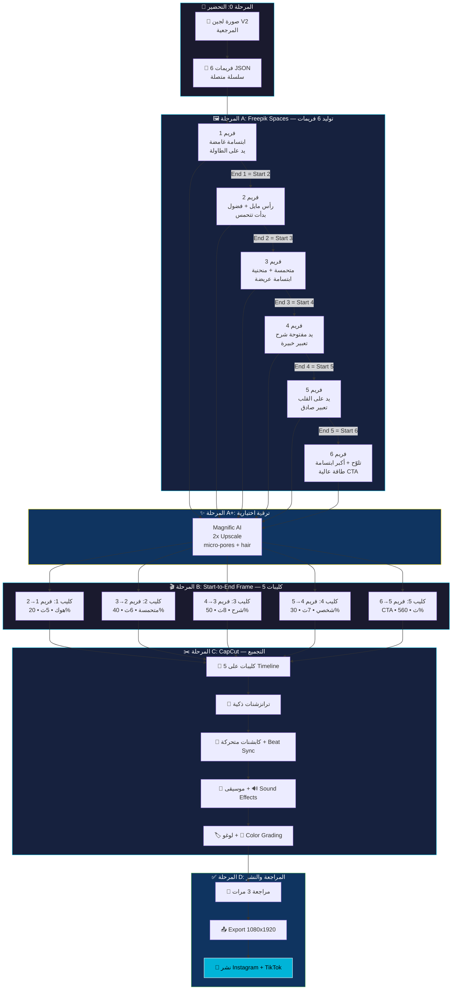

# 🎬 فيديو تعريف لجين — السيناريو + Workflow كامل

> **الأداة:** Freepik Spaces (Image Generator → Video Generator)
> **المدة:** 45-60 ثانية (أمثل مدة لتعريف شخصية جديدة)
> **الصوت:** بدون صوت — نص عربي (عراقي) + موسيقى
> **الفورمات:** 9:16 (Reels/TikTok/Stories)
---

## 🗺️ خريطة الـ Workflow الكاملة

> [!IMPORTANT]
> **نظام السلسلة:** نهاية كل كليب = بداية الكليب اللي بعده → 6 فريمات فقط = 5 كليبات متصلة بسلاسة!



### 📊 كيف يشتغل نظام السلسلة:

```
فريم 1 ───────→ فريم 2 ───────→ فريم 3 ───────→ فريم 4 ───────→ فريم 5 ───────→ فريم 6
│   كليب 1    │   كليب 2    │   كليب 3    │   كليب 4    │   كليب 5    │
│   (هوك)     │  (متحمسة)   │   (شرح)     │  (شخصي)    │   (CTA)     │
│  Start→End  │  Start→End  │  Start→End  │  Start→End  │  Start→End  │
│    5 ث      │    6 ث      │    8 ث      │    7 ث      │    5 ث      │
└─────────────┴─────────────┴─────────────┴─────────────┴─────────────┘
     ↑ نهاية كل كليب = بداية الكليب اللي بعده → سلاسة مثالية!
```

### 📊 ملخص المراحل:

| المرحلة | الأداة | المخرج | الوقت التقريبي |
|---------|--------|--------|---------------|
| **0** التحضير | — | سيناريو + JSON prompts | ✅ جاهز |
| **A** الفريمات | Freepik Spaces | 6 صور (سلسلة متصلة) | ~20 دقيقة |
| **A+** الترقية | Magnific AI | 6 صور بدقة 4K | ~10 دقائق |
| **B** الفيديو | Veo 3.1 / Kling | 5 كليبات (Start→End) | ~20 دقيقة |
| **C** التجميع | CapCut | فيديو كامل مع كابشنات | ~60 دقيقة |
| **D** المراجعة | — | فيديو نهائي جاهز للنشر | ~15 دقيقة |
| | | **المجموع** | **~2 ساعة** |


## 📊 لماذا 45-60 ثانية؟

| المدة | المميزات | العيوب |
|-------|---------|--------|
| 15 ثانية | سريع وحاد | ما يكفي تعرّف شخصية وبراند |
| **45-60 ثانية** ✅ | **وقت مثالي لتعريف + بناء فضول + CTA** | يحتاج محتوى قوي كل ثانية |
| 90 ثانية+ | مفصّل جداً | الناس تطلع قبل النهاية |

---

## 🧠 الاستراتيجية الفايروسية (مبنية على بحث)

> [!IMPORTANT]
> **4 قواعد ذهبية لفيديو يوقف السكرول:**
> 1. **الهوك خلال 1-3 ثوانٍ** — إذا ما شدّيت بأول ثانية، خسرت
> 2. **النص = البطل** — بدون صوت، النص هو اللي "يحكي"
> 3. **وجه + تواصل بصري مباشر** = يوقف السكرول 2x أكثر
> 4. **موسيقى ترند** = الخوارزمية تدفعك أكثر

---

## 🎬 السيناريو الكامل — "مين أنا؟"

### المشهد العام:
لجين بخلفية **تدرّج تيركواز-أكوا مجرد** (gradient مائي يعكس هوية AQUAVO — مو مكان حقيقي)، إضاءة **دافئة ذهبية من الجانب**. لابسة **بولو تيركواز AQUAVO**. شعرها طويل أسود. بدون مكياج. تنظر مباشرة للكاميرا. يدينها خارج الكادر أو بجانبها.

---

### ⚡ المشهد 1: الهوك — "من أنا؟" (0-3 ثوانٍ)

**الفريم:**
لجين تنظر مباشرة للكاميرا بابتسامة خفيفة واثقة غامضة. يديها بجانبها خارج الكادر. الإضاءة تبرز عيونها الكبيرة.

**النص على الشاشة (عربي كبير + واضح):**
```
أنا لجين 🐟
وهسة راح أخبرك شي...
```

**حركة:** تميل رأسها قليلاً للجانب — كأنها تحكي سر لصديقتها.

**🎵 الموسيقى:** نغمة ترند هادئة مع بيت دروب خفيف (بداية هادئة).

---

### 💬 المشهد 2: "شنو AQUAVO؟" (3-12 ثانية)

**الفريم:**
لجين تنظر للكاميرا بتعبير متحمس — حواجبها مرفوعة قليلاً، ابتسامة أعرض.

**النصوص (تظهر واحد بعد واحد مع الموسيقى):**
```
الثانية 3-5:
إذا عندك حوض سمك... 🐠

الثانية 5-7:
أو تحلم تبدأ واحد... 💭

الثانية 7-9:
بس ما تعرف من وين تبدي؟ 🤔

الثانية 9-12:
أنا هنا علمودك! 💚
```

**حركة:** تومئ برأسها عند "أنا هنا" مع ابتسامة Duchenne (حقيقية).

---

### 🌊 المشهد 3: "شنو اللي نسويه؟" (12-28 ثانية)

**الفريم:**
لجين متكئة قليلاً للأمام — كأنها قاعدة تحكي شي مهم. تعبير جدي وحماسي.

**النصوص (تظهر كقائمة مع أيقونات):**

```
الثانية 12-15:
🐟 AQUAVO = أول متجر أحواض متخصص بالعراق

الثانية 15-18:
📦 كلشي تحتاجه:
أحواض • فلاتر • إنارة • أسماك • نباتات

الثانية 18-22:
🎓 + نعلمك كلشي خطوة بخطوة
من الصفر لين حوضك يصير جنة مائية

الثانية 22-25:
🚚 نوصلك لباب بيتك
بتغليف يحمي أسماكك 100%

الثانية 25-28:
💚 مو بس متجر — عائلة!
```

**حركة:** عند "عائلة" تضع يدها على قلبها بحركة طبيعية بسيطة.

---

### 👋 المشهد 4: "مين أنا بالضبط؟" (28-42 ثانية)

**الفريم:**
لجين تبتسم بهدوء، نظرة مباشرة ودافئة. الإضاءة تبرز البولو التيركواز.

**النصوص:**
```
الثانية 28-31:
أنا لجين 👋
عمري 23 سنة — من بغداد 🇮🇶

الثانية 31-34:
أشتغل مع AQUAVO
كمختصة أحواض سمك

الثانية 34-37:
راح أعلمك:
✅ كيف تبني حوضك الأول
✅ أخطاء لازم تتجنبها
✅ أسرار الخبراء

الثانية 37-42:
هدفي = حوضك يكون أحلى حوض بالعراق! 🏆
```

**حركة:** تبتسم بهدوء ودفء — نظرة مباشرة عاطفية + إيماءة رأس خفيفة عند "هدفي".

---

### 🔥 المشهد 5: CTA — "تابعنا!" (42-50 ثانية)

**الفريم:**
لجين تنظر مباشرة للكاميرا بابتسامة كبيرة طبيعية (Duchenne). طاقة عالية.

**النصوص:**
```
الثانية 42-44:
تابعنا 👇

الثانية 44-47:
🐟 @aquavo.iq
محتوى يومي عن عالم الأحواض

الثانية 47-50:
لايك + فولو + شير = ❤️
قريباً مفاجآت كبيرة! 🔥
```

**حركة:** تلوح بيدها (wave) مع ابتسامة — كأنها تودّع صديقة.

---

## 🎨 مواصفات التصوير

### الإضاءة
| العنصر | التفصيل |
|--------|---------|
| **Key Light** | ضوء LED دافئ (3500K) من الجانب الأيسر بزاوية 45° |
| **Fill Light** | ضوء ناعم خفيف من الجانب الأيمن (50% قوة) |
| **Background** | تدرّج تيركواز-أكوا-أزرق محيطي مجرد — بدون أي عناصر مادية |
| **Hair Light** | إضاءة خلفية خفيفة تبرز لمعان الشعر الأسود |

### الملابس واللبس
| العنصر | التفصيل |
|--------|---------|
| **البولو** | تيركواز AQUAVO — مكوية ونظيفة، اللوغو صغير ومطرّز |
| **الشعر** | طويل أسود منسدل (مو مربوط — يعطي vibe ودي وغير رسمي) |
| **المكياج** | صفر — وجه طبيعي تماماً |
| **الإكسسوارات** | لا شي — بدون حلق او سلسال |

### البيئة
| العنصر | التفصيل |
|--------|---------|
| **الخلفية** | تدرّج مائي مجرد (teal → aqua → ocean blue) مع أنماط ضوء caustic خفيفة |
| **الأجواء** | لا طاولة، لا كرسي، لا رفوف — خلفية مجردة فقط |
| **الجودة** | جودة فيديو موبايل — تشويش خفيف، ضغط طبيعي، بدون فلاتر |

---

## 🎵 اختيار الموسيقى

### المعايير:
- ✅ **ترند** على TikTok أو Reels
- ✅ هادئة ودافئة مع **بيت خفيف**
- ✅ **بدون كلمات** (تتعارض مع النص)
- ✅ فيها **build up** (تبدأ هادئة وتقوى عند الCTA)

### نوع الموسيقى المطلوب:
```
Lo-fi chill beat, warm acoustic undertone,
soft drum pattern, builds gradually,
positive uplifting mood.
Duration: 50-60 seconds.
```

### منصات البحث:
1. **TikTok Sound Library** — ابحث عن الأصوات الرائجة
2. **Instagram Audio** — اختر من "trending"
3. **Epidemic Sound** — موسيقى بدون حقوق
4. **CapCut Music Library** — مجاني

---

## 📝 النص العربي للأوفرلي (نسخة نهائية للتصميم)

### الخط: **Cairo Bold** — أبيض مع ظل أسود خفيف
### الحجم: كبير بما يكفي للقراءة على الموبايل
### الموقع: الثلث الأسفل من الشاشة (Safe Zone)

```
مشهد 1:
أنا لجين 🐟
وهسة راح أخبرك شي...

مشهد 2:
إذا عندك حوض سمك... 🐠
أو تحلم تبدأ واحد... 💭
بس ما تعرف من وين تبدي؟ 🤔
أنا هنا علمودك! 💚

مشهد 3:
🐟 AQUAVO
أول متجر أحواض متخصص بالعراق
📦 كلشي تحتاجه — أحواض • فلاتر • إنارة
🎓 نعلمك خطوة بخطوة
🚚 نوصلك لباب بيتك
💚 مو بس متجر — عائلة!

مشهد 4:
أنا لجين 👋 عمري 23 — من بغداد 🇮🇶
مختصة أحواض سمك في AQUAVO
✅ أبني حوضك الأول
✅ أحذرك من الأخطاء
✅ أشاركك أسرار الخبراء
🏆 هدفي = حوضك يكون أحلى حوض!

مشهد 5:
تابعنا 👇
🐟 @aquavo.iq
لايك + فولو + شير = ❤️
قريباً مفاجآت كبيرة! 🔥
```

---

## 🔧 Workflow — Freepik Spaces (خطوة بخطوة)

> [!CAUTION]
> **اتبع الخطوات بالترتيب — كل خطوة تعتمد على اللي قبلها!**

### المرحلة A: تحضير الفريمات (Image Generator)

هنا نولّد **6 صور ثابتة** — سلسلة متصلة.

> [!IMPORTANT]
> **نظام السلسلة:** نهاية كليب 1 = بداية كليب 2، نهاية كليب 2 = بداية كليب 3... وهكذا.
> يعني 6 فريمات = 5 كليبات فيديو متصلة بسلاسة!

```
فريم 1 → (كليب 1: هوك)     → فريم 2
فريم 2 → (كليب 2: متحمسة)  → فريم 3
فريم 3 → (كليب 3: شرح)     → فريم 4
فريم 4 → (كليب 4: شخصي)   → فريم 5
فريم 5 → (كليب 5: CTA)     → فريم 6
```

#### 🖼️ الخطوة 1: إنشاء Space جديد
```
1. افتح Freepik Spaces
2. اضغط "+" لإنشاء Space جديد
3. سمّي: "Lajeen Intro Video"
```

#### 🖼️ الخطوة 2: Upload — ارفع صورة لجين المرجعية
```
1. اضغط "+" → Upload Node
2. ارفع صورة لجين V2 (الأخيرة اللي ولّدناها)
3. هذي الصورة ستكون Reference لكل الفريمات
```

#### 🖼️ الخطوة 3: ولّد 6 فريمات (Image Generator × 6)

**كل فريم يحتاج:**
1. Text Node → يحتوي البروموت
2. وصل الـ Text Node + Upload Node → Image Generator Node
3. ولّد الصورة

---

> [!IMPORTANT]
> **🧬 نظام الطبقات المتراكمة (Micro-Layer System)**
> كل طبقة تغيّر **شي واحد فقط** — بالضبط مثل الورك فلو الإبداعي!
> الـ AI يحافظ على كل التفاصيل السابقة ويعدّل فقط الشي اللي طلبته.

### 🗺️ خريطة الطبقات:

```
الطبقة 1  [BASE]       ← الصورة التأسيسية الكاملة
   ↓
الطبقة 2  [HEAD TILT]   ← ميّل الرأس لليمين
   ↓
الطبقة 3  [EYES]        ← عيون فضولية أكثر
   ↓ ─── ✂️ فريم 1 (هوك) جاهز ───
   ↓
الطبقة 4  [SMILE]       ← ابتسامة أعرض + حماس
   ↓
الطبقة 5  [LEAN]        ← انحناء خفيف للأمام
   ↓
الطبقة 6  [HAIR]        ← شعر مطاير من الحركة
   ↓
الطبقة 7  [HEAD FWD]    ← رأس مستقيم + نظرة مباشرة
   ↓ ─── ✂️ فريم 2 (متحمسة) جاهز ───
   ↓
الطبقة 8  [POSTURE]     ← تستقيم + جلسة مهنية
   ↓
الطبقة 9  [HAND UP]     ← يد ترتفع بإيماءة شرح
   ↓
الطبقة 10 [HEAD LEFT]   ← رأس يميل لليسار + ثقة
   ↓
الطبقة 11 [FOCUS]       ← ابتسامة أهدأ + نظرة خبيرة
   ↓ ─── ✂️ فريم 3 (شرح) جاهز ───
   ↓
الطبقة 12 [HAND DOWN]   ← يد تنزل من الشرح
   ↓
الطبقة 13 [HEART]       ← يد تلمس القلب بلطف
   ↓
الطبقة 14 [SOFT EYES]   ← عيون تلين + عاطفة عميقة
   ↓
الطبقة 15 [NOD]         ← إيماءة رأس خفيفة + ابتسامة دافئة صغيرة
   ↓ ─── ✂️ فريم 4 (شخصي) جاهز ───
   ↓
الطبقة 16 [WAVE]        ← يد ترتفع تلوّح
   ↓
الطبقة 17 [JOY]         ← أكبر ابتسامة + عيون مغمضة بسعادة
   ↓
الطبقة 18 [BRIGHT]      ← إضاءة أسطع + طاقة عالية
   ↓ ─── ✂️ فريم 5 (CTA) جاهز ───
```

### 🔗 أي طبقة تصير Start/End Frame لأي كليب:

| الكليب | Start Frame | End Frame | المدة |
|--------|-------------|-----------|-------|
| كليب 1 (هوك) | طبقة 1 | طبقة 3 | 5 ث |
| كليب 2 (متحمسة) | طبقة 3 | طبقة 7 | 6 ث |
| كليب 3 (شرح) | طبقة 7 | طبقة 11 | 8 ث |
| كليب 4 (شخصي) | طبقة 11 | طبقة 15 | 7 ث |
| كليب 5 (CTA) | طبقة 15 | طبقة 18 | 5 ث |

---

### 🎯 الطبقة 1 — BASE (الصورة التأسيسية)

> ⚠️ هذي الطبقة الوحيدة ببرومبت طويل — تبني كلشي من الصفر.

```
Create a front-facing smartphone video-style portrait of a young Iraqi woman, 
age 23, recorded indoors in the evening. The shot feels like a casual home 
recording, NOT a professional studio photo. The camera is fixed at face height 
as if resting on a desk directly in front of her. Framing is waist-up, 
9:16 vertical aspect ratio.

She wears a fitted turquoise polo shirt with a tiny embroidered AQUAVO logo 
on the left chest — the logo is very small and subtle like a Lacoste crocodile, 
dark teal thread on turquoise fabric, naturally embroidered with visible thread 
texture that follows the fabric wrinkles. The fabric has natural cotton wrinkles.

Her hair is long, jet black, flowing loose past her shoulders with a natural 
center part and soft face-framing strands. A few stray flyaway hairs are 
visible — NOT perfectly groomed. Individual hair strands catch the light.

Her face: natural facial asymmetry — her left eye is VERY SLIGHTLY larger 
than her right, her smile sits slightly higher on the right side, and her 
right eyebrow is barely higher than her left. She has large dark brown doe 
eyes with visible limbal rings around each iris. Two bright catchlight 
reflections in both eyes. Faint red blood vessels visible in the sclera. 
Natural tear film creates slight moisture. Individual lash strands visible.

Her skin: luminous fair with warm peachy-golden undertones. Natural micro-pores 
visible on nose and cheeks. Subtle vellus hairs (peach fuzz) catch the 
side-lighting on her cheeks. Her nose and forehead are slightly more shiny 
than her cheeks. Absolutely ZERO makeup.

Her expression: neutral, calm, relaxed. Looking directly at the camera. 
Lips naturally closed, resting expression. Hands at her sides, out of frame.

Background: soft blurred teal-turquoise-ocean blue gradient. Abstract 
underwater caustic light patterns faintly visible. NO furniture, NO desk, 
NO aquarium, NO fish tanks.

Lighting: warm golden key light (3500K) from camera-left at 45 degrees. 
Soft fill light from camera-right at 50%. Subtle backlight rim on black hair.

Image quality: smartphone video indoors at night — mild softness, visible 
digital noise, slight compression artifacts, no filters, no beauty effects. 
This must look like a real phone recording — NOT a perfect AI render.
```

---

### 🎯 الطبقة 2 — HEAD TILT

> 📋 Input: صورة الطبقة 1

```
Keep this photo exactly the same. Change ONLY one thing: 
tilt her head very slightly to the right — as if she is about 
to share a secret with a close friend. Just a subtle, natural tilt. 
Everything else stays identical.
```

---

### 🎯 الطبقة 3 — CURIOUS EYES + SECRET SMILE

> 📋 Input: صورة الطبقة 2
> ✂️ **هذي = فريم 1 (الهوك)**

```
Keep this photo exactly the same. Change ONLY her expression: 
her eyes widen very slightly with curiosity — sparkling, captivating, 
as if she knows something you do not. Add a subtle mysterious smile — 
lips gently closed, just the faintest confident smirk at the corners 
of her mouth. She looks like she is about to reveal a secret.
Everything else stays identical.
```

---

### 🎯 الطبقة 4 — BIGGER SMILE

> 📋 Input: صورة الطبقة 3

```
Keep this photo exactly the same. Change ONLY her smile: 
widen it from mysterious to genuinely WARM and ENTHUSIASTIC — 
a bigger closed-lip smile showing real excitement. Her cheeks 
push up slightly. But her lips stay closed — no teeth showing. 
Her eyes stay the same. Everything else stays identical.
```

---

### 🎯 الطبقة 5 — LEAN FORWARD

> 📋 Input: صورة الطبقة 4

```
Keep this photo exactly the same. Change ONLY her posture: 
she leans SLIGHTLY forward toward the camera — as if she is 
about to share exciting news. Her shoulders shift forward just 
a little. She is now slightly closer to the camera. Her face 
appears a tiny bit larger in the frame. Everything else stays identical.
```

---

### 🎯 الطبقة 6 — HAIR MOVEMENT

> 📋 Input: صورة الطبقة 5

```
Keep this photo exactly the same. Change ONLY her hair: 
a few more flyaway strands are disturbed from the forward lean — 
one or two strands fall slightly across her forehead, a strand 
near her ear shifts. The hair looks natural and slightly messy 
from movement. Everything else stays identical.
```

---

### 🎯 الطبقة 7 — HEAD STRAIGHT + DIRECT GAZE

> 📋 Input: صورة الطبقة 6
> ✂️ **هذي = فريم 2 (متحمسة)**

```
Keep this photo exactly the same. Change ONLY her head position: 
straighten her head from the tilt so she is now facing the camera 
directly — more engaged and energetic. Her eyebrows rise VERY 
slightly, showing growing surprise and passion. She looks like 
she is about to burst with excitement. Everything else stays identical.
```

---

### 🎯 الطبقة 8 — UPRIGHT POSTURE

> 📋 Input: صورة الطبقة 7

```
Keep this photo exactly the same. Change ONLY her posture: 
she sits more upright — straightening her back, pulling her 
shoulders back slightly into a more professional but still warm 
posture. She has leaned back from the forward position. She looks 
like a confident, knowledgeable person. Everything else stays identical.
```

---

### 🎯 الطبقة 9 — HAND RISES (EXPLAINING GESTURE)

> 📋 Input: صورة الطبقة 8

```
Keep this photo exactly the same. Change ONLY one thing: 
her right hand rises from her side to chest level — palm facing UP, 
fingers naturally spread, in a gentle "explaining" gesture as if she 
is listing important points. Her wrist is relaxed and natural, NOT stiff. 
Her fingers show realistic skin texture. Frame the shot slightly wider 
to show the hand clearly. Everything else stays identical.
```

---

### 🎯 الطبقة 10 — HEAD TILTS LEFT

> 📋 Input: صورة الطبقة 9

```
   Keep this photo exactly the same. Change ONLY her head: 
   tilt it very slightly to the LEFT — the opposite direction from 
   the beginning. This is a subtle confident tilt, like a knowledgeable 
   friend explaining something important. Everything else stays identical.
```

---

### 🎯 الطبقة 11 — FOCUSED EXPERT EXPRESSION

> 📋 Input: صورة الطبقة 10
> ✂️ **هذي = فريم 3 (شرح)**

```
Keep this photo exactly the same. Change ONLY her expression: 
her wide excited smile narrows to a GENTLE, CONFIDENT expression — 
professional warmth. Her eyes become more focused and intelligent, 
maintaining direct eye contact. She looks like a trusted expert giving 
valuable advice. Calm, assured, knowledgeable. Her mouth stays naturally 
closed. Everything else stays identical — same hand gesture, same posture.
```

---

### 🎯 الطبقة 12 — HAND LOWERS

> 📋 Input: صورة الطبقة 11

```
Keep this photo exactly the same. Change ONLY her hand: 
her right hand lowers from the explaining gesture — it drops slowly 
to rest at her side or in front of her chest. The explaining gesture 
is complete. Her expression stays the same. Everything else stays identical.
```

---

### 🎯 الطبقة 13 — HAND TOUCHES HEART

> 📋 Input: صورة الطبقة 12

```
Keep this photo exactly the same. Change ONLY her right hand: 
it moves gently to rest over her heart on her chest — fingers slightly 
spread, palm flat against the polo fabric. The touch is gentle and sincere, 
NOT pressing hard. Natural skin texture on her hand, subtle veins visible. 
This is a deeply genuine gesture. Everything else stays identical.
```

---

### 🎯 الطبقة 14 — EYES SOFTEN

> 📋 Input: صورة الطبقة 13

```
Keep this photo exactly the same. Change ONLY her eyes and expression: 
her eyes SOFTEN with deep genuine warmth — becoming slightly more moist 
(natural tear film glistening, but she is NOT crying). Her eyebrows 
soften empathetically. Her smile becomes SMALLER and WARMER — a soft, 
intimate, caring expression. This is the most emotionally vulnerable 
moment. Everything else stays identical — same hand on heart.
```

---

### 🎯 الطبقة 15 — GENTLE NOD + INTIMATE MOOD

> 📋 Input: صورة الطبقة 14
> ✂️ **هذي = فريم 4 (شخصي)**

```
Keep this photo exactly the same. Change ONLY two subtle things:

1. Her head gives a very subtle downward nod — barely noticeable, 
   affirming sincerity. Her chin drops just a fraction.

2. The overall lighting feels VERY SLIGHTLY softer and warmer — 
   as if the fill light increased by 10%, making the mood quieter 
   and more intimate.

Everything else stays identical — same hand on heart, same soft eyes, 
same warm expression.
```

---

### 🎯 الطبقة 16 — HAND LIFTS TO WAVE

> 📋 Input: صورة الطبقة 15

```
Keep this photo exactly the same. Change ONLY her right hand: 
it lifts from her heart and rises to shoulder level — open palm, 
fingers spread naturally, mid-wave position as if waving goodbye to 
a friend she will see again soon. Her hand is slightly angled, natural 
and casual, NOT a stiff military wave. Her expression stays the same 
for now. Everything else stays identical.
```

---

### 🎯 الطبقة 17 — BIGGEST SMILE (DUCHENNE JOY)

> 📋 Input: صورة الطبقة 16

```
Keep this photo exactly the same — same waving hand. Change ONLY 
her expression: her soft sincere expression BURSTS into the biggest, 
most genuine smile of the entire series — a real Duchenne smile where 
her eyes crinkle and squint slightly from happiness. Her cheeks push 
up naturally. Her lips part just enough to show a natural, warm smile — 
NOT a teeth-baring exaggerated grin, but genuine JOY. Her eyebrows 
raise slightly — open and happy. Everything else stays identical.
```

---

### 🎯 الطبقة 18 — BRIGHTER ENERGY + FINAL TOUCHES

> 📋 Input: صورة الطبقة 17
> ✂️ **هذي = فريم 5 (CTA)**

```
Keep this photo exactly the same — same waving hand, same big smile. 
Change ONLY two things:

1. Her body language becomes OPEN and POSITIVE — shoulders back slightly, 
   posture upright and welcoming, radiating warm energy. A subtle bounce 
   in her posture as if she is genuinely happy.

2. The overall lighting feels VERY SLIGHTLY BRIGHTER — as if the mood 
   itself brightened. More light fills the scene. Less shadow on her face.

Her hair shows very slight movement from the wave — a few strands shift 
naturally. Everything else stays identical.
```

---

> [!TIP]
> ### 💡 نصائح التنفيذ:
> - **إذا الـ AI غيّر شي ما طلبته:** كرر نفس البرومبت مع إضافة `"DO NOT change [الشي اللي تغيّر]"` 
> - **إذا الوجه اختلف:** ارجع للطبقة اللي قبلها واستخدمها كـ reference من جديد
> - **مو لازم تستخدم كل الـ 18 طبقة!** الـ 5 فريمات المحددة بـ ✂️ هي اللي تحتاجها للفيديو
> - **الطبقات الوسطية (بدون ✂️):** اختيارية — لكن تساعد على ثبات الشخصية إذا القفزة الكبيرة ما نجحت

---

### 🏷️ المرحلة A.5: تصحيح اللوغو (Logo Fix — بعد كل فريم)

> [!IMPORTANT]
> **استخدم هذا البرومبت بعد توليد كل فريم** لتصغير اللوغو وجعله طبيعي.

**البرومبت (انسخه مباشر):**

```
Edit this image. Change ONLY the AQUAVO logo on the polo shirt. Keep everything else exactly the same — same face, same expression, same hair, same pose, same background.

The AQUAVO logo has two parts:
- TOP: a wave/fish infinity ICON symbol (this is TOO BIG — needs to be MUCH SMALLER)
- BOTTOM: the word "AQUAVO" text

Fix the logo:
1. Make the wave/fish ICON symbol MUCH SMALLER — reduce it to about half its current size. The icon is currently way too large and dominant. It should be tiny and subtle like a Lacoste crocodile.
2. Keep the "AQUAVO" text proportional to the smaller icon — both should be small together.
3. The entire logo (icon + text) should be about 2cm wide total — very small and elegant.
4. Make it look NATURALLY EMBROIDERED — real thread stitching on fabric, not a flat digital print. Visible thread texture, follows fabric wrinkles.
5. Dark teal thread color on turquoise polo — subtle, barely noticeable.

DO NOT change: face, eyes, hair, skin, expression, background, pose, body, hands, lighting. ONLY fix the logo.
```

**خطوات التنفيذ:**
```
1. ولّد الفريم بالبرومبت العادي
2. ارفع الصورة الطالعة كـ input
3. الصق البرومبت أعلاه
4. شغّل Edit mode
5. لو اللوغو لسه كبير → كرر مرة ثانية
```

---

### المرحلة B: تحويل الفريمات لفيديو (Start-to-End Frame)

> [!IMPORTANT]
> **كل كليب يستخدم فريمين من نظام الطبقات:** Start Frame (الطبقة ✂️ الأولى) + End Frame (الطبقة ✂️ الثانية).
> نهاية كل كليب = بداية الكليب اللي بعده → سلاسة مثالية!

#### 🎬 الخطوة 4: ولّد 5 كليبات فيديو (Start → End)

```
لكل كليب:
1. ارفع Start Frame + End Frame (من الطبقات المحددة بـ ✂️)
2. اختر Model: **"Kling O1"** (الأفضل لـ Start-to-End Frame)
3. Duration: 5-8 ثوانٍ لكل كليب
4. Aspect Ratio: 9:16
5. اكتب Motion Prompt لكل كليب

التوزيع (مرتبط بنظام الطبقات):
├── كليب 1 (هوك):     طبقة 1 → طبقة 3    (5 ثوانٍ)
├── كليب 2 (متحمسة):  طبقة 3 → طبقة 7    (6 ثوانٍ)
├── كليب 3 (شرح):     طبقة 7 → طبقة 11   (8 ثوانٍ)
├── كليب 4 (شخصي):   طبقة 11 → طبقة 15   (7 ثوانٍ)
└── كليب 5 (CTA):     طبقة 15 → طبقة 18   (5 ثوانٍ)
```

> [!CAUTION]
> **⚠️ قواعد Kling O1 المؤكدة (من البحث):**
> 1. **مختصر:** 2-4 أفكار رئيسية فقط — لا تكتب فقرات طويلة!
> 2. **لا تكتب timelines:** Kling يسوي interpolation بين الفريمين تلقائياً
> 3. **وصف الانتقال:** شنو يتغيّر من البداية للنهاية
> 4. **حدد الكاميرا:** لازم تُذكر صراحة
> 5. **البنية:** Subject + Action + Context + Style

### ✅ مطابقة البرومبتات مع السيناريو:

| الكليب | مشهد السيناريو | الحركة المطلوبة | ✅ |
|--------|---------------|-----------------|----|
| كليب 1 | مشهد 1: الهوك | ابتسامة غامضة + ميلان رأس يمين | ✅ |
| كليب 2 | مشهد 2: شنو AQUAVO | حماس + إيماءة رأس عند "أنا هنا" | ✅ |
| كليب 3 | مشهد 3: الخدمات | يد مفتوحة شرح + يد على القلب عند "عائلة" | ✅ |
| كليب 4 | مشهد 4: مين أنا | نظرة دافئة + إيماءة رأس عند "هدفي" | ✅ |
| كليب 5 | مشهد 5: CTA | تلويح + أكبر ابتسامة | ✅ |

---

**Motion Prompt — كليب 1 (الهوك الغامض):**
> مشهد 1: "أنا لجين 🐟 وهسة راح أخبرك شي..."
> Start: طبقة 1 (BASE) → End: طبقة 3 (CURIOUS EYES) | 5 ثوانٍ

```
A young woman in a turquoise polo shirt transitions from a calm 
neutral expression to a subtle mysterious smile. Her head tilts 
very slightly to the right as if sharing a secret. Her eyes widen 
with curiosity and sparkle with intrigue. One natural blink. Subtle 
breathing through gentle shoulder rise. Lips stay closed — no talking. 
Fixed camera, no movement. Slow, intimate smartphone-quality evening.
```

---

**Motion Prompt — كليب 2 (بناء الحماس):**
> مشهد 2: "إذا عندك حوض سمك... أنا هنا علمودك! 💚"
> Start: طبقة 3 (CURIOUS EYES) → End: طبقة 7 (HEAD STRAIGHT) | 6 ثوانٍ

```
The same young woman's mysterious curiosity transforms into genuine 
excitement. Her closed-lip smile widens warmly. Her body leans 
slightly forward with growing energy. Her head straightens from 
the tilt to face camera directly. Eyebrows rise with enthusiasm. 
She gives one affirming nod. Flyaway hairs shift from movement. 
No talking, lips stay closed. Fixed camera, no movement. Fluid, 
natural indoor smartphone video.
```

---

**Motion Prompt — كليب 3 (الشرح + يد على القلب):**
> مشهد 3: "AQUAVO = أول متجر... 💚 مو بس متجر — عائلة!"
> Start: طبقة 7 (HEAD STRAIGHT) → End: طبقة 11 (FOCUSED EXPERT) | 8 ثوانٍ

```
The same young woman shifts from excited to calm professional focus. 
She sits upright as her right hand rises to chest level in an 
open-palm explaining gesture. Her head tilts slightly left with 
confidence. Her smile narrows to a gentle assured expression. Eyes 
become focused with direct eye contact. She nods once thoughtfully. 
Her hand then lowers and gently rests over her heart — a sincere 
gesture. Lips stay closed. Fixed camera. Smartphone-quality indoor.
```

---

**Motion Prompt — كليب 4 (اللحظة الشخصية):**
> مشهد 4: "أنا لجين 👋 عمري 23... هدفي = حوضك يكون أحلى حوض!"
> Start: طبقة 11 (FOCUSED EXPERT) → End: طبقة 15 (NOD) | 7 ثوانٍ

```
The same young woman with her hand on her heart. Her confident 
expression softens into deep genuine warmth and sincerity. Her eyes 
become intimate and slightly glistening with emotion, gazing directly 
into camera. Her smile becomes smaller and warmer. She gives one slow 
affirming nod. Breathing deepens. Lighting warms subtly. Lips stay 
closed. Fixed camera. Slow, emotional, intimate smartphone recording.
```

---

**Motion Prompt — كليب 5 (التوديع):**
> مشهد 5: "تابعنا 👇 @aquavo.iq"
> Start: طبقة 15 (NOD) → End: طبقة 18 (BRIGHT ENERGY) | 5 ثوانٍ

```
The same young woman transitions from quiet sincerity to joyful 
farewell. Her right hand lifts from her heart to shoulder level 
and waves side-to-side with open palm. Her soft expression bursts 
into her biggest genuine smile — eyes crinkle with happiness. She 
nods with a playful head tilt. Posture opens with positive energy. 
Lighting brightens. Lips barely part — no talking. Fixed camera. 
Upbeat, warm indoor smartphone video.
```

---

### المرحلة C: التجميع والكابشنات والترانزشنات (CapCut)

> [!IMPORTANT]
> **هذا القسم هو الأهم** — الكابشنات والترانزشنات هم اللي يخلّون الزبون يبقى ويكمّل الفيديو بدل ما يطفر! كل ثانية محسوبة.

---

#### ✂️ الخطوة 5: نزّل الكليبات وجهّز المشروع

```
📁 حمّل الكليبات من Freepik Spaces:
├── clip01_hook.mp4        (5 ثوانٍ)
├── clip02_excited.mp4     (6 ثوانٍ)
├── clip03_explain.mp4     (8 ثوانٍ)
├── clip04_personal.mp4    (7 ثوانٍ)
└── clip05_cta.mp4         (5 ثوانٍ)

📱 افتح CapCut:
1. مشروع جديد → 9:16 (1080×1920)
2. استورد كل الكليبات بالترتيب
3. رتبهم على الـ Timeline: 01 → 02 → 03 → 04 → 05
```

---

#### 🔄 الخطوة 6: الترانزشنات (Transitions) — مشهد بمشهد

> [!TIP]
> **قاعدة ذهبية:** الترانزشن لازم يخدم **المعنى** — مو بس حركة حلوة. كل انتقال يحكي شي.

| من → إلى | نوع الترانزشن | المدة | ليش هذا بالضبط؟ |
|----------|--------------|-------|-----------------|
| **مشهد 1 → 2** | **Jump Cut (قص مباشر)** | 0 ث | سريع ومفاجئ — يحافظ على طاقة الهوك. أقوى من أي ترانزشن ناعم |
| **مشهد 2 → 3** | **Soft Zoom In (زوم تدريجي)** | 0.4 ث | تقترب للمشاهد — كأنها "تعال أخبرك شي مهم". يخلق حميمية |
| **مشهد 3 → 4** | **Cross Dissolve (ذوبان)** | 0.5 ث | انتقال ناعم من الشرح الرسمي → الشخصي الدافئ. يغيّر المزاج بلطف |
| **مشهد 4 → 5** | **Light Flash (وميض أبيض)** | 0.3 ث | ⚡ وميض طاقة! ينقل من الهدوء → الحماس. يصحّي المشاهد للـ CTA |

**🚫 ترانزشنات ممنوعة:**
- ❌ Swipe يمين/يسار (يبين رخيص)
- ❌ Spin/دوران (يدوّخ)
- ❌ Glitch (مو مناسب للبراند)
- ❌ أي ترانزشن أطول من 0.5 ثانية

**كيف تسوي بـ CapCut:**
```
1. اضغط على النقطة بين كليبين على الـ Timeline
2. تظهر قائمة الترانزشنات
3. اختر النوع المطلوب
4. اسحب المدة للقيمة المحددة
5. Preview وشوف إذا ناعم
```

---

#### 📝 الخطوة 7: الكابشنات المتحركة — التفصيل الكامل

> [!CAUTION]
> **كل كلمة لها أنيميشن محدد وتوقيت دقيق!** لا تستخدم نفس الأنيميشن لكل النصوص — التنويع يخلي العين ما تملّ.

---

##### 📝 أنماط الكابشن المستخدمة (مرجع):

```
🔸 Pop-In       = يظهر فجأة بحجم كبير ثم يستقر — للكلمات القوية
🔸 Typewriter   = حرف حرف — للسرد والأسرار
🔸 Slide Up     = يطلع من تحت — للقوائم والمعلومات
🔸 Word-by-Word = كلمة كلمة مع البيت — للإيقاع
🔸 Scale Bounce = يكبر ويرجع — للتشديد على كلمة محددة
🔸 Fade In      = يظهر تدريجياً — للجمل الهادئة
🔸 Highlight    = الكلمة تتلون — لتمييز كلمة واحدة
```

---

##### 🎬 مشهد 1 — الهوك (الثانية 0-3)

```
⏱️ 0.0 - 0.5 ث:
   لا نص — فقط وجه لجين. المشاهد يركز على عيونها.

⏱️ 0.5 - 1.5 ث:
   النص: "أنا لجين 🐟"
   الأنيميشن: ✨ Pop-In (يطلع فجأة بحجم 120% ثم يستقر على 100%)
   الخط: Cairo ExtraBold — 48px
   اللون: أبيض (#FFFFFF)
   الظل: أسود ناعم 3px blur
   الموقع: وسط الشاشة (استثنائياً — مو تحت — لأنه الهوك!)
   Emoji: 🐟 يظهر مع bounce بسيط

⏱️ 1.5 - 3.0 ث:
   النص: "وهسة راح أخبرك شي..."
   الأنيميشن: 💬 Typewriter (حرف حرف — كأنها تكتب سر)
   الخط: Cairo Bold — 36px
   اللون: أبيض مع شفافية 90%
   الموقع: تحت النص الأول بقليل
   النقاط "..." تظهر وحدة وحدة ببطء — تخلق ترقّب

   ⚠️ النص يختفي عند الثانية 3.0 بـ Fade Out سريع (0.2ث)
```

---

##### 🎬 مشهد 2 — المشكلة (الثانية 3-12)

```
⏱️ 3.0 - 5.0 ث:
   النص: "إذا عندك حوض سمك... 🐠"
   الأنيميشن: 📝 Word-by-Word (كل كلمة تظهر مع بيت الموسيقى)
   الخط: Cairo Bold — 40px
   اللون: أبيض
   الموقع: الثلث الأسفل من الشاشة
   "إذا" ← بيت 1 | "عندك" ← بيت 2 | "حوض" ← بيت 3 | "سمك" ← بيت 4

⏱️ 5.0 - 7.0 ث:
   النص: "أو تحلم تبدأ واحد... 💭"
   الأنيميشن: 🔼 Slide Up (يطلع من تحت بلطف)
   الخط: Cairo Bold — 38px
   اللون: أبيض
   Speed: 0.3 ثانية للظهور

⏱️ 7.0 - 9.0 ث:
   النص: "بس ما تعرف من وين تبدي؟ 🤔"
   الأنيميشن: 📝 Word-by-Word مع البيت
   الخط: Cairo Bold — 40px
   اللون: أبيض — كلمة "ما تعرف" بلون مختلف (#FFD700 ذهبي)
   هذا الـ Highlight يشد الانتباه

⏱️ 9.0 - 12.0 ث:
   النص: "أنا هنا علمودك! 💚"
   الأنيميشن: ✨ Scale Bounce (يكبر 130% ← يرجع 100% ← يكبر 105% ← يستقر)
   الخط: Cairo ExtraBold — 46px (أكبر من السابق!)
   اللون: تيركواز AQUAVO (#00B4D8) بدل الأبيض — لحظة البراند!
   الموقع: وسط-أسفل
   💚 Emoji يظهر مع bounce مع بيت drop بالموسيقى
```

---

##### 🎬 مشهد 3 — الشرح (الثانية 12-28)

```
⏱️ 12.0 - 15.0 ث:
   النص سطر 1: "🐟 AQUAVO"
   الأنيميشن: ✨ Pop-In كبير + وميض خفيف (glow effect)
   الخط: Cairo ExtraBold — 52px (أكبر نص بالفيديو!)
   اللون: أبيض
   الموقع: وسط الشاشة

   النص سطر 2: "أول متجر أحواض متخصص بالعراق"
   الأنيميشن: 🔼 Slide Up (0.3ث بعد السطر الأول)
   الخط: Cairo Regular — 28px
   اللون: أبيض شفاف 85%
   الموقع: تحت AQUAVO مباشرة

   ← بعد 2.5 ثانية يختفي الكل بـ Fade Out

⏱️ 15.0 - 18.0 ث:
   النص: "📦 كلشي تحتاجه:"
   الأنيميشن: 🔼 Slide Up
   الموقع: أعلى الثلث الأسفل

   ثم تظهر القائمة واحد بواحد (Stagger):
   "أحواض" ← ثانية 15.5 (Slide Right)
   "فلاتر" ← ثانية 16.0 (Slide Right)
   "إنارة" ← ثانية 16.5 (Slide Right)
   "أسماك" ← ثانية 17.0 (Slide Right)
   "نباتات" ← ثانية 17.5 (Slide Right)
   كل كلمة فيها نقطة ملونة (•) تيركواز قبلها

⏱️ 18.0 - 22.0 ث:
   النص: "🎓 نعلمك كلشي خطوة بخطوة"
   الأنيميشن: 📝 Word-by-Word مع البيت
   الخط: Cairo Bold — 36px
   "خطوة بخطوة" = Highlight بلون ذهبي (#FFD700)

   النص: "من الصفر لين حوضك يصير جنة مائية 🌿"
   الأنيميشن: 🌫️ Fade In (0.4ث)
   الخط: Cairo Bold — 32px — italics دافئ

⏱️ 22.0 - 25.0 ث:
   النص: "🚚 نوصلك لباب بيتك"
   الأنيميشن: 🔼 Slide Up
   "بتغليف يحمي أسماكك 100%"
   الأنيميشن: 🔼 Slide Up (0.3ث delay)

⏱️ 25.0 - 28.0 ث:
   النص: "💚 مو بس متجر — عائلة!"
   الأنيميشن: ✨ Scale Bounce (يكبر ويرجع)
   الخط: Cairo ExtraBold — 44px
   اللون: تيركواز (#00B4D8) — لحظة عاطفية
   يبقى على الشاشة لحظة أطول (2.5ث)
```

---

##### 🎬 مشهد 4 — الشخصي (الثانية 28-42)

```
⏱️ 28.0 - 31.0 ث:
   النص: "أنا لجين 👋"
   الأنيميشن: ✨ Pop-In ناعم (مو قوي مثل الهوك — الجو هادئ هنا)
   الخط: Cairo Bold — 42px

   "عمري 23 سنة — من بغداد 🇮🇶"
   الأنيميشن: 🌫️ Fade In (0.5ث)
   الخط: Cairo Regular — 30px

⏱️ 31.0 - 34.0 ث:
   النص: "أشتغل مع AQUAVO"
   الأنيميشن: 🔼 Slide Up
   "كمختصة أحواض سمك 🐟"
   الأنيميشن: 🔼 Slide Up (0.3ث delay)

⏱️ 34.0 - 37.0 ث:
   النص: "راح أعلمك:"
   الأنيميشن: 📝 Typewriter

   القائمة تظهر واحد بواحد (كل 0.8ث):
   "✅ كيف تبني حوضك الأول"     ← 🔼 Slide Up + ✅ bounce
   "✅ أخطاء لازم تتجنبها"       ← 🔼 Slide Up + ✅ bounce
   "✅ أسرار الخبراء"             ← 🔼 Slide Up + ✅ bounce

   كل ✅ يظهر مع صوت "pop" خفيف (إذا متوفر بـ CapCut)

⏱️ 37.0 - 42.0 ث:
   النص: "هدفي ="
   الأنيميشن: 🌫️ Fade In

   "حوضك يكون أحلى حوض بالعراق! 🏆"
   الأنيميشن: ✨ Scale Bounce كبير!
   الخط: Cairo ExtraBold — 44px
   اللون: ذهبي (#FFD700) — لحظة التتويج!
   🏆 Emoji يظهر مع sparkle effect
   يبقى 3 ثوانٍ كاملة — أطول نص بالفيديو
```

---

##### 🎬 مشهد 5 — CTA (الثانية 42-50)

```
⏱️ 42.0 - 44.0 ث:
   النص: "تابعنا 👇"
   الأنيميشن: ✨ Pop-In قوي! (أقوى pop بالفيديو)
   الخط: Cairo ExtraBold — 52px (أكبر نص!)
   اللون: أبيض
   الموقع: وسط الشاشة
   👇 Emoji يتحرك لتحت (bounce متكرر)

⏱️ 44.0 - 47.0 ث:
   النص: "🐟 @aquavo.iq"
   الأنيميشن: 🔼 Slide Up
   الخط: Cairo ExtraBold — 40px
   اللون: تيركواز (#00B4D8) — لون البراند!

   "محتوى يومي عن عالم الأحواض"
   الأنيميشن: 🌫️ Fade In
   الخط: Cairo Regular — 26px

⏱️ 47.0 - 50.0 ث:
   النص: "لايك + فولو + شير = ❤️"
   الأنيميشن: 📝 Word-by-Word مع البيت النهائي
   "لايك" (pop) + "فولو" (pop) + "شير" (pop) = "❤️" (scale bounce كبير!)
   الخط: Cairo ExtraBold — 38px
   كل كلمة بلون مختلف:
   "لايك" = ❤️ أحمر | "فولو" = 💙 أزرق | "شير" = 💚 أخضر

   "قريباً مفاجآت كبيرة! 🔥"
   الأنيميشن: ✨ Scale Bounce + glow
   الخط: Cairo ExtraBold — 36px
   اللون: ذهبي (#FFD700)
   🔥 Emoji مع flame animation
```

---

#### 🎨 الخطوة 8: مواصفات النص (Text Styling — المرجع الموحّد)

```
┌─────────────────────────────────────────────────┐
│              مواصفات النص الموحّدة               │
├─────────────────────────────────────────────────┤
│ الخط الأساسي:    Cairo Bold / ExtraBold        │
│ الحجم الأساسي:   36-42px                          │
│ حجم العناوين:    46-52px                          │
│ حجم الفرعي:       26-30px                          │
│ لون أساسي:       #FFFFFF (أبيض)                  │
│ لون البراند:     #00B4D8 (تيركواز AQUAVO)        │
│ لون التشديد:     #FFD700 (ذهبي)                  │
│ لون CTA:         ألوان متعددة (أحمر/أزرق/أخضر)  │
│ الظل:            أسود #000000 — blur 3px         │
│ خلفية النص:      شريط أسود 40% opacity (اختياري) │
│ اتجاه النص:      يمين لليسار (RTL) ← عربي       │
│ المحاذاة:        وسط (Center)                    │
└─────────────────────────────────────────────────┘
```

---

#### 📐 الخطوة 9: مناطق الأمان (Safe Zones) — وين تحط النص

```
┌──────────────────────────────────┐
│  ⛔ USERNAME ZONE (لا نص هنا)    │  ← 0-15% من الأعلى
│   هنا يظهر اسم الحساب          │
├──────────────────────────────────┤
│                                  │
│                                  │
│  🎯 FACE ZONE — وجه لجين        │  ← 15-55% (وسط)
│  (لا نص يغطي الوجه!)           │
│                                  │
│                                  │
├──────────────────────────────────┤
│                                  │
│  ✅ TEXT SAFE ZONE               │  ← 55-80% (هنا النصوص!)
│  هنا تحط كل الكابشنات          │
│                                  │
├──────────────────────────────────┤
│  ⛔ BUTTON ZONE (لا نص هنا)     │  ← 80-100% من الأسفل
│  هنا أزرار لايك/كومنت/شير      │
│  + لوغو AQUAVO (أسفل يمين)     │
└──────────────────────────────────┘
```

> [!WARNING]
> **استثناء وحيد:** مشهد 1 (الهوك) — "أنا لجين" يظهر **بوسط الشاشة** فوق الـ safe zone العادي. هذا مقصود — الهوك لازم يكون بالوجه!

---

#### 🎵 الخطوة 10: الموسيقى + Beat Sync (الخطوة السرية!)

> [!TIP]
> **Beat-Synced Captions** = السر اللي يفرّق بين فيديو عادي وفيديو احترافي. كل كلمة تظهر **مع ضربة الموسيقى** بالضبط.

**كيف تسوي Beat Sync بـ CapCut:**
```
الخطوة 1: أضف الموسيقى على الـ Timeline
الخطوة 2: اضغط "Edit" على الموسيقى
الخطوة 3: اضغط "Beats" → اختر "Auto" أو "Manual"
الخطوة 4: CapCut يحدد نقاط الإيقاع تلقائياً (نقاط صفراء)
الخطوة 5: حرّك بداية كل كابشن لتتوافق مع أقرب نقطة إيقاع
الخطوة 6: Preview واسمع — كل كلمة لازم "تنبض" مع البيت
```

**إعدادات الموسيقى:**
```
📀 النوع: Lo-fi chill / warm acoustic (بدون كلمات!)

🔊 Volume Timeline:
├── مشهد 1 (0-3ث):    Volume 50% ← هادئ، الانتباه على الوجه
├── مشهد 2 (3-12ث):   Volume 65% ← يبدأ يرتفع
├── مشهد 3 (12-28ث):  Volume 75% ← بيت أقوى مع الشرح
├── مشهد 4 (28-42ث):  Volume 60% ← يهدأ للحظة الشخصية
└── مشهد 5 (42-50ث):  Volume 85% ← أعلى volume! بيت drop قوي!

⏮️ Fade In:  0.5 ثانية (بداية ناعمة)
⏭️ Fade Out: 1.5 ثانية (نهاية تدريجية)
```

---

#### 🏷️ الخطوة 11: لوغو AQUAVO (Watermark ثابت)

```
1. Overlay → Sticker أو Image
2. ارفع لوغو AQUAVO (🐟 AQUAVO — pill shape أسود)
3. الموقع: أسفل يمين — داخل الـ Button Zone
4. الحجم: صغير (ما يشتت — بس موجود)
5. Opacity: 75%
6. المدة: طوال الفيديو (من 0:00 لين النهاية)
7. لا animation — ثابت ساكن
```

---

#### 📤 الخطوة 12: المعاينة النهائية + Export

**قبل الـ Export — راجع 3 مرات:**
```
المراجعة 1: 🔇 بدون صوت
   → هل النصوص واضحة وتحكي القصة لوحدها؟
   → هل الترانزشنات ناعمة؟

المراجعة 2: 🔊 مع صوت
   → هل النصوص sync مع البيت؟
   → هل الـ volume مناسب؟

المراجعة 3: 📱 على شاشة موبايل صغيرة
   → هل النصوص قابلة للقراءة؟
   → هل safe zones محترمة؟
```

**إعدادات Export:**
```
┌──────────────────────────┐
│ Resolution: 1080 × 1920  │
│ Aspect Ratio: 9:16       │
│ Frame Rate: 30fps        │
│ Quality: High / 1080p    │
│ Format: MP4 (H.264)      │
│ Bitrate: 8-12 Mbps       │
│ Audio: AAC 256kbps       │
└──────────────────────────┘

📁 اسم الملف: Lajeen_Intro_AQUAVO_v1.mp4
📁 نسخة احتياطية: اسحب المشروع بـ CapCut Cloud
```

---

## � ترقية 2026 — أفكار من دليل الإنتاج المرئي + أحدث الترندات

> [!IMPORTANT]
> **هذي الأفكار مأخوذة من `COMPLETE_AI_VISUAL_PRODUCTION_GUIDE.md` (Tim Koda workflow) + أحدث أبحاث 2026 عن الكابشنات والترانزشنات.**

---

### 🎯 تقنية 1: Visual Hierarchy — التدرج البصري (ترند 2026!)

**المشكلة:** لما كل الكلمات بنفس الحجم واللون = العين ما تعرف وين تركز.
**الحل:** الكلمة المهمة **أكبر وألمع** — الباقي **أصغر وأخفت**.

```
المثال — مشهد 3:

❌ الطريقة القديمة (كلشي نفس الحجم):
   🐟 AQUAVO = أول متجر أحواض متخصص بالعراق

✅ طريقة 2026 (Visual Hierarchy):
   🐟 AQUAVO          ← 56px, أبيض 100%, ExtraBold
   =
   أول متجر          ← 28px, أبيض 70%, Regular
   أحواض متخصص       ← 36px, تيركواز 100%, Bold ← الكلمة المهمة!
   بالعراق 🇮🇶        ← 28px, أبيض 70%, Regular

النتيجة: العين تروح أول شي لـ "AQUAVO" ثم "أحواض متخصص" ثم الباقي.
```

**كيف تسوي بـ CapCut:**
```
1. اكتب كل كلمة مهمة كـ Text Layer منفصل
2. الكلمة المهمة: حجم أكبر + لون مختلف (تيركواز أو ذهبي)
3. الكلمات المحيطة: حجم أصغر + opacity 70%
4. هذا يخلق "focus point" طبيعي للعين
```

---

### 🎯 تقنية 2: Tease → Reveal — سوّي فضول ثم اكشف!

**من أبحاث 2026:** بدل ما تعطي المعلومة كاملة فوراً، **لمّح أول** ثم اكشف.

```
❌ الطريقة القديمة:
   "AQUAVO أول متجر أحواض متخصص بالعراق" ← يظهر كامل

✅ طريقة Tease → Reveal:
   ⏱️ 12.0ث: "🐟 ________" ← صندوق غامض (blurred text)
   ⏱️ 12.5ث: "🐟 AQUAVO" ← يتكشف! (unblur animation)
   ⏱️ 13.0ث: "أول _____ متخصص" ← كلمة ناقصة
   ⏱️ 13.5ث: "أول متجر أحواض متخصص" ← تتكمل!

المشاهد يحس بفضول ← يبقى يتفرج ← retention أعلى!
```

**بـ CapCut:**
```
1. استخدم "Blur" effect على النص أول
2. ثم Keyframe: Blur 100% → 0% خلال 0.3ث
3. أو استخدم "Mask Reveal" — يكشف النص من اليمين لليسار
```

---

### 🎯 تقنية 3: Kinetic Typography — النص يتحرك مع المعنى

**ترند 2026:** النص مو بس يظهر ويختفي — **يتحرك بطريقة تعكس معناه!**

```
أمثلة لفيديو لجين:

🚚 "نوصلك" ← النص يتحرك من اليمين لليسار (كأنه يوصل!)
📦 "كلشي تحتاجه" ← كل كلمة تسقط من فوق وتستقر (كأنها تنحط بالصندوق!)
🏆 "أحلى حوض" ← النص يكبر تدريجياً (يتضخم بالأهمية!)
👋 "تابعنا" ← النص يتمايل يمين وشمال (كأنه يلوّح!)
```

**بـ CapCut:**
```
1. استخدم "Custom Animation" للنص
2. حرّك Position X/Y بـ Keyframes
3. مشهد التوصيل: Keyframe X من +500 → 0 (ينطلق من اليمين)
4. مشهد الأحلى: Keyframe Scale من 80% → 110% → 100% (يكبر ويستقر)
```

---

### 🎯 تقنية 4: الترانزشنات الذكية 2.0 (مستوحاة من Tim Koda)

> مستوحاة من دليل الإنتاج المرئي — القسم 5 (تصميم الصوت)

**القاعدة:** الترانزشن لازم يكون **30% أسرع مما تحس إنه مناسب** = يحافظ على الطاقة.

**ترانزشنات جديدة (2026 style):**

| من → إلى | الترانزشن الأصلي | **الترقية 2026** |
|----------|-----------------|-----------------|
| مشهد 1 → 2 | Jump Cut | **Match Cut** — نفس موقع الوجه بالضبط، بس التعبير يتغير. يبين احترافي جداً |
| مشهد 2 → 3 | Soft Zoom | **Punch Zoom** — زوم سريع (0.15ث بدل 0.4ث) مع تأثير صوتي whoosh |
| مشهد 3 → 4 | Cross Dissolve | **Whip Pan Blur** — بلور سريع (0.2ث) كأن الكاميرا تلفت بسرعة |
| مشهد 4 → 5 | Light Flash | **RGB Split Flash** — وميض مع تشتت ألوان RGB خفيف (⚡ ترند 2026!) |

**كيف تسوي بـ CapCut:**
```
Match Cut:
1. قص الكليبين بنقطة يكون فيها وجه لجين بنفس الموقع
2. الحركة مستمرة لكن التعبير يتغير ← سحر!

Punch Zoom:
1. اضف Keyframe على Scale: 100% → 115% خلال 0.15ث
2. اضف Motion Blur effect
3. اضف صوت "whoosh" من Sound Effects

Whip Pan Blur:
1. Keyframe على Position X: 0 → 200 → 0 خلال 0.2ث
2. اضف Motion Blur 50%
3. اضف صوت "swoosh"

RGB Split Flash:
1. اضف Filter → Glitch (خفيف جداً — 0.1ث فقط!)
2. أو اضف فريم أبيض 0.05ث + فريم مع slight color shift
```

---

### 🔊 تقنية 5: Sound Design — تصميم الصوت (من Tim Koda Workflow!)

> [!CAUTION]
> **هذا السر اللي يحوّل الفيديو من "حلو" لـ "احترافي"!** حتى بدون كلام، الصوت يعزز كل حركة.

**Tim Koda يقول:** "تصميم الصوت هو السبب اللي يخلي النتيجة النهائية تحس كإعلان حقيقي وليس مجرد اختبار AI."

```
🔊 Sound Effects Timeline:

⏱️ 0.0ث: 🎵 الموسيقى تبدأ (fade in 0.5ث)

⏱️ 0.5ث: 💫 "Pop" خفيف ← لما "أنا لجين" تظهر
⏱️ 1.5ث: ⌨️ صوت keyboard typing خفيف ← مع Typewriter effect

⏱️ 3.0ث: 🌊 "Whoosh" سريع ← مع Jump Cut للمشهد 2
⏱️ 9.0ث: ✨ "Sparkle/Shine" ← لما "أنا هنا علمودك! 💚" تظهر

⏱️ 12.0ث: 📢 "Punch" impact ← مع Punch Zoom للمشهد 3
⏱️ 12.5ث: 💫 "Reveal" swoosh ← لما "AQUAVO" يتكشف
⏱️ 15-17.5ث: 🎯 "Pop pop pop" خفيف ← مع كل كلمة بالقائمة
⏱️ 25.0ث: ❤️ "Warm tone" ← لحظة "مو بس متجر — عائلة"

⏱️ 28.0ث: 🌊 "Swoosh" ← مع Whip Pan للمشهد 4
⏱️ 34-37ث: ✅ "Check" sound × 3 ← مع كل ✅ بالقائمة
⏱️ 37.0ث: 🏆 "Achievement unlock" sound ← "أحلى حوض بالعراق!"

⏱️ 42.0ث: ⚡ "Glitch buzz" 0.1ث ← مع RGB Split Flash
⏱️ 42.0ث: 💫 "Big Pop" ← "تابعنا 👇"
⏱️ 47-49ث: ❤️💙💚 "Triple pop" ← "لايك + فولو + شير"
⏱️ 49.0ث: 🔥 "Whoosh + Impact" ← "مفاجآت كبيرة!"
```

**أين تلاقي Sound Effects بـ CapCut:**
```
1. Effects → Sound Effects → ابحث:
   - "pop" أو "notification" ← للـ Pop-In
   - "whoosh" أو "swoosh" ← للترانزشنات
   - "typing" ← للـ Typewriter
   - "sparkle" أو "magic" ← للحظات البراند
   - "impact" أو "punch" ← للـ Punch Zoom
   - "achievement" ← لـ 🏆

2. Volume: 20-30% (خفيف جداً — يُحسّ بدون ما يشتت!)
3. لا تضع sound effect على كل نص — فقط اللحظات المهمة
```

---

### 🎨 تقنية 6: Post-Production (من دليل الإنتاج المرئي)

> مستوحاة من القسم 6 — صيغة الواقعية (Magnific AI)

#### 🔧 ترقية الفريمات بـ Magnific AI (اختياري — لكن يرفع الجودة 10x)

**بعد توليد الفريمات من Freepik Spaces وقبل التحويل لفيديو:**

```
1. نزّل كل فريم من Image Generator
2. ارفعه لـ Magnific AI
3. الإعدادات:
   - Model: Magnific
   - Scale: 2x
   - Preset: Low (أقصى تحكم)
   - Creativity: -3 (نريد تحسين مو إعادة تخيل)
   - HDR: 0 (محايد)
   - Resemblance: 3 (ابقَ وفياً للأصل)
   - Fractality: 0

4. برومبت الترقية:
   "Add micro pores, natural skin texture, individual hair strands,
    subtle fabric weave on the polo shirt, and sharp eye details."

5. النتيجة: بشرة واقعية + تفاصيل ملابس + عيون حية
6. ارجع ارفع الصورة المرقاة كـ Reference لـ Video Generator
```

#### 🎬 Color Grading سينمائي (بـ CapCut)

```
1. اضغط "Adjust" على كل الكليبات:
   - Contrast: +10
   - Saturation: +5
   - Temperature: +8 (أدفأ قليلاً)
   - Highlights: -5 (يمنع الإنفجار)
   - Shadows: +10 (يرفع التفاصيل بالظلال)

2. أو اضف Filter:
   - "Warm" أو "Golden" → Intensity 30-40%
   - تأكد إن لون البولو التيركواز يبقى واضح!

3. تطبيق على كل الكليبات بنفس الإعدادات = تناسق لوني
```

---

### 🧠 تقنية 7: Hook-Hold-Reward Framework (ترند 2026!)

> من أبحاث Instagram & TikTok 2026 — الخوارزميات تفضل هالهيكل.

```
الهيكل:
┌──────────────┐
│  🪝 HOOK     │  0-3 ثوانٍ — أوقف السكرول!
│  "أنا لجين"  │  وجه + عيون + نص مفاجئ
├──────────────┤
│  🤝 HOLD     │  3-42 ثانية — اعطيه قيمة
│  شرح + تعريف │  معلومات + عاطفة + تنويع
├──────────────┤
│  🎁 REWARD   │  42-50 ثوانٍ — كافئه!
│  CTA + وعد   │  "تابعنا + مفاجآت قريبة!"
└──────────────┘

لماذا يشتغل:
- HOOK = الخوارزمية تقيس "هل وقف المشاهد؟"
- HOLD = الخوارزمية تقيس "هل بقى يتفرج؟" (watch time)
- REWARD = الخوارزمية تقيس "هل تفاعل؟ شيّر؟ فولو؟"

إذا نجح بالثلاث = الخوارزمية تدفعك لملايين! 🚀
```

---

## 📋 قائمة فحص قبل النشر (محدّثة 2026)

### ✅ المحتوى:
- [ ] **الهوك:** أول ثانيتين تشد فعلاً؟ (جرّب على 3 أشخاص)
- [ ] **الإيقاع:** مو أقل من 30% أسرع مما تحس إنه طبيعي
- [ ] **Tease-Reveal:** فيه لحظة فضول واحدة على الأقل؟
- [ ] **الوجه:** نفس لجين بكل المشاهد (ثبات)؟
- [ ] **الملابس:** البولو واللوغو واضحين وثابتين؟
- [ ] **المدة:** 45-55 ثانية (مو أكثر)؟

### ✅ الكابشنات:
- [ ] **Visual Hierarchy:** الكلمات المهمة أكبر وألمع؟
- [ ] **Beat Sync:** النصوص تظهر مع بيت الموسيقى؟
- [ ] **التنويع:** مو نفس الأنيميشن لكل النصوص؟
- [ ] **Kinetic Motion:** على الأقل 2 نصوص تتحرك مع معناها؟
- [ ] **Safe Zones:** ما في نص يغطي الوجه أو ينقطع بالأزرار؟
- [ ] **قراءة بالموبايل:** واضحة على شاشة صغيرة؟

### ✅ الترانزشنات:
- [ ] **سرعتها:** كلها أسرع من 0.5 ثانية؟
- [ ] **تنويع:** مو نفس الترانزشن بكل مكان؟
- [ ] **صوت:** كل ترانزشن معاه sound effect مناسب؟
- [ ] **ممنوعات:** ما في swipe/spin/glitch مبالغ؟

### ✅ الصوت:
- [ ] **الموسيقى:** ترند + بدون كلمات + build up؟
- [ ] **Sound Effects:** خفيفة (20-30% volume) ومو على كل نص؟
- [ ] **الـ Volume:** يتغير حسب المشهد (هادئ بالهوك → عالي بالـ CTA)؟
- [ ] **Fade In/Out:** ناعم بالبداية والنهاية؟

### ✅ التقنية:
- [ ] **الدقة:** 1080×1920 — 30fps — High Quality؟
- [ ] **Color Grading:** دافئ وموحّد على كل الكليبات؟
- [ ] **اللوغو:** AQUAVO ظاهر أسفل يمين بدون ما يشتت؟
- [ ] **CTA:** واضح ومحفز (تابعنا @aquavo.iq)؟

---

## 📱 الكابشن (عند النشر)

### Instagram:
```
أنا لجين 🐟👋

عمري 23 سنة — مختصة أحواض سمك في @aquavo.iq

إذا عندك حوض أو تحلم تبدأ واحد... أنا هنا أساعدك 💚

راح أشاركك:
✅ كيف تبني حوضك الأول
✅ أخطاء لازم تتجنبها
✅ أسرار الخبراء اللي ما يخبرونك إياها

تابعني وخلّ حوضك يصير أحلى حوض بالعراق 🏆

👇 لايك + فولو + شير
.
.
.
#لجين_اكوافو #أحواض_سمك #أسماك_زينة #حوض_سمك #العراق #بغداد #aquavo #aquarium #fishtank #بيتا #سمك
```

### TikTok:
```
أنا لجين 🐟 مختصة أحواض سمك بالعراق 🇮🇶
إذا عندك حوض — تابعني! 💚
#لجين #اكوافو #أحواض_سمك #fyp #foryou #العراق #aquarium #viral
```

---

*آخر تحديث: فبراير 2026*
*AQUAVO — أول متجر أحواض متخصص بالعراق 🐟*
