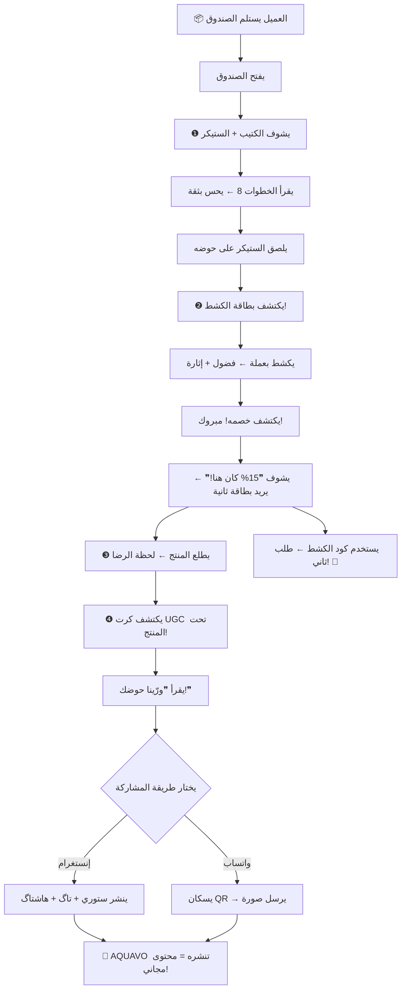

# 📦 التسلسل النهائي لمحتويات صندوق AQUAVO

## 🎯 الفلسفة: قيمة → إثارة → فعل

> **تسلسل مبني على 3 موجات نفسية:**
> 1. **الكتيب** = يبني ثقة وقيمة (Reciprocity)
> 2. **الكشط** = يولّد إثارة وحافز (Variable Reward)
> 3. **UGC** = يستغل ذروة الحماس (Peak-End Rule)

---

## 📐 الترتيب داخل الصندوق (من الأعلى للأسفل)

```
┌──────────────────────────────────────────────┐
│                                                │
│   الطبقة ❶  ←  كتيب البداية السريعة          │
│              (أول شي يشوفه العميل)             │
│               + ستيكر هولوغرافي                │
│                                                │
├──────────────────────────────────────────────┤
│                                                │
│   الطبقة ❷  ←  بطاقة الكشط                   │
│              (مخفية تحت الكتيب)                │
│              🎰 اكشط واكتشف هديتك!             │
│                                                │
├──────────────────────────────────────────────┤
│                                                │
│   الطبقة ❸  ←  المنتج                         │
│              (اللحظة الكبيرة!)                  │
│                                                │
├──────────────────────────────────────────────┤
│                                                │
│   الطبقة ❹  ←  بطاقة UGC                     │
│              (تحت المنتج — مفاجأة أخيرة!)     │
│              📸 ورّينا حوضك!                   │
│                                                │
└──────────────────────────────────────────────┘
```

---

## 🧠 لماذا هذا الترتيب؟ (تحليل نفسي لكل طبقة)

### ❶ كتيب البداية السريعة — الطبقة الأولى

**لماذا أول شي؟**

| المبدأ النفسي | التطبيق |
|---|---|
| **المعاملة بالمثل** (Reciprocity) | "عطوني شي مفيد مجاناً = لازم أردلهم الجميل" |
| **الانطباع الأول** (Primacy Effect) | أول شي يشوفه = أقوى ذاكرة — قيمة تعليمية مو إعلان |
| **تقليل القلق** (Anxiety Reduction) | المبتدئ يرتاح: "عدي دليل، أكدر أبدي!" |

**المواصفات:**
- أكورديون 8 ألواح (8.75×9 سم مطوي)
- ورق 250-300gsm مطفي
- لونين: تيل `#0D7377` + كحلي `#0A1F3B`
- تكلفة: ~$0.15-0.25/قطعة

**المحتوى (8 خطوات):**
1. **الغلاف** — "دليل البداية السريعة 🚀 — حوضك الأول؟ لا تخاف، احنا وياك 💙"
2. **اختيار المكان** — بعيد عن الشمس، سطح قوي، قريب من كهرباء
3. **الغسل والتجهيز** — بدون صابون! حصى 3-5سم، رتب الديكور
4. **تركيب المعدات** — فلتر + سخان (25°م) + إضاءة (8 ساعات بس!)
5. **تهيئة الماء** ⚠️ — مزيل كلور + بكتيريا + انتظر 24-48 ساعة
6. **إضافة السمك** — كيس يطفو 15 دقيقة → ماء شوية شوية → شبچة
7. **التغذية + الصيانة** — مرتين/يوم + غيّر 25% ماء أسبوعياً
8. **تحتاج مساعدة؟** — حسابات التواصل + QR + هاشتاگ

> [!TIP]
> **لمسة ذكية:** حط ستيكر AQUAVO هولوغرافي صغير فوق الكتيب. العميل يشوفه أول → يلصقه على حوضه → يظهر بصور UGC الجاية = إعلان دائم مجاني!

**الستيكر الهولوغرافي:**
- شعار AQUAVO ∞🐟 بتأثير هولوغرافي (يتغير لونه)
- قياس: 5×5 سم (مقاوم للماء!)
- تكلفة: ~$0.08-0.12/قطعة

---

### ❷ بطاقة الكشط — الطبقة الثانية

**لماذا ثاني شي؟**

| المبدأ النفسي | التطبيق |
|---|---|
| **المكافأة المتغيرة** (Variable Ratio Reinforcement) | نفس آلية ماكينات القمار — الدوبامين يُفرز أثناء الانتظار |
| **التصعيد العاطفي** (Emotional Escalation) | بعد "قيمة" الكتيب → "إثارة" الكشط = تصعيد مثالي |
| **تأثير أقرب-فوز** (Near-Miss Effect) | 3 مناطق كشط — يكتشف إنه "فاته" الأكبر → يطلب مرة ثانية! |

**المواصفات:**
- قياس: 90×55mm (حجم بطاقة ائتمان — يدخل بالمحفظة)
- خامة: 400gsm — ملمس مخملي Soft-Touch
- 3 مناطق كشط فضية هولوغرافية
- Spot UV على الشعار
- كود خصم فريد (VDP) لكل بطاقة
- تكلفة: ~$0.05-0.13/بطاقة

**نظام 3 مناطق الكشط (السر!):**

مكتوب على البطاقة: "✨ اختار وحدة بس... واكشطها! ✨" — لكن العميل **راح يكشط الثلاثة** (فضول!) وهذا بالضبط اللي نريده:

| المنطقة | ما تحتها | التأثير النفسي |
|---|---|---|
| **كشط 1** | الخصم الحقيقي (مثلاً 10%) | ✅ "مبروك! فزت!" |
| **كشط 2** | نسبة أعلى: "15% كان هنا!" | 😱 Near-Miss: "يااا لو كشطت هذي!" |
| **كشط 3** | "شحن مجاني فاتك!" | 🤯 Near-Miss ثاني: "لازم أطلب مرة ثانية!" |

**توزيع الجوائز:**

| الجائزة | النسبة | كلهن "فوز" |
|---|---|---|
| 10% خصم | 50% | "مبروك! فزت بخصم!" |
| 15% خصم | 25% | "واو! خصم كبير!" |
| شحن مجاني | 13% | "فوز نادر!" |
| 20% خصم | 7% | "يلااا!" |
| 25% خصم | 3% | نادر جداً |
| 30% + هدية | 2% | الجائزة الكبرى! |

**الشروط على الخلف:**
- صالح 30 يوم (أعلى نسبة استخدام)
- طلبات فوق 50,000 د.ع
- هاشتاق: `#كشطت_مع_اكوافو`
- CTA: "📸 صوّر لحظة الكشط وشاركها! أحلى كشطة = هدية منّا!"

> [!IMPORTANT]
> **البطاقة الذهبية (1%):** واحدة من كل 100 طلب = بطاقة ذهبية بالكامل (Gold Foil). الجائزة: خصم 50% أو حوض مجاني. هذي راح تنتشر بالسوشال ميديا كالنار. تكلفة إضافية: ~$0.10/بطاقة.

---

### ❸ المنتج — الطبقة الثالثة

**لماذا بهالموقع؟**

| المبدأ النفسي | التطبيق |
|---|---|
| **التوقع المتصاعد** (Anticipation Build-up) | قبل ما يوصل للمنتج مر بطبقتين مثيرتين = عنده توقعات عالية |
| **تأثير الملكية** (Endowment Effect) | الآن يمسك المنتج + عنده خصم + عنده دليل = "هذا كله مالي!" |
| **الذروة** (Peak Experience) | المنتج هو السبب اللي طلب عليه = لحظة الرضا الكبرى |

> العميل الآن يحس: تعلّمت (كتيب) + فزت (كشط) + حصلت على منتجي! = **3 لحظات سعادة متتالية**.

---

### ❹ بطاقة UGC "ورّينا حوضك!" — الطبقة الرابعة (الأخيرة)

**لماذا آخر شي؟**

| المبدأ النفسي | التطبيق |
|---|---|
| **قاعدة الذروة-والنهاية** (Peak-End Rule) | الناس يتذكرون آخر شي بالتجربة أكثر من أي شي = هنا نطلب الفعل |
| **الحماس المتراكم** (Cumulative Excitement) | العميل بأعلى مستوى سعادة: كتيب مفيد + فاز بخصم + منتج بإيده |
| **تقليل الحاجز** (Friction Reduction) | QR → واتساب مع رسالة جاهزة = **3 ثوان فقط** للمشاركة |

**المواصفات:**
- قياس: 100×100mm — **مربع!** (شكل پوست إنستغرام بالضبط)
- خامة: 350gsm + Soft-Touch + Spot UV
- تكلفة: ~$0.08-0.12/بطاقة

**الوجه الأمامي — The Emotional Hook:**
- صورة حوض أكواسكيب مذهل (full bleed)
- تدرج كحلي من الأسفل
- عنوان: "📸 ورّينا حوضك!"
- تحته: "حوضك ممكن يكون النجم الجاي على صفحتنا! 🌟"
- هاشتاگ ذهبي: `#حوضي_مع_اكوافو`

**الوجه الخلفي — The Action Plan:**

```
✨ حوضك يستاهل يتشاف!

الخطوات بسيطة:

①  صوّر حوضك 📸
   (نظّفه شوي أول 😉)

②  انشره على إنستغرام
   تاگنا ← @aquavo.iq
   هاشتاگ ← #حوضي_مع_اكوافو

   ↕️ أو ↕️

   أرسله واتساب مباشرة ←
   [QR CODE كبير]
   ⬆️ اسكان وأرسل!

🎁 شنو تحصل؟

🏆  ننشر حوضك على صفحتنا (١٠,٠٠٠+ متابع!)
🏷️  كود خصم ١٠٪ على طلبك الجاي
⭐  فرصة تفوز بـ "حوض الأسبوع" + هدية! 🎁

💙 كل حوض قصة... شنو قصتك؟
```

**رسالة واتساب الجاهزة (عبر QR):**
```
https://wa.me/964XXXXXXXXX?text=مرحبا اكوافو! 📸 هذي صورة حوضي، أبي أشارك بـ %23حوضي_مع_اكوافو 🐟✨
```
العميل يسكان → يفتح واتساب → الرسالة مكتوبة → يرفق صورة → يرسل = **3 ثوان!**

---

## 💰 الملخص المالي

| العنصر | التكلفة/وحدة | المصدر |
|---|---|---|
| كتيب أكورديون 8 ألواح | $0.15-0.25 | مطبعة محلية |
| ستيكر هولوغرافي | $0.08-0.12 | AliExpress |
| بطاقة كشط (VDP) | $0.05-0.13 | مورّد متخصص |
| بطاقة UGC مربعة | $0.08-0.12 | مطبعة محلية |
| **المجموع/صندوق** | **$0.36-0.62** | |

> بالدينار العراقي: **~470-810 د.ع لكل صندوق** (أقل من 1% من متوسط قيمة الطلب!)

---

## 📊 العائد المتوقع (ROI)

| القناة | المتوقع |
|---|---|
| **طلبات العودة** (من كرت الكشط) | 25-35% نسبة استخدام الكود = طلب ثاني |
| **محتوى UGC مجاني** (من كرت UGC) | 8-15% نسبة مشاركة (مقابل 1-3% بدون كرت) |
| **تقييمات 5 نجوم** (من الانطباع العام) | التجربة المميزة = تقييمات إيجابية طبيعية |
| **ROI إجمالي** | **~300-500%** 🚀 |

---

## 📏 المقارنة: لماذا 4 عناصر وليس 3؟

أضفت **ستيكر هولوغرافي** واحد على فكرتك الأصلية. السبب:

| بدون ستيكر | مع ستيكر |
|---|---|
| 3 عناصر بس | 4 عناصر — حس أغنى |
| ❌ ما يظل شي يذكّره بالبراند يومياً | ✅ ملصق على الحوض = تذكير يومي |
| ❌ صور UGC بدون براندنج | ✅ الستيكر يظهر بالصور = إعلان مجاني |
| ❌ − | ✅ تكلفة $0.10 فقط = أرخص عنصر بالصندوق |

---

## 🎬 رحلة العميل (من يستلم لما يشارك)



---

## ✅ تشيك لست التنفيذ

### المرحلة 1: التصميم
- [ ] تصميم كتيب البداية (8 ألواح) بـ Canva/InDesign
- [ ] تصميم بطاقة الكشط (أمام + خلف)
- [ ] تصميم بطاقة UGC (أمام + خلف)
- [ ] تصميم ستيكر هولوغرافي
- [ ] طباعة نماذج تجريبية

### المرحلة 2: التجهيز
- [ ] اختيار مطبعة للكتيب والبطاقات
- [ ] طلب ستيكرات من AliExpress (500 قطعة)
- [ ] البحث عن مورّد بطاقات كشط (VDP + holographic)
- [ ] تجهيز أكواد الخصم الفريدة
- [ ] إعداد رابط واتساب QR

### المرحلة 3: التنفيذ
- [ ] طباعة الدفعة الأولى (500 من كل عنصر)
- [ ] تجربة الترتيب داخل الصندوق الفعلي ← تأكد من التسلسل
- [ ] تصوير فيديو Unboxing تجريبي ← قيّم التجربة
- [ ] إطلاق!

---

## 📋 الهاشتاقات الرسمية

| الهاشتاق | الاستخدام |
|---|---|
| `#حوضي_مع_اكوافو` | كرت UGC — الهاشتاق الرئيسي |
| `#كشطت_مع_اكوافو` | كرت الكشط — لحظة الكشف |
| `#البطاقة_الذهبية` | البطاقة النادرة (1%) — فايرال! |

---

> **الخلاصة:** صندوق AQUAVO = 4 عناصر فقط بتكلفة أقل من $1. التسلسل المدروس يصنع 6 لحظات دوبامين متتالية ويحوّل كل عميل إلى مسوّق مجاني. 🐟💙

---

*مبني على: AQUAVO_QUICK_START_GUIDE.md, AQUAVO_SCRATCH_OFF_CARD.md, AQUAVO_UGC_CARD.md, AQUAVO_STICKERS_DESIGN.md, AQUAVO_UNBOXING_PSYCHOLOGY_BLUEPRINT.md*
*آخر تحديث: فبراير 2026 — AQUAVO*
